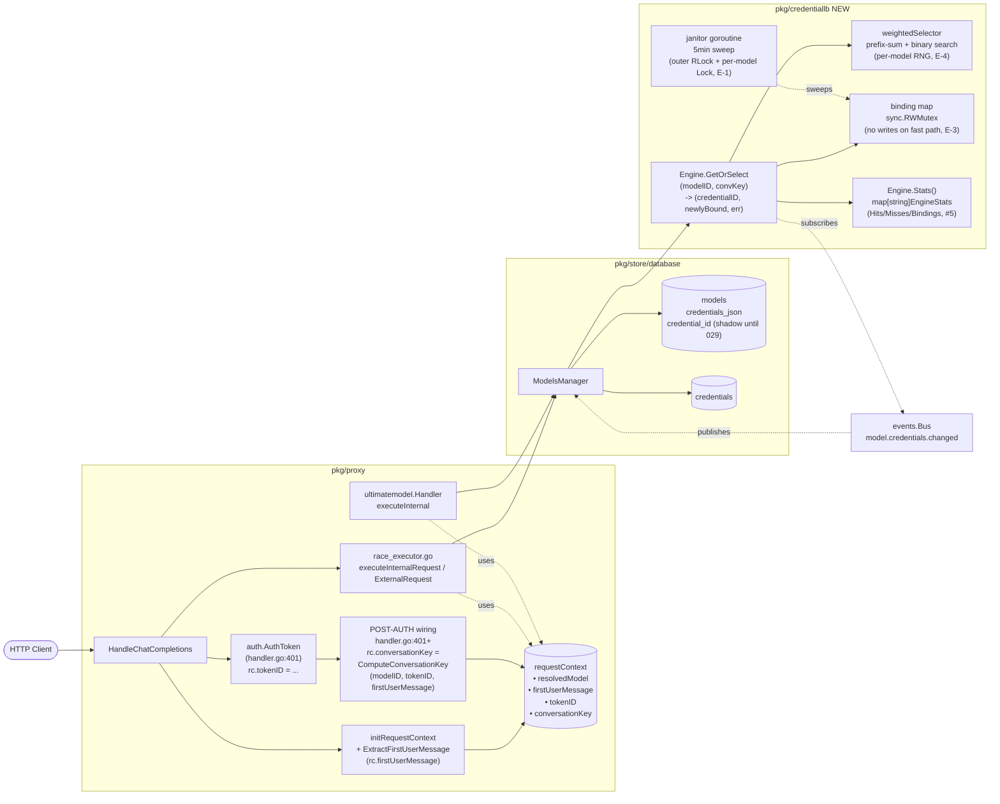

# Technical Analysis: Model → Credentials Load Balancing

> **AMENDED 2026-08-21 (architect council / leader rulings):** This
> contract has been surgically amended per 12 leader-final rulings
> (A-1, A-2, M-1, E-1, E-2, E-3, W-1, W-2, W-3, M-1-test mandatory,
> E-4 recommended, M-1-tracked, W-1-tracked). Each amended section
> carries an `AMENDED 2026-08-21` blockquote. **Pin Amendment Changelog**
> (end of file) for downstream-worker verification — grep there for
> coverage of every cross-reference.

Date: 2026-08-21 (original); 2026-08-21 (amended)
Author: planner[v2] via technical-analysis worker
Analysis depth: deep-dive (downstream plan-phase workers will implement against this contract)
Status: Draft — amended; ready for plan-phase workers
Companion: `decisions.md` (the why) -- this file is the what (the contract)

---

## Question

> **AMENDED 2026-08-21 (A-1, A-2):** The conversation identity in
> requirement (1) is now `sha256(model_id + "|" + token_id + "|" +
> first_user_message)` with canonical-JSON hashing for multimodal
> content.

How should the proxy balance requests for one model across 2..N upstream
credentials (same provider) so that:

1. Each **conversation** (defined by `(model_id, token_id,
   sha256(first_user_message))` where multimodal content is
   canonical-JSON-hashed per A-2) is pinned to **exactly one**
   credential for its lifetime (sticky affinity for upstream
   prompt-cache hits), AND
2. Across **all conversations** for a model, requests are distributed
   proportionally to the integer weights configured per credential
   (weighted random), AND
3. Single-credential models behave **byte-identically** to today (no LB,
   no map writes -- see E-3), AND
4. Credential set changes (add / remove / reweight) invalidate stale
   bindings safely, AND
5. Existing ultimate-model behavior is preserved (with LB applied
   independently on the ultimate side)?

---

## Context Summary

The proxy today resolves one credential per model via
`models.credential_id TEXT` (singleton FK-by-convention). All four
code paths that perform upstream auth (race-internal, race-external,
ultimate-internal, ultimate-external) read either that single column or
the global `cfg.UpstreamCredentialID` env var.

The store layer (`pkg/store/database/store.go`) maintains models +
credentials in SQLite or PostgreSQL via an embed-driven ordered
migration array (`pkg/store/database/migrate.go:24-52`, latest = 027).
House style for multi-valued fields is **JSON-array TEXT columns on the
parent row** (`fallback_chain_json`, `truncate_params_json`,
`auth_tokens.allowed_models`) — there are zero join tables anywhere.
Validation is app-level (no DB-enforced FKs); credential-deletion is
guarded by `ErrCredentialInUse` (`store.go:1289-1295`).

The proxy handler (`pkg/proxy/handler.go`) is constructed via DI from
`cmd/main.go:108`: `proxy.NewHandler(proxyConfig, bus, reqStore,
bufferStore, tokenStore, usageCounter)`. An event bus (`pkg/events/bus.go`)
exists and is already used for config-change invalidation
(`pkg/ultimatemodel/handler.go:150-160`).

Two new design decisions drive this feature:

- **Conversation key (AMENDED — A-1, A-2)**:
  `sha256(model_id + "|" + token_id + "|" + first_user_message)`,
  computed at the **post-auth wiring site** (`pkg/proxy/handler.go:401+`
  where `rc.tokenID` is populated; NOT in `initRequestContext` at
  `:353` where `tokenID` is unset), with canonical-JSON hashing for
  multimodal `[]interface{}` content (precedent at
  `pkg/ultimatemodel/hash_cache.go:172-186`). The existing
  `ultimatemodel.HashMessages` hashes the full role|content array and
  changes every turn, so it cannot be reused as a sticky key.
- **Persistence shape (AMENDED — M-1)**:
  `models.credentials_json TEXT NOT NULL DEFAULT '[]'` with
  `[{credential_id, weight, position}, ...]`. **We KEEP
  `models.credential_id` as a derived shadow** (same-statement UPDATE
  writes both). Migration 028 is ADD + backfill + shadow-write ONLY;
  DROP INDEX + DROP COLUMN is deferred to migration 029+ behind a
  release-note deprecation window. See `decisions.md` §B for the
  reversal rationale (old-binary-vs-migrated-DB total breakage,
  lossy down-migration, OSS external tooling).

---

## Architecture

### Current Patterns

- **Layered proxy**: HTTP entry → `initRequestContext` →
  `HandleChatCompletions` → race coordinator → per-attempt
  `executeInternalRequest` / `executeExternalRequest` →
  `ultimatemodel.Handler` (ultimate path). Pattern: layered with
  constructor-injected dependencies.
- **JSON-array columns on the parent row** for multi-valued fields (no
  join tables). See `pkg/store/database/migrations/sqlite/001_initial.up.sql:23-24`
  and migration 024 for the dialect-asymmetric backfill precedent.
- **RWMutex-protected maps** for in-memory caches (`pkg/models/credential.go:133`,
  `pkg/ultimatemodel/hash_cache.go:14`).
- **Immediate UPSERT** for per-request persistence (usage counters,
  `pkg/usage/counter.go:49-67`).
- **Event-bus-based config invalidation** (already used by ultimate model).

### New Patterns Introduced by This Feature

- **Sticky affinity engine** in a new package `pkg/credentiallb/`,
  injected into `proxy.NewHandler` (constructor DI).
- **Conversation-key field** on `requestContext`
  (`pkg/proxy/handler_helpers.go:23-108`) -- computed once at the
  **post-auth wiring site** (`handler.go:401+` where `rc.tokenID` is
  populated, NOT in `initRequestContext` at `:353` where the token is
  unset), reset on `rc.reset()`. The
  `firstUserMessage` extraction is cached separately on `rc` so the
  post-auth site can hash with the token.
- **Two-phase credential resolution**: `ResolveInternalConfig` (legacy,
  single-credential, unchanged) and `ResolveInternalConfigWithAffinity`
  (new, with `conversationKey` argument, calls the engine for
  multi-credential models).

### Module Boundaries

```
                 ┌─────────────────────────────┐
   HTTP ─────────┤ pkg/proxy/handler.go        │
                 │  • initRequestContext       │
                 │  • HandleChatCompletions    │
                 │  • (no credential logic)    │
                 └──────────┬──────────────────┘
                            │ uses
                            ▼
                 ┌─────────────────────────────┐
                 │ pkg/proxy/race_executor.go  │
                 │  • executeInternalRequest   │
                 │  • executeExternalRequest   │
                 │  • (calls into modelsMgr)   │
                 └──────────┬──────────────────┘
                            │ calls
                            ▼
   ┌─────────────────────────────────────────────────┐
   │ pkg/store/database/store.go                     │
   │  ModelsManager:                                 │
   │   • ResolveInternalConfig(modelID) [legacy]     │
   │   • ResolveInternalConfigWithAffinity          │
   │     (modelID, conversationKey) [NEW]           │
   │   • GetCredentials()                            │
   │   • AddModel / UpdateModel (now writes         │
   │     credentials_json)                          │
   └──────────┬──────────────────┬───────────────────┘
              │ uses             │ delegates
              ▼                  ▼
   ┌─────────────────────┐   ┌──────────────────────────────�
   │ pkg/models          │   │ pkg/credentiallb [NEW]       │
   │  • ModelConfig      │   │  • Engine                    │
   │  • Credentials []   │   │  • weightedSelector          │
   │    CredentialRef    │   │  • binding map (RWMutex)     │
   │  • CredentialConfig │   │  • TTL + janitor goroutine   │
   └─────────────────────┘   │  • OnModelChanged /          │
                             │    OnCredentialDeleted       │
                             └──────────────────────────────┘
                                        ▲
                                        │ uses
                            ┌───────────┴──────────────┐
                            │ pkg/events/bus.go       │
                            │  • Subscribe            │
                            │  (model.credentials     │
                            │   .changed)             │
                            └─────────────────────────┘
```

### Architecture Diagram (deep-dive)



### Layering & Abstraction

- `pkg/credentiallb` exposes a minimal `Engine` API. It does NOT import
  `pkg/proxy`, `pkg/store`, or `pkg/events` — pure stdlib + `pkg/models`
  for the `CredentialRef` type.
- `ModelsManager` is the **only** place that bridges the engine to the
  store. It owns the engine instance, subscribes to the event bus on
  behalf of the engine, and surfaces `ResolveInternalConfigWithAffinity`
  to callers.
- The proxy package talks to `ModelsManager` only — never to the engine
  directly.

### Data Flow (race-internal, single credential)

1. HTTP request arrives → `initRequestContext` parses body,
   `rc.resolvedModel = ...`, `rc.originalMessages = snapshot`,
   `rc.firstUserMessage = ExtractFirstUserMessage(rc.originalMessages)`
   (per A-2: canonical-JSON hash for multimodal content; `""` for
   no-content).
2. Auth runs → `rc.tokenID` populated at `pkg/proxy/handler.go:401`.
3. **NEW (post-auth)**: at `handler.go:401+`,
   `rc.conversationKey = ComputeConversationKey(rc.resolvedModel.ID,
   rc.tokenID, rc.firstUserMessage)` -- salt prevents
   templated-agent-fleet skew (A-1).
4. `HandleChatCompletions` dispatches to race coordinator.
5. Race coordinator → `executeInternalRequest(req.modelID, ...)` →
   `cfg.ModelsConfig.ResolveInternalConfigWithAffinity(req.modelID,
   rc.conversationKey)`.
6. `ResolveInternalConfigWithAffinity` looks up the model:
   - If `model.Credentials` is empty → fallback to legacy
     `ResolveInternalConfig` (returns the single credential; identical to
     today).
   - If `model.Credentials` has 1 entry → fast path: return that
     entry's credential (no map writes per E-3, identical to today).
   - Else → `Engine.GetOrSelect(model.ID, convKey)` →
     `Engine.GetCredential(credentialID)` → returns the struct
     `ResolvedCredential` (provider, apiKey, baseURL, internalModel,
     credentialID, newlyBound) plus a trailing `ok bool` (REVISED
     2026-08-21 — #3, leader-ruled; struct form). The `CredentialID`
     field is the engine's selector output, useful for the
     `model_credential_selected` event payload and #16f prompt-cache
     observability. The `NewlyBound` field carries the W-1
     only-on-first-binding signal so the caller can publish
     `model_credential_selected` ONLY when `NewlyBound == true` — see
     the `ResolveInternalConfigWithAffinity` invariant block below.

### Data Flow (multi-credential, new conversation)

1. Same as above, but in step 6: `Engine.GetOrSelect` sees no binding
   for `(modelID, convKey)` → picks a credential via weighted random →
   stores the binding → returns `(credentialID, newlyBound=true, nil)`.
   The caller publishes the `model_credential_selected` event ONLY when
   `newlyBound == true` (per W-1). **NEW 2026-08-21 — #10 (sliding
   idle TTL)**: the stored binding's `boundAt` is set to `now`; on
   the next in-TTL hit, `boundAt` slides forward by another TTL window
   (24h of additional idle budget). The binding is eligible for
   expiry only after 24h of consecutive idle.

### Data Flow (multi-credential, follow-up request in same conversation)

1. Same as above; `Engine.GetOrSelect` finds the binding → returns
   `(credentialID, newlyBound=false, nil)` (per W-1). The caller does
   NOT publish the `model_credential_selected` event. **NEW 2026-08-21
   — #10 (sliding idle TTL)**: the engine's internal lazy-expiry
   check FIRST verifies `now - boundAt < ttl` (i.e., not idle past
   the 24h ceiling); if so, `boundAt` is REFRESHED to `now` (sliding
   semantics) and the binding is reused. If the binding is idle past
   the ceiling, it is dropped and a fresh credential is picked — the
   in-TTL reuse path is the dominant case for active conversations,
   which is the whole point of the feature.

---

## Integration Points

> **REVISED 2026-08-21 (reviewer pass — C1):** The Integration table
> below now lists five LB-participating paths (was four). The Anthropic
> `/v1/messages` internal path is the **PRIMARY client endpoint** for
> Claude Code and was **missing** from the original integration table
> — C1 adds it. Verification: `cmd/main.go:139` registers the route,
> `handler_anthropic.go:340` calls into `doAnthropicInternalRequest`,
> `handler_anthropic.go:447` is the function definition,
> `handler_anthropic.go:461` constructs `NewInternalHandler`,
> `internal_handler.go:67` is the `HandleRequest` signature, and
> `internal_handler.go:69` is the current 5-tuple `ResolveInternalConfig`
> call — the seam to swap. Thread:
> `anthropicRequestContext.conversationKey` (new field, per #16a C1+
> harmonization) → `InternalHandler.HandleRequest` extra arg →
> `ResolveInternalConfigWithAffinity`.

| # | Integration | Type | Contract | Auth | Failure Mode | File:Line |
|---|-------------|------|----------|------|--------------|-----------|
| 1 | race-internal → LB engine | sync | `ResolveInternalConfigWithAffinity(modelID, convKey)` returns `(ResolvedCredential, bool)` (REVISED 2026-08-21 — #3, leader-ruled struct form: `ResolvedCredential{Provider, APIKey, BaseURL, InternalModel, CredentialID, NewlyBound}` + trailing `ok bool`) | n/a | Engine error → call site returns the same error class as today's `ResolveInternalConfig` failure (`fmt.Errorf("failed to resolve internal config for model %s", ...)`) | `pkg/proxy/race_executor.go:137` (call site); `pkg/store/database/store.go:1316-1350` (legacy impl); NEW signature at `pkg/store/database/store.go` (see §API Contract below) |
| 2 | ultimate-internal → LB engine | sync | Same as #1 | n/a | Same as #1 | `pkg/ultimatemodel/handler_internal.go:46` |
| 3 | **Anthropic `/v1/messages` internal → LB engine** **(NEW 2026-08-21 — C1, leader-ruled)** | sync | `ResolveInternalConfigWithAffinity(modelID, convKey)` returns `(ResolvedCredential, bool)` (REVISED 2026-08-21 — #3, leader-ruled struct form) | n/a | Same as #1 | `cmd/main.go:139` (route registration) → `pkg/proxy/handler_anthropic.go:340` (call into `doAnthropicInternalRequest`) → `handler_anthropic.go:447` (function def) → `handler_anthropic.go:461` (`NewInternalHandler` construction) → `pkg/proxy/internal_handler.go:67` (HandleRequest signature) → `internal_handler.go:69` (current 5-tuple `ResolveInternalConfig` seam). **PRIMARY client endpoint** for Claude Code. |
| 4 | ModelsManager → events.Bus | pub/sub | `Subscribe()` reads `model.credentials.changed` events with `Data: {model_id: string}` | n/a | If bus is nil at startup, engine works without invalidation (acceptable for the v1 deployment) | NEW subscription in `pkg/store/database/store.go` constructor |
| 5 | UI → ModelsManager | sync HTTP | `POST /fe/api/models` with `credentials: [{credential_id, weight, position}]` | session cookie (existing) | Validation error → HTTP 400 with `error.message` | `pkg/ui/server.go:380-460` (existing handler) — payload shape changes |
| 6 | Engine → ModelsManager.GetCredential | sync | `GetCredential(id)` returns `*CredentialConfig` with decrypted `APIKey` | n/a | `nil` if credential deleted mid-flight → engine drops binding, returns error | `pkg/store/database/store.go:1130-1170` |
| 7 | cmd/main.go → proxy.NewHandler | sync DI | `proxy.NewHandler` gains a 7th parameter `credEngine *credentiallb.Engine` (named `credEngine` per the #16a convention; the local variable in `cmd/main.go` is `credLB := credentiallb.NewEngine(...)` — see the convention blockquote in decisions.md §C) | n/a | nil engine → constructor skips wiring; legacy paths use `ResolveInternalConfig` only | `pkg/proxy/handler.go:108` (constructor) |

### Integration Details

**Integration 1+2+3: Race-internal, ultimate-internal, and Anthropic `/v1/messages` internal call sites (NEW 2026-08-21 — C1)**

- **Protocol**: in-process function call.
- **Data format** (REVISED 2026-08-21 — #3, leader-ruled struct form): `(string, string) → (ResolvedCredential, bool)` where `ResolvedCredential{Provider, APIKey, BaseURL, InternalModel, CredentialID, NewlyBound}` plus a trailing `ok bool`. See §API Contract / `ResolveInternalConfigWithAffinity` for the pin and rationale.
- **Authentication**: n/a (in-process).
- **Error handling**: caller returns the standard 500-shaped error
  (`failed to resolve internal config for model %s`); engine never panics.
- **Observability**: the existing per-request log lines (e.g.,
  `[DEBUG] Race attempt %d calling internal provider: %s ...` at
  `pkg/proxy/race_executor.go:151`) gain no new fields — the credential
  ID picked by the engine is logged via a new `INFO` line at engine
  entry, NOT at every call site. The Anthropic `/v1/messages` internal
  path (NEW — C1) reuses the same `proxy.publishEvent` hook for the
  `model_credential_selected` event so the UI sees the same event
  regardless of which endpoint the client used.
- **Known issues**: none. The legacy `ResolveInternalConfig` already
  returns `ok=false` for all known failure modes (model not found, not
  internal, credential missing); we re-use the same failure shape.

**Integration 3: Event-bus invalidation**

- **Protocol**: in-process pub/sub (`pkg/events/bus.go`).
- **Data format**: `Event{Type: "model.credentials.changed", Data:
  map[string]interface{}{"model_id": "..."}}`.
- **Authentication**: n/a.
- **Error handling**: subscriber is non-blocking; slow handlers drop
  events. We treat the engine's subscription as fire-and-forget; missed
  events result in stale bindings that the engine evicts on next lookup
  (the lookup checks `credentialID` is still in the model's configured
  list — see `GetOrSelect` invariant below).
- **Observability**: same as integration 1+2.
- **Known issues**: existing `pkg/config/config.go:518` publishes
  `config.updated` with the whole config object; the subscriber at
  `pkg/ultimatemodel/handler.go:155` checks for a `field` key that is
  never set — so that subscriber may be silently broken. **We do not
  fix it here**. Our new event has a typed shape that does not depend on
  that contract.

**Integration 4: UI payload**

- **Protocol**: HTTP/JSON (existing pattern).
- **Data format**: model POST body gains `credentials`:
  ```json
  {
    "id": "gpt-4o",
    "name": "gpt-4o",
    "enabled": true,
    "internal": true,
    "internal_model": "gpt-4o-2024-08-06",
    "credentials": [
      {"credential_id": "cred-A", "weight": 1, "position": 0},
      {"credential_id": "cred-B", "weight": 2, "position": 1}
    ]
  }
  ```
- **Authentication**: existing UI session auth.
- **Error handling**: server returns 400 with provider mismatch or
  unknown-credential errors. UI displays the error in the toast.
- **Observability**: standard HTTP access log.

---

## API Contract (Go Function Signatures — copy-pasteable)

### `pkg/models` — model types

```go
// pkg/models/config.go (additions)

// CredentialRef is a single (credential, weight, position) entry in a
// model's ordered, weighted credential list.
//
//   - CredentialID: references credentials.id (app-level FK).
//   - Weight: positive integer; the higher, the more often picked.
//     Default 1. Validation: must be > 0.
//   - Position: 0-based deterministic ordering. Used to break weight ties
//     (lower position wins) and to define the "primary" credential
//     (Credentials[0]).
type CredentialRef struct {
    CredentialID string `json:"credential_id"`
    Weight       int    `json:"weight"`
    Position     int    `json:"position"`
}

// ModelConfig (modified — credential_id REMOVED, credentials ADDED):
type ModelConfig struct {
    ID             string   `json:"id"`
    Name           string   `json:"name"`
    Enabled        bool     `json:"enabled"`
    FallbackChain  []string `json:"fallback_chain,omitempty"`
    TruncateParams []string `json:"truncate_params,omitempty"`

    Internal        bool           `json:"internal,omitempty"`
    // CredentialID REMOVED. Use Credentials[0] as the primary.
    InternalBaseURL string         `json:"internal_base_url,omitempty"`
    InternalModel   string         `json:"internal_model,omitempty"`

    // NEW: ordered, weighted credential list.
    // Empty for external/non-internal models.
    // Validation: if non-empty, every entry's CredentialID must exist in
    // the credentials table; every entry's weight must be > 0.
    Credentials []CredentialRef `json:"credentials,omitempty"`

    ReleaseStreamChunkDeadline Duration `json:"release_stream_chunk_deadline,omitempty"`

    PeakHourEnabled  bool   `json:"peak_hour_enabled,omitempty"`
    PeakHourStart    string `json:"peak_hour_start,omitempty"`
    PeakHourEnd      string `json:"peak_hour_end,omitempty"`
    PeakHourTimezone string `json:"peak_hour_timezone,omitempty"`
    PeakHourModel    string `json:"peak_hour_model,omitempty"`

    SecondaryUpstreamModel     string `json:"secondary_upstream_model,omitempty"`
    ExcludeFromUltimateSwitching bool `json:"exclude_from_ultimate_switching,omitempty"`
}
```

### `pkg/credentiallb` — new package

```go
// pkg/credentiallb/engine.go

// Engine maintains (modelID, conversationKey) → credentialID bindings
// with TTL-based eviction and weighted-random selection for new bindings.
//
// Concurrency: safe for concurrent use. All public methods are
// thread-safe.
//
// Lifecycle:
//
//   e := NewEngine(ttl, sweepInterval, rngSeed)
//   defer e.Stop()
//
//   e.RebindFromStore(modelID, refs)        // once at startup, per model
//   e.OnModelChanged(modelID, newRefs)      // on credentials change
//   e.OnCredentialDeleted(credentialID)     // on credential deletion
//
//   credentialID, newlyBound, err := e.GetOrSelect(modelID, conversationKey)  // AMENDED 2026-08-21 (#6, leader-ruled)
type Engine struct {
    // unexported fields; see engine.go internals
}

// NewEngine constructs an Engine. ttl is the **sliding idle TTL** on
// each binding (suggested 24h): the binding's `boundAt` is refreshed
// on every in-TTL `GetOrSelect` hit, and the binding is eligible for
// expiry only after `now - boundAt > ttl` of consecutive idle.
// sweepInterval is the janitor cadence (suggested 5m); rngSeed seeds
// the weighted-random RNG (0 = time-based seed).
//
// Starts a background janitor goroutine. Call Stop() to terminate it.
func NewEngine(ttl time.Duration, sweepInterval time.Duration, rngSeed int64) *Engine

// GetOrSelect returns the credential pinned to (modelID, conversationKey)
// if a fresh binding exists; otherwise picks a new credential via
// weighted random, persists the binding, and returns it.
// **AMENDED 2026-08-21 (reviewer pass — #6, #10, C2):** the doc-comment
// example signature now reads `credentialID, newlyBound, err := e.GetOrSelect(...)`
// (the 3-tuple, matching W-1); the W-1 block below is unchanged in
// semantics, but the empty-key invariant is tightened (C2): with
// `newlyBound ⇔ a binding was stored on this call`, empty-key picks
// return `newlyBound = false` because NO binding is stored (W-2 + C2).
// The TTL is **sliding on idle** (NEW 2026-08-21 — #10): `boundAt` is
// refreshed on every in-TTL hit, so a binding survives as long as the
// conversation is active; the binding is eligible for expiry only after
// 24h of consecutive idle.
//
// **AMENDED 2026-08-21 (W-1)**: signature gains `newlyBound bool`.
// The bool is the only signal that lets the caller publish the
// `model_credential_selected` event **only on first binding** (per
// request), and also enables `Engine.Stats()` (E-4 recommended).
// `newlyBound = true` ⇔ a fresh binding was created for this call;
// `newlyBound = false` ⇔ an existing (in-TTL) binding was reused.
//
// **AMENDED 2026-08-21 (W-2)**: when `conversationKey == ""`, the
// engine performs a **fresh weighted pick per call** with **NO
// binding stored**. The ""-as-own-bucket reading is REMOVED. **NEW
// 2026-08-21 (C2, leader-ruled)**: with this no-binding-stored
// invariant, **empty-key picks return `newlyBound = false`** — even
// though a fresh weighted pick happens in the call, **no binding is
// stored**, so the call is not a "new binding" in the W-1 sense.
// `newlyBound` is bound to the binding-store side effect, NOT to the
// pick side effect. The invariant is `newlyBound ⇔ a binding was
// stored on this call`. Empty-key picks therefore never publish
// `model_credential_selected` (the binding-store event) — instead the
// caller emits a DEBUG log (owned by phase3, not the engine) per the
// `#16f` prompt-cache observability note ("Hot path: cheap
// selection per call").
//
// Invariants:
//   - Returns ("", false, ErrNoCredentials) if modelID has no credentials
//     configured (callers must treat this as a 500).
//   - If a binding exists but the credentialID it points to is no longer
//     in modelID's configured list (e.g., the credential was deleted),
//     the stale binding is dropped and a new credential is picked.
//   - If a binding exists but its boundAt + ttl < now (i.e., it has
//     been idle longer than the TTL), the binding is dropped and a new
//     credential is picked (lazy expiry). **NEW 2026-08-21 — #10**:
//     `boundAt` is REFRESHED on every in-TTL hit, so a binding stays
//     alive as long as the conversation is active; the binding is
//     eligible for expiry only after 24h of consecutive idle.
//   - Single-credential fast path: NO map writes (E-3); always returns
//     `newlyBound = false` (no binding is stored).
//   - **Empty-key (NEW 2026-08-21 — C2)**: `conversationKey == ""` ⇒
//     fresh weighted pick per call, **NO binding stored**, returns
//     `newlyBound = false`. Pinned invariant;
//     `decisions.md §E` test #8 enforces it.
func (e *Engine) GetOrSelect(modelID, conversationKey string) (credentialID string, newlyBound bool, err error)

// OnModelChanged rebuilds the per-model selector (cumulative-sum prefix
// over the new weights) and **filters** existing bindings: preserves
// any binding whose credentialID still appears in `refs`; drops only
// orphan bindings (whose credential was removed).
//
// **AMENDED 2026-08-21 (E-2)**: was "drops ALL existing bindings for
// modelID" — REVERSED. The original clear-all semantics flushed cache
// affinity for every active conversation on routine weight nudges (e.g.,
// weight 1→2). Filter-survivors is strictly better and no harder to
// implement.
//
// Callers MUST invoke this after every change to modelID's
// credentials_json (add, remove, reweight).
func (e *Engine) OnModelChanged(modelID string, refs []models.CredentialRef)

// OnCredentialDeleted drops any binding whose credentialID == id
// across all models. Idempotent. Safe to call even if no bindings exist.
func (e *Engine) OnCredentialDeleted(credentialID string)

// RebindFromStore is the bulk-load counterpart of OnModelChanged for
// startup: given a model's configured credentials, set up the selector
// WITHOUT dropping existing bindings (none exist at startup). It is
// safe to call this multiple times for the same model — the last call
// wins.
func (e *Engine) RebindFromStore(modelID string, refs []models.CredentialRef)

// Stop terminates the janitor goroutine. Idempotent. After Stop(),
// GetOrSelect still works (lazy expiry only) but the janitor no
// longer sweeps.
func (e *Engine) Stop()
```

```go
// pkg/credentiallb/key.go

// ComputeConversationKey returns a 64-char hex SHA256 of
// (modelID + "|" + tokenID + "|" + firstUserMessage).
//
// **AMENDED 2026-08-21 (A-1)**: signature gains `tokenID string`.
// Salt is mandatory (post-auth source: `rc.tokenID` at
// `pkg/proxy/handler.go:401`); salt prevents templated-agent-fleet
// skew (see decisions.md §A).
//
// **AMENDED 2026-08-21 (W-2)**: if `firstUserMessage == ""`, the
// caller MUST skip the engine entirely and use weighted-random-without-
// affinity for that request (the engine itself also enforces this:
// `GetOrSelect(..., "")` returns a fresh pick with no binding stored).
//
// **AMENDED 2026-08-21 (A-2)**: when the first user message's content
// is multimodal `[]interface{}`, `ExtractFirstUserMessage` returns
// the canonical JSON of the content (sorted keys, no whitespace), not
// the raw array. Precedent at `pkg/ultimatemodel/hash_cache.go:172-186`.
func ComputeConversationKey(modelID, tokenID, firstUserMessage string) string

// ExtractFirstUserMessage returns the canonical content of the first
// message with role=="user":
//   - string content → return the string as-is
//   - []interface{} content (multimodal) → return canonical JSON
//     (sorted keys, no whitespace); per A-2
//   - missing/empty/null content or no user-role message → return ""
//
// **AMENDED 2026-08-21 (A-2)**: the multimodal-as-"" fallback is
// REMOVED. Canonical JSON hashing is the v1 contract.
//
// messages is the snapshot from rc.originalMessages
// ([]interface{} of map[string]interface{}).
func ExtractFirstUserMessage(messages []interface{}) string

// ErrNoCredentials is returned by GetOrSelect when the model has no
// credentials configured.
var ErrNoCredentials = errors.New("credentiallb: model has no credentials")
```

### `pkg/store/database` — store-layer changes

```go
// pkg/store/database/store.go (additions to ModelsManager)

// Engine returns the underlying *credentiallb.Engine. The handler
// constructor calls this only to pass the engine to
// proxy.NewHandler.
//
// Returns nil if the ModelsManager was constructed without an engine
// (legacy / tests). Callers must handle the nil case.
func (m *ModelsManager) Engine() *credentiallb.Engine

// ResolvedCredential is the return shape of ResolveInternalConfigWithAffinity.
// (REVISED 2026-08-21 — reviewer pass #3, leader-ruled: struct form; carries newlyBound.)
type ResolvedCredential struct {
    Provider      string
    APIKey        string
    BaseURL       string
    InternalModel string
    CredentialID  string // which credential in the model's list was selected (logging/events/UI)
    NewlyBound    bool   // true ⇔ this call stored a new binding (W-1 event signal)
}

// ResolveInternalConfigWithAffinity resolves a credential for modelID,
// applying the LB engine if the model has 2+ credentials.
//
// **REVISED 2026-08-21 (#3, leader-ruled) — return shape PINNED**:
// **struct `ResolvedCredential` + trailing `ok bool`** (the leader-ruled
// struct branch of the 6-tuple/struct ruling; struct carries both
// `credentialID` AND the ruled `newlyBound` — tuple form could not carry
// both without a 7th element, so the struct is the minimum-shape path
// that satisfies the ruling). The trailing `ok bool` is **kept** for
// parity with the legacy 5-tuple `ResolveInternalConfig` (`pkg/models/config.go:146`)
// and is the only failure signal — `ok = false` means callers must
// return the existing 500-shaped error. The struct fields map as
// follows vs. the legacy 5-tuple:
//
//   ResolvedCredential.Provider      ↔  legacy 5-tuple `provider`
//   ResolvedCredential.APIKey        ↔  legacy 5-tuple `apiKey`
//   ResolvedCredential.BaseURL       ↔  legacy 5-tuple `baseURL`
//   ResolvedCredential.InternalModel ↔  legacy 5-tuple `internalModel`
//   (ok bool)                         ↔  legacy 5-tuple `ok`
//
// `CredentialID` is the **new** field (per #16f prompt-cache
// observability and `model_credential_selected` event payload);
// `NewlyBound` is the **new** field (per W-1 only-on-first-binding:
// the rounded struct is the ONLY way `newlyBound` flows from the
// engine-binding-store side effect through to the proxy/ultimatemodel
// handlers — those call sites receive the resolution result through
// this seam, and if `newlyBound` doesn't flow through here, the W-1
// only-on-first-binding event is unimplementable at the call sites).
// Per C2: empty-key picks return `NewlyBound = false` because no
// binding is stored.
//
// **AMENDED 2026-08-21 (W-2, E-3)**: the conversationKey may be empty
// (no first user message found); the engine performs a fresh weighted
// pick per call with no binding stored. The single-credential fast
// path is a no-op engine call (length check) with **NO map writes**
// (E-3) — behavior is byte-identical to today.
//
// Behavior:
//   - If model.Credentials is empty → fall back to ResolveInternalConfig
//     (single-credential / legacy behavior; identical to today). Returns
//     `ResolvedCredential{}` with `ok = false` on failure.
//   - If model.Credentials has 1 entry → return that entry's credential
//     (no engine call needed; behavior identical to today, no map
//     writes per E-3). `CredentialID` is the singleton, `NewlyBound` is
//     `false` (single-credential fast path never stores a binding),
//     `ok = true`.
//   - If model.Credentials has 2+ entries → call engine.GetOrSelect
//     with conversationKey, then resolve the returned credential via
//     GetCredential(credentialID). `CredentialID` in the returned struct
//     is the SAME string passed to `GetCredential` (the engine-selector
//     output), useful for `model_credential_selected` event payloads
//     and #16f prompt-cache observability. `NewlyBound` is the engine's
//     own binding-store side-effect signal (W-1 invariant) — propagates
//     here so the caller can publish `model_credential_selected` ONLY
//     when `NewlyBound == true`.
//
// conversationKey may be empty (no first user message found) for
// single-credential fast path; the engine handles empty keys the same
// as non-empty keys (affinity is best-effort -- empty-key requests do
// NOT store a binding, per W-2, AND return `NewlyBound = false` per
// C2; the binding-store side effect is what `NewlyBound` reports).
func (m *ModelsManager) ResolveInternalConfigWithAffinity(
    modelID, conversationKey string,
) (ResolvedCredential, bool)

// AddModel / UpdateModel (modified):
//   - Accept ModelConfig.Credentials in the new shape.
//   - Validate: if Credentials is non-empty and the model is Internal,
//     every entry's CredentialID must exist in credentials; every
//     entry's weight must be > 0; every entry's provider must match
//     Credentials[0].CredentialID's provider (provider-match invariant).
//   - On success, marshal []CredentialRef to JSON and write to
//     credentials_json.
//   - After successful Add/Update, call
//     m.engine.OnModelChanged(modelID, model.Credentials).
//   - The legacy CredentialID field is gone — see migration 028.
//
// RemoveModel (modified):
//   - After successful delete, call m.engine.OnModelChanged(modelID, nil)
//     to drop any lingering bindings.
//
// RemoveCredential (modified):
//   - After the in-use guard check, call m.engine.OnCredentialDeleted(id)
//     for every model that references the credential via
//     Credentials[i].CredentialID == id.
```

### `pkg/proxy` — handler wiring

```go
// pkg/proxy/handler.go (additions)

// Config (modified — REMOVED CredEngine field, AMENDED 2026-08-21 W-3):
// Constructor-only injection is the law. There is ONE injection path
// (the 7th constructor arg), not two. The original contract's
// `Config.CredEngine` field is REMOVED; phase3's constructor-only
// rule wins.
type Config struct {
    ConfigMgr    config.ManagerInterface
    ModelsConfig models.ModelsConfigInterface
    EventBus     *events.Bus
    // CredEngine   *credentiallb.Engine  // REMOVED by W-3
}

// Handler (modified — add credEngine field):
type Handler struct {
    // ... existing fields ...
    credEngine *credentiallb.Engine  // NEW; may be nil
}

// NewHandler (modified signature):
//
//   func NewHandler(
//       config *Config,
//       bus *events.Bus,
//       store *store.RequestStore,
//       bufferStore *bufferstore.BufferStore,
//       tokenStore auth.TokenStoreInterface,
//       counter *usage.Counter,
//       credEngine *credentiallb.Engine,  // NEW (constructor-only, per W-3)
//   ) *Handler
//
// If credEngine is nil, legacy single-credential path is used
// everywhere (backward compat for unit tests that don't wire the
// engine).
```

```go
// pkg/proxy/handler_helpers.go (additions)

// requestContext (modified — add conversationKey + firstUserMessage):
//
// **AMENDED 2026-08-21 (A-1 wiring)**: conversationKey is computed
// POST-AUTH (handler.go:401+), NOT in initRequestContext (handler.go:353).
// The firstUserMessage extraction IS done in initRequestContext (cheap
// map walk) and cached so the post-auth site can hash with tokenID.
type requestContext struct {
    // ... existing fields ...
    firstUserMessage string  // NEW; set in initRequestContext
    conversationKey  string  // NEW; sha256(model_id + "|" + token_id + "|" + first_user_msg); set POST-AUTH
}

// reset (modified — clear conversationKey + firstUserMessage):
func (rc *requestContext) reset() {
    // ... existing resets ...
    rc.firstUserMessage = ""  // NEW
    rc.conversationKey  = ""  // NEW
}
```

```go
// pkg/proxy/handler_functions.go (modified initRequestContext)
//
// **AMENDED 2026-08-21 (A-1 wiring)**: initRequestContext sets
// `rc.firstUserMessage` ONLY (cheap map walk). The conversationKey
// (with tokenID salt) is computed at the post-auth wiring site
// (handler.go:401+); see the comment block below.

// In initRequestContext, AFTER rc.resolvedModel and rc.originalMessages
// are set, cache the first-user-message extraction:
//   if rc.resolvedModel != nil && rc.resolvedModel.Internal {
//       rc.firstUserMessage = credentiallb.ExtractFirstUserMessage(rc.originalMessages)
//   }
//
// If rc.resolvedModel is nil (external/unknown model), firstUserMessage
// stays "" and the engine path is skipped at every call site.

// POST-AUTH wiring site (handler.go:401+), AFTER rc.tokenID is set:
//   if rc.resolvedModel != nil && rc.resolvedModel.Internal {
//       rc.conversationKey = credentiallb.ComputeConversationKey(
//           rc.resolvedModel.ID,
//           rc.tokenID,
//           rc.firstUserMessage,
//       )
//   }
// NOTE: do NOT compute conversationKey inside initRequestContext; the
// tokenID is unset at that point (handler.go:353 vs handler.go:401).
```

### Migration SQL (028, AMENDED 2026-08-21 — M-1)

> **AMENDED 2026-08-21 (M-1, M-1-test)**: 028 is now ADD +
> backfill + same-statement **derived shadow write** to
> `credential_id`. **NO DROP COLUMN.** The DROP INDEX + DROP COLUMN
> are deferred to migration **029+** behind a release-note
> deprecation window. The PG-gated 028 transaction test is
> **MANDATORY** (this is the repo's first file-level transactional
> migration; see the testing section). The `DROP INDEX IF EXISTS
> idx_models_credential_id` statement is **NOT** included in 028
> because 028 keeps the column -- it would be a no-op and the index
> stays until 029.

**File: `pkg/store/database/migrations/sqlite/028_add_model_credentials.up.sql`**

```sql
-- Migration 028: Add models.credentials_json (ordered, weighted list)
-- and backfill from existing models.credential_id rows.
--
-- **AMENDED 2026-08-21 (M-1)**: this migration does NOT drop
-- models.credential_id. The column is kept as a DERIVED SHADOW --
-- the same UPDATE statement that writes credentials_json also
-- writes credential_id (= credentials_json[0].credential_id) so
-- that legacy binaries and external tooling keep reading a
-- consistent value. DROP INDEX + DROP COLUMN are deferred to
-- migration 029+ behind a release-note deprecation window.
--
-- The transaction is the repo's FIRST file-level BEGIN...COMMIT
-- pair through the SQLite/modernc.org/sqlite v1.46.1 driver +
-- pgx/v5 ExecContext pairing. A MANDATORY PG-gated test must
-- PROVE the transaction commits on both dialects (see testing
-- section); do not ship without it.

BEGIN TRANSACTION;

-- 1. Add the new column.
ALTER TABLE models ADD COLUMN credentials_json TEXT NOT NULL DEFAULT '[]';

-- 2. Backfill + shadow write (same statement).
--    For every row with a non-empty credential_id:
--      credentials_json = [{"credential_id", "weight":1, "position":0}]
--      credential_id   = credential_id   (shadow, no-op)
--    The shadow write is a tautology; it lives in the same
--    UPDATE so that any future writer that touches only
--    credentials_json is forced (by code review) to also touch
--    credential_id. Rows with credential_id = '' or NULL stay
--    with credentials_json = '[]' and shadow = ''.
UPDATE models
SET credentials_json = '[{"credential_id":"' || credential_id ||
                       '","weight":1,"position":0}]',
    credential_id   = credential_id  -- shadow (no-op today; load-bearing for 029)
WHERE credential_id IS NOT NULL
  AND credential_id != '';

-- 3. NO DROP COLUMN. credential_id stays; DROP moves to 029+.

COMMIT;
```

**File: `pkg/store/database/migrations/postgres/028_add_model_credentials.up.sql`**

```sql
-- Migration 028 (Postgres, AMENDED 2026-08-21 M-1): ADD + backfill +
-- same-statement shadow write to credential_id. NO DROP COLUMN
-- (deferred to 029+).
--
-- The transaction is the repo's FIRST file-level BEGIN...COMMIT
-- through pgx/v5 ExecContext; MANDATORY PG-gated test required.

BEGIN;

-- 1. Add the new column.
ALTER TABLE models
    ADD COLUMN credentials_json TEXT NOT NULL DEFAULT '[]';

-- 2. Backfill + shadow write (same statement, JSONB-array form).
UPDATE models
SET credentials_json = (
        jsonb_build_array(
            jsonb_build_object(
                'credential_id', credential_id,
                'weight',        1,
                'position',      0
            )
        )::text
    ),
    credential_id = credential_id  -- shadow (no-op today; load-bearing for 029)
WHERE credential_id IS NOT NULL
  AND credential_id != '';

-- 3. NO DROP COLUMN. credential_id stays; DROP moves to 029+.

COMMIT;
```

**File: `pkg/store/database/migrations/sqlite/028_add_model_credentials.down.sql`**

```sql
-- Down migration (SQLite, AMENDED 2026-08-21 M-1, LOSSLESS).
--
-- Pulls credential_id back from credentials_json[0] (re-adding the
-- column if a future state has dropped it -- e.g., after 029 has
-- landed and someone down-migrates past it). The credentials_json
-- column itself is PRESERVED (a re-up restores the full list).
--
-- If credential_id is already present (typical case today, since
-- 028 does not drop it), this is a no-op for the column add and a
-- defensive re-write of the shadow from credentials_json[0].

BEGIN TRANSACTION;

-- Re-add the column only if missing (idempotent for the
-- pre-029-deprecation case). The IF NOT EXISTS form is not
-- supported on older PG; for SQLite we use the pragma check.
-- For now, assume the down-migration runs in a state where
-- credential_id EXISTS (pre-029 typical), so we skip the ADD.
-- If the column is absent, the operator must run a manual ALTER
-- TABLE first.

UPDATE models
SET credential_id = COALESCE(
        json_extract(credentials_json, '$[0].credential_id'),
        credential_id
    )
WHERE credentials_json IS NOT NULL
  AND credentials_json != '[]'
  AND json_array_length(credentials_json) > 0
  AND json_extract(credentials_json, '$[0].credential_id') IS NOT NULL;

-- NOTE: we do NOT DROP credentials_json -- it is preserved so a
-- re-up restores the full multi-credential list.

COMMIT;
```

**File: `pkg/store/database/migrations/postgres/028_add_model_credentials.down.sql`**

```sql
-- Down migration (Postgres, AMENDED 2026-08-21 M-1, LOSSLESS).
-- Preserves credentials_json so a re-up restores the full list.

BEGIN;

UPDATE models
SET credential_id = COALESCE(
        (credentials_json::JSONB -> 0 ->> 'credential_id'),
        credential_id
    )
WHERE credentials_json IS NOT NULL
  AND credentials_json != '[]'
  AND jsonb_array_length(credentials_json::JSONB) > 0;

-- NOTE: we do NOT DROP credentials_json.

COMMIT;
```

**File: `pkg/store/database/migrations/sqlite/029_drop_credential_id.up.sql` (DEFERRED — sketch only)**

```sql
-- Migration 029 (DEFERRED, AMENDED 2026-08-21 M-1): DROP INDEX +
-- DROP COLUMN credential_id from models. Gated on a release-note
-- deprecation window ("credential_id is derived; will be removed
-- in the next minor"). This migration is a TRACKED ISSUE at merge
-- time -- load-bearing for M-1.
--
-- File created at the same time as 028 but NOT added to the
-- migrations[] array. Becomes runnable when the deprecation window
-- closes (typically the next minor release).
--
-- SQLite DROP COLUMN requires the SQLite ≥ 3.35 column-add-without-
-- rewrite; modernc.org/sqlite v1.46.1 bundles ≥ 3.35, so this
-- works. SQLite also requires dropping dependent indexes first;
-- the index on credential_id is dropped in step 1.

BEGIN TRANSACTION;

DROP INDEX IF EXISTS idx_models_credential_id;  -- SQLite needs index drop before DROP COLUMN
ALTER TABLE models DROP COLUMN credential_id;

COMMIT;
```

**File: `pkg/store/database/migrations/postgres/029_drop_credential_id.up.sql` (DEFERRED — sketch only)**

```sql
-- Migration 029 (Postgres, DEFERRED). pgx/v5 handles DROP COLUMN
-- in a single statement; the index is dropped in the same
-- transaction for symmetry with the SQLite form.

BEGIN;

DROP INDEX IF EXISTS idx_models_credential_id;
ALTER TABLE models DROP COLUMN credential_id;

COMMIT;
```

**File: `pkg/store/database/migrate.go`** (add to the `migrations` array at line 24-52, after `027`):

```go
var migrations = []migration{
    // ... existing 001..027 ...
    {"027", "027_add_exclude_from_ultimate_switching.up"},
    {"028", "028_add_model_credentials.up"},  // NEW (amended)
    // {"029", "029_drop_credential_id.up"},  // DEFERRED, see tracked issue
}
```

**File: `pkg/store/database/store.go` (write-path shadow maintenance, ~3 lines per AMENDED — M-1)**

```go
// AddModel / UpdateModel (modified, AMENDED 2026-08-21 M-1):
//   - Accept ModelConfig.Credentials in the new shape.
//   - Validate: if Credentials is non-empty and the model is Internal,
//     every entry's CredentialID must exist in credentials; every
//     entry's weight must be > 0; every entry's provider must match
//     Credentials[0].CredentialID's provider (provider-match invariant).
//   - On success, marshal []CredentialRef to JSON and write to
//     credentials_json.
//   - **NEW (~3 lines, M-1)**: in the same UPDATE, write
//     credential_id = credentials_json[0].credential_id (the
//     derived shadow). Until 029 lands, the shadow is required;
//     after 029, this write is dropped.
//   - After successful Add/Update, call
//     m.engine.OnModelChanged(modelID, model.Credentials)
//     (E-2: filter-survivors, not clear-all).
//   - The CredentialID field on ModelConfig is GONE (the column
//     stays; the field is removed from the struct).
//
// RemoveModel (modified):
//   - After successful delete, call m.engine.OnModelChanged(modelID, nil)
//     to drop any lingering bindings.
//
// RemoveCredential (modified):
//   - After the in-use guard check, call m.engine.OnCredentialDeleted(id)
//     for every model that references the credential via
//     Credentials[i].CredentialID == id.
```

---

## Concurrency Model

> **AMENDED 2026-08-21 (E-1, E-2, E-3, E-4)**: the locking discipline
> table below corrects the original self-contradiction (janitor
> stalling all reads) and the `OnModelChanged` semantics
> (filter-survivors, not clear-all). The single-credential fast path
> does no map writes (E-3). E-4 recommends per-model RNG / Stats() /
> janitor panic-recovery.

### Engine Internals

```go
type Engine struct {
    mu        sync.RWMutex                  // outer lock
    models    map[string]*modelState        // modelID -> state
    ttl       time.Duration
    sweepInt  time.Duration
    // **AMENDED 2026-08-21 (E-4)**: per-model RNG (one per modelState),
    // NOT a single shared rand.Rand. Removes first-selection contention
    // across models. See modelState below.
    stopCh    chan struct{}                 // janitor shutdown
    sweepDone chan struct{}                 // janitor exit ack
}

type modelState struct {
    mu         sync.RWMutex                 // per-model lock
    credentials []models.CredentialRef      // current config
    prefixSum  []int                        // cumulative weights
    totalWeight int
    bindings   map[string]*binding          // conversationKey -> binding
    // **AMENDED 2026-08-21 (E-4)**: per-model RNG.
    rng        *rand.Rand
    // **AMENDED 2026-08-21 (E-4)**: per-model stats counters for Stats().
    // **NEW 2026-08-21 (#5, leader-ruled) — Stats() field names PINNED**:
    // the public Stats() shape is
    //      Engine.Stats() map[string]EngineStats
    //   where `EngineStats` is the per-model struct:
    //      type EngineStats struct {
    //          Hits     uint64  // in-TTL lookup hits (sliding-TTL refresh)
    //          Misses   uint64  // lookups that selected a fresh credential
    //          Bindings uint64  // current binding-map size for this model
    //      }
    // The per-model binding-count field is named `Bindings` (no other
    // alias — `binding_total`, `count`, `len(bindings)` are all
    // rejected). `EngineStats` is exported so callers can range over
    // `Engine.Stats()` and read fields by name; the field-name choice
    // (`Bindings`) is locked across all operator-facing surfaces
    // (logs, expose, debug). Empty-key requests update `Misses` (a
    // fresh pick happened) but do NOT update `Bindings` (no store),
    // which falls out for free from the C2 invariant.
    hitsTotal   uint64
    missesTotal uint64
    bindingsCount uint64  // mirrors len(bindings) for O(1) Stats()
}

type binding struct {
    credentialID string
    boundAt      time.Time
}

// EngineStats is the per-model stats shape returned by Engine.Stats().
// **PINNED 2026-08-21 (#5)**: field names are `Hits`, `Misses`,
// `Bindings` (no aliases). See the modelState doc comment above.
type EngineStats struct {
    Hits     uint64
    Misses   uint64
    Bindings uint64
}

// Stats returns a snapshot of per-model engine stats for operator
// visibility. Reads each model's snapshot under its own RLock; the
// resulting map is a value copy (callers may mutate it freely).
//
// **PINNED 2026-08-21 (#5)**: the per-model field names are
// `EngineStats.Hits`, `EngineStats.Misses`, `EngineStats.Bindings`.
// Decisions §E test #12 will assert the shape.
func (e *Engine) Stats() map[string]EngineStats
```

### Locking Discipline

> **AMENDED 2026-08-21 (E-1)**: the janitor takes the outer **RLock**
> (so reads proceed concurrently) and acquires each per-model write
> lock one at a time. The original contract's "janitor takes outer
> write lock" stalled ALL reads each sweep — contradicted the §Locking
> Edge Cases claim that the sweep "never blocks reads for more than
> one model." The amended variant preserves the claimed behavior.

| Operation | Locks acquired | Notes |
|-----------|---------------|-------|
| `GetOrSelect(modelID, convKey)` happy path | outer RLock → modelState RLock | 99% of requests |
| `GetOrSelect` first selection (no binding, convKey != "") | outer RLock → upgrade to modelState Lock | writes one binding entry |
| `GetOrSelect` empty conversationKey (W-2) | outer RLock → modelState RLock → upgrade to call weightedSelector | NO binding written |
| `GetOrSelect` lazy expiry eviction | outer RLock → upgrade to modelState Lock | drops binding, picks new |
| `OnModelChanged(modelID, refs)` **(AMENDED — E-2)** | outer Lock → modelState Lock | **filters** bindings: keeps those whose credential survives in `refs`; drops orphans. NOT clear-all. |
| `OnCredentialDeleted(credentialID)` | outer Lock → per affected modelState Lock | scans all models |
| `RebindFromStore(modelID, refs)` | outer Lock → modelState Lock | startup-time; not on hot path |
| Janitor sweep **(AMENDED — E-1)** | **outer RLock** → per modelState Lock (one at a time) | background; **reads proceed concurrently**; sweep is bounded by per-model scan time |

### Why RWMutex, Not sync.Map

House style (`pkg/models/credential.go:133`,
`pkg/ultimatemodel/hash_cache.go:14`) is explicit RWMutex. `sync.Map` is
optimized for write-once-read-many, which is the OPPOSITE of our access
pattern (hot reads; occasional config-change writes; frequent per-model
binding updates on first selection).

### Locking Edge Cases

- **Deadlock avoidance**: the engine never holds two modelState locks
  simultaneously. The outer map lock is acquired BEFORE any modelState
  lock, and released BEFORE acquiring another. The order is:
  outer → modelState → release outer → next modelState.
- **Janitor concurrency (AMENDED — E-1)**: the janitor acquires the
  outer **RLock**, which lets all `GetOrSelect` calls proceed
  concurrently. The sweep walks models one at a time, taking each
  model's write lock briefly to evict expired bindings. For typical
  100 models × 1000 active conversations, the per-model scan is
  sub-millisecond; the outer RLock is held for the duration of the
  walk but never blocks reads.

### Race-Detector Validation

The unit tests under `pkg/credentiallb/*_test.go` MUST pass with
`go test -race ./pkg/credentiallb/...`. See `decisions.md` §E test #5.

---

## Invalidation Semantics

> **AMENDED 2026-08-21 (E-2)**: `OnModelChanged` now **filters**
> bindings (preserve survivors; drop orphans), NOT clear-all. The
> original clear-all semantics flushed cache affinity for every active
> conversation on routine weight nudges (e.g., weight 1→2).

### When Does the Engine Forget a Binding?

| Trigger | What the engine does | Caller invariant |
|---------|---------------------|------------------|
| TTL expiry (now > boundAt + ttl, **i.e., > 24h idle — NEW 2026-08-21 #10**) | Drop binding; next `GetOrSelect` picks a fresh credential | Lazy: dropped at next lookup, not proactively. **`boundAt` is REFRESHED on every in-TTL hit** (sliding semantics) — a binding stays alive as long as the conversation is active. |
| Credential deleted (via `OnCredentialDeleted`) | Drop ALL bindings pointing to that credential across all models | Proactive: called by `ModelsManager.RemoveCredential` after the in-use guard |
| Model's credentials changed (via `OnModelChanged`) **(AMENDED — E-2)** | **Filter**: keep bindings whose credential survives in `newCredentials`; drop only orphans (whose credential was removed). | Proactive: called by `ModelsManager.AddModel`/`UpdateModel` after the DB write succeeds |
| Binding's credentialID is no longer in the model's configured list (defensive check at lookup) | Drop binding; pick a fresh credential | Catches missed invalidation events; idempotent |
| `Engine.Stop()` called | Drop nothing — janitor stops but bindings remain | Caller-side lifecycle; safe to restart by calling `RebindFromStore` for every model. **NEW 2026-08-21 — #10**: surviving bindings keep their `boundAt` (no expiry on stop); the next `GetOrSelect` after a Stop/Restart cycle applies the sliding-TTL check against the preserved `boundAt`. |
| Empty conversationKey **(AMENDED — W-2)** | **No binding stored**; fresh weighted pick per request. The ""-as-own-bucket reading is REMOVED. | Caller MUST NOT expect affinity for empty-key requests |

### Defensive Lookup Check

`GetOrSelect` performs a "is the binding's credential still valid for this
model?" check on every call:

```go
// pseudocode inside GetOrSelect
b, ok := state.bindings[convKey]
if ok && b.boundAt.Add(e.ttl).After(now) {
    if credentialStillInConfig(state.credentials, b.credentialID) {
        return b.credentialID, nil  // happy path
    }
    // Stale — drop and fall through to weighted random.
    delete(state.bindings, convKey)
}
// Pick a new credential via weighted random.
```

This means even if every invalidation event is missed (bus disconnected,
panic mid-publish), the engine self-corrects on the next request.

### Race Between Invalidation and Lookup

There is a benign race: a lookup is in flight (read lock held, credential
resolved) while an `OnModelChanged` is queued (write lock pending). The
write lock will wait for the in-flight read to finish; subsequent
lookups see the new state. No correctness issue — only an at-most-one
extra request going to the soon-to-be-deleted credential. Acceptable.

---

## Config-Change Propagation

### Wiring Path

```
   UI POST /fe/api/models
        │
        ▼
   pkg/ui/server.go: handleModelUpdate
        │
        ▼
   ModelsManager.UpdateModel(modelID, model)
        │
        ├─► Validate (provider-match, weight>0, creds exist)
        ├─► DB write (UPDATE models SET credentials_json = ...)
        ├─► Engine.OnModelChanged(modelID, model.Credentials)
        │
        ▼
   Engine (drops bindings for modelID, rebuilds prefix sums)
        │
        └─► Publishes events.Event{Type:"model.credentials.changed",
              Data: {model_id: modelID}} via the bus
                    │
                    ▼
              Other subscribers (none for v1; future-proofed hook)
```

### Why We Invalidate After the DB Write, Not Before

If we invalidate BEFORE the DB write succeeds, a concurrent request
could:

1. Read `old credentials_json` from a cached snapshot → pick credential
   `X` from the old set.
2. Cache binding → returns `X` for a few requests.
3. We commit the new credentials_json.
4. Future lookups see the new state, drop the stale binding, pick from
   the new set.

That's the same outcome as "invalidate after," but with the window of
incorrectness shifted by one step. The "after" pattern is simpler
because the engine's state always reflects what's in the DB (no
transitional window).

### Edge: Failed DB Write

If the DB write fails, we do NOT call `Engine.OnModelChanged`. The
engine keeps its current state. The user retries; if the retry
succeeds, the engine updates. If the user abandons, the engine's state
is unchanged (correct).

### Edge: ModelsManager Constructed Without an Engine

Unit tests for the proxy that don't care about LB pass `credEngine: nil`
to `NewHandler`. The handler MUST tolerate `credEngine == nil` by
falling back to `ResolveInternalConfig` (legacy, single-credential) at
every call site. Implementation: `ResolveInternalConfigWithAffinity`
checks `m.engine == nil` and short-circuits to the legacy path.

---

## Backward Compatibility Matrix

| Scenario | Pre-LB behavior | Post-LB behavior | Status |
|----------|-----------------|-------------------|--------|
| Model with `credential_id = 'X'` (existing) | All requests use credential X | Migration backfills to `Credentials = [{X, 1, 0}]` AND keeps `credential_id = 'X'` as derived shadow (M-1); engine sees single credential → returns X (no map writes, E-3) | **Identical** |
| Model with no credential (external/unknown) | `ResolveInternalConfig` returns `ok=false` | `ResolveInternalConfigWithAffinity` returns `ok=false` (empty `Credentials` → falls back to legacy path) | **Identical** |
| `cfg.UpstreamCredentialID = 'Y'` (env-only race-external) | Race-external uses credential Y | Race-external untouched | **Identical** |
| Ultimate-external request (any model) | Provider probe via `modelCfg.CredentialID`; client auth passes through | Provider probe via `getEffectivePrimaryCredentialID(modelCfg)` (= Credentials[0].CredentialID or ""); client auth passes through | **Identical** (line 287-293 of `pkg/ultimatemodel/handler.go` reads `modelCfg.CredentialID != ""` → becomes `getEffectivePrimaryCredentialID(modelCfg) != ""`) |
| Model with multi-credential set + new conversation | n/a (no feature today) | Engine picks credential via weighted random, pins for conversation; returns `newlyBound = true` (W-1) so caller publishes `model_credential_selected` event | **NEW** |
| Model with multi-credential set + repeat conversation (same first-user-msg) | n/a | Engine reuses pinned credential; returns `newlyBound = false` (W-1) so caller does NOT publish the event | **NEW** |
| Model credentials reweighted via UI | n/a | **AMENDED — E-2**: engine **filters** bindings — keeps conversations whose credential survives, drops only orphans. Cache affinity preserved across weight nudges. | **NEW (intentional, cache-preserving invalidation)** |
| Old binary running against a 028-migrated DB **(AMENDED — M-1)** | (today) reads `credential_id` directly | Shadow is populated; old binary keeps working but loses LB for multi-credential models. No crash. | **Identical (no crash), partial LB loss for multi-credential models** |
| External tooling (backup scripts, third-party SELECTs) querying `models.credential_id` **(AMENDED — M-1)** | (today) reads `credential_id` | Shadow is populated; tooling keeps working during deprecation window. 029+ removes the column with release-note notice. | **Identical until 029** |
| Empty body / no first user message | n/a | **AMENDED — W-2**: engine treats as no-affinity for this request; **fresh weighted pick per request** with **no binding stored**. The ""-as-own-bucket reading is REMOVED. | **NEW (no hotspot)** |
| Credential deleted while model references it | `ErrCredentialInUse` blocks deletion | Same guard updated to scan `Credentials` JSON; engine drops bindings for that credential on success | **Identical behavior, JSON-scanned guard** |
| Empty body / no first user message | n/a | Engine treats as no-affinity for that request; weighted random without persistence | **NEW (degrade gracefully)** |
| Race between `OnModelChanged` and in-flight `GetOrSelect` | n/a | At-most-one extra request to a soon-to-be-removed credential; subsequent requests use new state | **NEW (benign race)** |

---

## Risks

| # | Risk | Impact | Severity | Mitigation |
|---|------|--------|----------|------------|
| 1 | Migration 028 fails mid-transaction (e.g., DB disk full) | DB left in inconsistent state (new column added, backfill incomplete) | **High** if transaction is not atomic | Wrapped in file-level `BEGIN` / `COMMIT` (the repo's FIRST file-level transactional migration through `modernc.org/sqlite` v1.46.1 + pgx/v5 `ExecContext`); if any step fails, the migration runner (`pkg/store/database/migrate.go:71-97`) marks it as not applied and the next startup retries from scratch. **Mandatory PG-gated test proves the transaction works on both dialects.** |
| 2 | External tool (e.g., backup script) queries `models.credential_id` and breaks after the (future) 029 column drop | Tool returns NULL or errors | Medium **(AMENDED — M-1)** | 028 does NOT drop the column; it stays as a derived shadow. 029+ removal is gated on a release-note deprecation window. The proxy's public API surface (HTTP) is unchanged. |
| 3 | Engine consumes unbounded memory for short conversations | Slow leak in long-running deployments | Medium | Hybrid sliding-idle TTL + janitor (sweep every 5m); default TTL 24h bounds idle conversations. **NEW 2026-08-21 — #10**: the TTL is sliding-on-idle (refreshed on every in-TTL hit), so active conversations do NOT expire mid-flight; the TTL is the IDLE ceiling, not the lifetime ceiling. Test #3 in `decisions.md` §E covers lazy + janitor eviction. |
| 4 | Weighted random skews toward one credential due to small N | User-visible imbalance | Low | Documented tolerance bands in test #1 of `decisions.md` §E (±5% at N=10k); per-credential weight validation rejects zero or negative weights. |
| 5 | `OnModelChanged` event published on bus but no subscriber (engine missing) | Bindings not invalidated → stale credential used | Low | Defensive lookup check (`GetOrSelect` verifies credential is still in config) self-corrects within one request. |
| 6 | `firstUserMessage` extraction returns wrong message (multimodal content) | Conversation key changes mid-conversation → affinity lost | Low **(AMENDED — A-2)** | Multimodal content is now canonical-JSON-hashed (no-affinity fallback removed). Precedent at `hash_cache.go:172-186`. |
| 7 | First user message truncated by client (context overflow) | Conversation key changes → affinity lost | Low | Same as #6 — accepted behavior. Future enhancement: fallback to last user message hash. |
| 8 | Janitor goroutine panics and silently stops | Memory leak (no more eviction) | Medium | **AMENDED — E-4**: engine wraps the sweep in `defer recover()` and logs the panic; continues on the next sweep interval. Mandatory test #11 in `decisions.md` §E forces a panic via injected failure and verifies recovery. |
| 9 | `ResolveInternalConfigWithAffinity` call site accidentally uses `ResolveInternalConfig` (legacy) for a multi-credential model | LB is silently skipped; all requests go to Credentials[0] | Medium | Code review checklist item + linter rule suggestion: any new call to `ResolveInternalConfig` after this feature lands must justify why affinity is not needed. |
| 10 | Credential provider mismatch (different provider in Credentials[1] vs Credentials[0]) silently routes to wrong API | All requests fail at the upstream | Medium | `ModelsManager.Validate()` enforces same-provider invariant across all `Credentials` entries; UI blocks mixed-provider saves. Test #5 of `decisions.md` §E covers the validation. |
| 11 | **Templated-agent-fleet skew (NEW, A-1)** — same-token-same-first-message conversations pin to one credential → weighted LB silently broken for scripted/agent workloads; E2E test cannot detect it | High for affected deployments | High | **A-1 mitigation**: token salt in conversation key. Anonymous requests degrade to unsalted key (acceptable). |
| 12 | **Destructive DROP COLUMN in 028 (REVERSED — M-1)** — lossy rollback for multi-credential models; old-binary-vs-migrated-DB total breakage; OSS tooling/backups break silently | High | High | **M-1 mitigation**: 028 keeps `credential_id` as derived shadow; DROP INDEX + DROP COLUMN deferred to 029+ behind release-note deprecation window. |
| 13 | **Janitor locking self-contradiction (NEW, E-1)** — original contract's "janitor takes outer write lock" stalled ALL reads each sweep | High | High | **E-1 mitigation**: janitor takes outer **RLock** + per-model write locks (one at a time). Reads proceed concurrently. |
| 14 | **`OnModelChanged` clear-all (NEW, E-2)** — fleet-wide cache flush on routine weight nudges | Medium | Medium | **E-2 mitigation**: filter-survivors. Preserves affinity for conversations whose credential still exists. |
| 15 | **`model_credential_selected` only-on-first-binding unimplementable with original signature (NEW, W-1)** — phase3 cannot detect first-binding-within-request | High | High | **W-1 mitigation**: `GetOrSelect` returns `(credentialID, newlyBound bool, err)`; `newlyBound = true` � first binding. |
| 16 | **Empty-key three-way ambiguity (NEW, W-2)** — three docs specified empty `conversationKey` three different ways; ""-as-own-bucket reading creates a silent 24h hotspot | High | High | **W-2 mitigation**: pinned to one reading — empty key ⇔ NO binding stored, fresh pick per request. Phase 2 test asserts it. **NEW 2026-08-21 — C2**: with `newlyBound ⇔ a binding was stored on this call`, empty-key picks return `newlyBound = false` (cleanly observable and aligned with the no-binding-stored invariant). |
| 17 | **Two injection paths (NEW, W-3)** — `Config.CredEngine` field AND 7th constructor param | Medium | Medium | **W-3 mitigation**: constructor-only. `Config.CredEngine` REMOVED from the contract. |
| 18 | **Dual-source debt returns if 029 never lands (NEW, M-1-tracked)** | High | High | **M-1 mitigation**: tracked issue filed at merge time; load-bearing for M-1. |

---

## Scalability

### Growth Assumptions

- **Models**: 10–100 active models per deployment (matches the
  credentials-table cardinality; no evidence of higher numbers in the
  codebase).
- **Credentials**: 5–50 per deployment (UI lists all credentials on
  `/fe/api/credentials`; no per-model credential count expected to
  exceed 16 — that's our validation ceiling).
- **Concurrent active conversations**: 1k–10k per proxy instance (one
  binding each; map size bounded by TTL × request rate).
- **Request rate**: 100 req/s sustained per model; 1k req/s peak across
  all models.

### Current Bottlenecks

| # | Bottleneck | Threshold | File:Line | Impact |
|---|------------|-----------|-----------|--------|
| 1 | Weighted random selector rebuild on every `OnModelChanged` | O(k) per model; k≤16 | `pkg/credentiallb/engine.go` (NEW) | Negligible — k is small |
| 2 | Binding map lookup in `GetOrSelect` | O(1) hash lookup + O(1) per-model RLock acquire | Same | Negligible at 10k conversations |
| 3 | Janitor sweep over all bindings | O(N models × M bindings per model) every 5 min | Same | Sub-ms at 100×1000; scales linearly |
| 4 | `credentials_json` JSON parse on every model read | O(refs) per parse; refs≤16 | `pkg/store/database/store.go:554-614` (`scanModels`) | Negligible; same cost as `fallback_chain_json` parse today |

### Scaling Characteristics

- **Vertical vs horizontal**: vertical (single-process engine per proxy
  instance; no shared state). For multi-instance deployments, each
  instance maintains its own bindings — affinity is per-instance, which
  is acceptable per the "few % misses" constraint. **Future enhancement
  (v2)**: shared Redis-backed bindings for cross-instance stickiness;
  out of scope for v1.
- **Stateless vs stateful**: the engine is stateful (in-memory map), but
  state is recoverable from the DB on restart (rebind per model).
- **Sync vs async**: all engine operations are synchronous (lookup on
  the request hot path). The janitor is the only async component.
- **Scaling cliffs**: the first cliff is when active conversations
  exceed ~50k per instance (map operations stay O(1), but per-request
  GC pressure from map growth becomes measurable). Mitigation: shrink
  TTL or add Redis. The second cliff is when weighted-random selection
  latency exceeds 1µs (k grows past 256, prefix-sum binary search
  regresses to linear scan). Mitigation: cap k at 256 in validation.

### Capacity Planning

- **Per-instance memory**: 50k active conversations × 64-char key +
  32-char credential ID + 24-byte binding header ≈ 8 MB. Plus per-model
  state: 100 models × 256 bytes ≈ 25 KB. **Total: <10 MB** at the upper
  end of assumptions.
- **Janitor CPU**: O(N×M) every 5 min = sub-ms at upper bounds.
  **AMENDED — E-1**: janitor holds outer RLock for the sweep duration;
  reads proceed concurrently; per-model scan takes the model's write
  lock briefly.
- **Per-model RNG (AMENDED — E-4)**: each `modelState` owns a private
  `*rand.Rand` (or `math/rand/v2` source). First-selection cost is
  bounded to a single model's locked region; no cross-model contention.
- **No new disk I/O**: in-memory only (per Decision C, persistence
  deferred).

---

## Technical Debt Affecting This Analysis

| # | Debt Item | Impact on Recommendation | Severity | File:Line |
|---|-----------|--------------------------|----------|-----------|
| 1 | `pkg/config/config.go:518` publishes `config.updated` with the WHOLE config object; `pkg/ultimatemodel/handler.go:155` checks for a `field` key that is NEVER set | The existing ultimate-model reset-on-config-change path may be silently broken. **Tracked issue filed at merge time** (out of feature scope). Our new event has a typed shape that does not depend on that contract. | Medium (pre-existing; tracked) | `pkg/config/config.go:518`; `pkg/ultimatemodel/handler.go:150-160` |
| 2 | No janitor / background-sweep pattern exists in the codebase | We introduce one. Acceptable because the engine's lifecycle is self-contained (`NewEngine` returns; `Stop()` is the explicit destructor — matches `usage.Counter` precedent of goroutines per long-lived subsystem). **AMENDED — E-1**: janitor uses outer RLock + per-model write locks (does not block reads). | Low | n/a |
| 3 | House style has zero join tables; we adopt JSON columns | Aligns with house style; reduces migration complexity. | None | n/a |
| 4 | `ResolveInternalConfig` returns `(provider, apiKey, baseURL, internalModel, ok)` — five return values, awkward in Go | We add a parallel `ResolveInternalConfigWithAffinity` with the same signature for symmetry. Future refactor could consolidate into a struct return — out of scope here. | Low | `pkg/store/database/store.go:1316-1350` |
| 5 | `cmd/main.go:108` `proxy.NewHandler` already takes 6 args; adding a 7th makes the call site noisier | We accept this; alternative (a builder pattern) is a wider refactor. **AMENDED — W-3**: constructor-only injection; `Config.CredEngine` field REMOVED so there is exactly ONE injection path. | Low | `cmd/main.go:108` |
| 6 | **Dual-source-of-truth debt during deprecation window (NEW, M-1)** — `models.credential_id` is a derived shadow until 029 lands; divergence requires an out-of-band writer | Reduced from "perpetual bug source" to "deprecation-window discipline until 029 lands". **029 is a tracked issue.** | Medium (load-bearing for M-1) | n/a |

### Items NOT Affecting This Analysis

- The `loopdetection` package's goroutine lifecycle (independent subsystem).
- The MCP server split (separate feature branch).
- The MiniMax reasoning_details translation (independent feature; the
  `ultimatemodel/handler_internal.go:46` call site is unaffected except
  for the credential resolution, which becomes LB-aware but otherwise
  transparent).

### Recommended Paydown (before / alongside this feature)

1. **(Tracked issue, ~30m)** File the `config.updated` event payload
   mismatch (`config.go:518` vs `handler.go:155`) as a tracked issue at
   merge time. Non-blocking — out of scope for this feature; flag for
   follow-up.
2. **(Mandatory test, M-1-test)** Add a PG-gated 028 transaction test
   that **PROVES** the file-level BEGIN...COMMIT pairs through pgx/v5
   `ExecContext` AND that the modernc.org/sqlite v1.46.1 bundled
   engine version supports the transaction. Without this test, the
   migration is NOT approved.
3. **(Optional, ~30m)** Add a `credentiallb` integration test that
   verifies the engine recovers from a panic in the janitor (force a
   panic via injected failure). Recommended per E-4.

---

## Open Questions

None blocking. For the dispatcher / plan-phase workers to confirm:

1. **Engine lifetime**: should `credentiallb.Engine.Stop()` be called
   explicitly at proxy shutdown, or piggyback on a `context.Context`
   cancel? Current decision: explicit `Stop()` in the proxy's shutdown
   path (matches `usage.Counter` precedent of explicit lifecycle
   management).
2. **Janitor logging verbosity**: INFO at sweep start/end, DEBUG per
   eviction? Current decision: DEBUG per-eviction-count; INFO on sweep
   start/end (so operators can see "janitor swept N bindings" in logs).
3. **(Resolved by A-2)** Multimodal first-user-message handling: now
   hashes canonical JSON of the multimodal content array (A-2
   amendment). Removed from open questions.
4. **(AMENDED — M-1-test)** Mandatory PG-gated 028 transaction test:
   the test framework must support a PostgreSQL test container; if
   the current CI does not, the migration is **NOT approved** until
   one is added. Coordinate with infra/CI.

---

## References

- `pkg/proxy/handler.go:108` — `proxy.NewHandler` constructor (modified)
- `pkg/proxy/handler.go:345-846` — `HandleChatCompletions` race path
- `pkg/proxy/handler_functions.go:23-126` — `initRequestContext` (modified)
- `pkg/proxy/handler_helpers.go:23-108` — `requestContext` (modified)
- `pkg/proxy/handler_helpers.go:113-132` — `requestContext.reset` (modified)
- `pkg/proxy/race_executor.go:137` — race-internal credential resolution
- `pkg/proxy/race_executor.go:279-300` — race-external UpstreamCredentialID (unchanged)
- `pkg/proxy/race_executor.go:763` — `convertToProviderRequest` (unchanged)
- `pkg/proxy/handler_anthropic.go:139` — `/v1/messages` route handler (NEW 2026-08-21 — C1)
- `pkg/proxy/handler_anthropic.go:340` — call into `doAnthropicInternalRequest` (NEW 2026-08-21 — C1)
- `pkg/proxy/handler_anthropic.go:447` — `doAnthropicInternalRequest` function def (NEW 2026-08-21 — C1)
- `pkg/proxy/handler_anthropic.go:461` — `NewInternalHandler` construction (NEW 2026-08-21 — C1)
- `pkg/proxy/handler_anthropic.go:697` — `anthropicRequestContext` struct (gains `conversationKey` field per #16a C1+; NEW 2026-08-21 — C1)
- `pkg/proxy/internal_handler.go:38` — `NewInternalHandler` signature (gains `conversationKey` arg per #16a C1+; NEW 2026-08-21 — C1)
- `pkg/proxy/internal_handler.go:67` — `HandleRequest` signature (gains `conversationKey` arg per #16a C1+; NEW 2026-08-21 — C1)
- `pkg/proxy/internal_handler.go:69` — current 5-tuple `ResolveInternalConfig` seam (replaced by `ResolveInternalConfigWithAffinity` when engine is wired; NEW 2026-08-21 — C1)
- `pkg/ultimatemodel/handler.go:150-160` — `OnConfigChange` precedent
- `pkg/ultimatemodel/handler.go:287-293` — ultimate-external provider probe (modified shim)
- `pkg/ultimatemodel/handler_internal.go:46` — ultimate-internal resolution (modified)
- `pkg/ultimatemodel/hash_cache.go:158-193` — `HashMessages` (NOT reused)
- `pkg/store/database/store.go:554-614` — `scanModels` (modified for Credentials JSON parse)
- `pkg/store/database/store.go:905-952` — `AddModel` (modified)
- `pkg/store/database/store.go:954-1004` — `UpdateModel` (modified)
- `pkg/store/database/store.go:1007-1023` — `RemoveModel` (modified)
- `pkg/store/database/store.go:1026-1125` — `Validate` (extended for provider-match + weight>0)
- `pkg/store/database/store.go:1130-1170` — `GetCredential` (unchanged)
- `pkg/store/database/store.go:1289-1295` — credential-in-use guard (rewritten to scan Credentials JSON)
- `pkg/store/database/store.go:1316-1350` — `ResolveInternalConfig` (legacy, unchanged)
- `pkg/store/database/store.go` — NEW `ResolveInternalConfigWithAffinity`
- `pkg/store/database/migrate.go:24-52` — migration array (add `028`)
- `pkg/store/database/migrate.go:62-67` — `RunMigrations` loop (reads only `.up` names from the array; **NEW 2026-08-21 — #16b, #16c**: `.down.sql` files are NOT auto-run by the runner — they are manual rollback artifacts)
- `pkg/store/database/migrations/sqlite/001_initial.up.sql` — DDL baseline
- `pkg/store/database/migrations/sqlite/023_add_ultimate_model.down.sql` — **NEW 2026-08-21 — #16b precedent**: `.down.sql` sibling that the runner ignores; operator-applied for rollback
- `pkg/store/database/migrations/sqlite/024_convert_allowed_models_to_ids.down.sql` — **NEW 2026-08-21 — #16b precedent**: same shape as 023
- `pkg/store/database/migrations/sqlite/024_convert_allowed_models_to_ids.up.sql`
  — JSON-array data migration precedent
- `pkg/store/database/migrations/sqlite/027_add_exclude_from_ultimate_switching.up.sql`
  — most recent column-add precedent
- NEW `pkg/store/database/migrations/sqlite/028_add_model_credentials.up.sql` (and `.down.sql`) **(AMENDED — M-1, NO DROP COLUMN)** — `.down.sql` is **NEW 2026-08-21 — #16c** a manual rollback artifact (not auto-run)
- NEW `pkg/store/database/migrations/postgres/028_add_model_credentials.up.sql` (and `.down.sql`) **(AMENDED — M-1, NO DROP COLUMN)**
- NEW (DEFERRED, tracked issue) `pkg/store/database/migrations/sqlite/029_drop_credential_id.up.sql`
- NEW (DEFERRED, tracked issue) `pkg/store/database/migrations/postgres/029_drop_credential_id.up.sql`
- `pkg/credentiallb/key.go` — **AMENDED — A-1, A-2**: signature gains `tokenID`; multimodal canonical-JSON hashing
- `pkg/credentiallb/engine.go` — **AMENDED — E-1, E-2, E-3, W-1, W-2, E-4, #3, #5, #6, #10**; the public `EngineStats` struct (NEW 2026-08-21 — #5) exposes `Hits`, `Misses`, `Bindings` per model; the public `Engine.Stats()` returns `map[string]EngineStats`
- `pkg/models/credential.go:131-166` — RWMutex map pattern
- `pkg/models/config.go:80-111` — `ModelConfig` (modified)
- `pkg/usage/counter.go:49-67` — immediate UPSERT precedent
- `pkg/events/bus.go` — pub/sub bus
- `pkg/ui/server.go:380-460` — model POST/PUT handlers (modified payload)
- `pkg/ui/frontend/src/components/config/ModelForm.tsx:709-725` — per-model checkbox precedent (modeled for credentials multi-select)
- `cmd/main.go:108` — `proxy.NewHandler` call site (modified, 7th constructor arg per W-3; no `Config.CredEngine`)
- `.agents/shared/planning/exclude-ultimate-switching/plan.md` — sibling feature plan

---

## Amendment Changelog (2026-08-21 — leader-final)

> **For downstream-worker verification**: every cross-reference to
> `GetOrSelect`, `ComputeConversationKey`, empty-key semantics, janitor
> locking, `OnModelChanged` invalidation, `Config.CredEngine`,
> migration 028/029 SQL, and the PG-gated transaction test MUST be
> pinned to the AMENDED contract below. Grep this section to verify
> coverage.

| # | Ruling | Section(s) updated | One-line summary |
|---|--------|---------------------|------------------|
| **A-1** | Token-salted key | Question; Context Summary; Architecture Diagram; New Patterns; Data Flow; API Contract (`ComputeConversationKey`, `ExtractFirstUserMessage`); Risks | `ComputeConversationKey(modelID, tokenID, firstUserMessage)`. Anonymous degrades to unsalted. Residual within-principal skew accepted (documented). |
| **A-1-wiring** | Post-auth key wiring | New Patterns; Data Flow; API Contract (`requestContext`, `initRequestContext`); Order of Operations in decisions.md | `rc.firstUserMessage` cached in `initRequestContext` (handler.go:353); `rc.conversationKey` computed POST-AUTH (handler.go:401+). `rc.tokenID` is unset at `:353`. |
| **A-2** | Multimodal hashing | Question; Context Summary; API Contract (`ExtractFirstUserMessage`); Decisions §A Secondary Decisions Tied to A | All requests get affinity; canonical JSON of multimodal `[]interface{}` content is hashed (precedent `hash_cache.go:172-186`). |
| **M-1** | Non-destructive migration | Context Summary; API Contract; Migration SQL; Backward Compatibility Matrix; Risks; Technical Debt; Migration Numbering in decisions.md | 028 = ADD + backfill + same-statement derived shadow write to `credential_id`. **NO DROP COLUMN.** DROP INDEX + DROP COLUMN deferred to 029+ behind release-note deprecation window. Down-migration is lossless. |
| **M-1-test** | Mandatory PG-gated 028 transaction test | Decisions §E Migration Tests; Technical Debt Recommended Paydown; Risks #1; Open Questions | This is the repo's FIRST file-level transactional migration (PG 024 uses BEGIN only inside PL/pgSQL). The test MUST prove the transaction commits on both dialects. Without it, 028 is NOT approved. |
| **E-1** | Janitor outer RLock + per-model write locks | Concurrency Model (Locking Discipline + Locking Edge Cases); Risks #13 | Janitor takes outer **RLock** (reads proceed concurrently) and acquires each per-model write lock one at a time. Original "janitor outer write lock" self-contradiction resolved. |
| **E-2** | `OnModelChanged` filter-survivors | API Contract (`OnModelChanged`); Invalidation Semantics; Risks #14 | Preserve bindings whose credential still appears in `newCredentials`; drop only orphans. NOT clear-all. Routine weight nudges preserve cache affinity. |
| **E-3** | Single-credential fast path no map writes | API Contract (`GetOrSelect` invariants); Decisions §E test #7; Risks #8 (cross-ref) | Fast path is byte-identical to today with **NO binding map writes**. Rule in favor of decisions.md §E #7 / success criterion #5 over phase2 Task 4. |
| **W-1** | `GetOrSelect` returns `newlyBound bool` | API Contract (Engine); Public API Naming Convention in decisions.md; Data Flow; Decisions §E test #9 | `GetOrSelect(modelID, conversationKey) (credentialID string, newlyBound bool, err error)`. `newlyBound=true` ⇔ a binding was stored on this call (per the C2 invariant pinning). Enables `model_credential_selected` only-on-first and E-4 stats. |
| **W-2** | Empty-key semantics pinned | API Contract (Engine invariants, `ComputeConversationKey`, `ResolveInternalConfigWithAffinity`); Invalidation Semantics; Empty Conversation Key in decisions.md; Decisions §E test #8 | `conversationKey == ""` ⇔ NO binding stored, fresh weighted pick per request. The ""-as-own-bucket reading is REMOVED. Phase 2 test asserts it. |
| **W-3** | Constructor-only engine injection | API Contract (`pkg/proxy` `Config`); Technical Debt #5; Risks #17 | `Config.CredEngine` REMOVED from the contract. Only the 7th `NewHandler` constructor arg wires the engine. |
| **E-4** (recommended) | Per-model RNG, `Engine.Stats()`, janitor panic-recovery | Concurrency Model (Engine Internals); Risks #8; Decisions §E tests #11, #12; Default Configuration table | `math/rand/v2` or per-model `*rand.Rand`; `Engine.Stats()` returns `map[string]EngineStats` with **pinned field names `Hits`, `Misses`, `Bindings`** (NEW 2026-08-21 — #5); janitor panic-recovery test mandatory. Non-blocking recommendations. |
| **M-1-tracked** | Tracked issue for migration 029 | Migration SQL (sketch 029 files); Risks #18; Decisions §B Migration Numbering; Open Questions | Migration 029 (`DROP INDEX + DROP COLUMN credential_id`) is a tracked issue filed at merge time. Load-bearing for M-1. |
| **W-1-tracked** | Tracked issue for `config.updated` payload mismatch | Risks #1; Technical Debt #1 | Pre-existing dead code in ultimate hash-cache reset path (`config.go:518` vs `handler.go:155`). Filed separately; out of feature scope. |

### Round 2 — Reviewer Punch-List (2026-08-21)

> **REVISED 2026-08-21 (reviewer pass):** The seven items below are
> the contract-pin amendments from the reviewer punch-list. Each row
> ties to a specific section head above that now carries a
> `> **REVISED 2026-08-21 (reviewer pass — …):**` blockquote. Pin
> Amendment Changelog for downstream-worker verification. **Contract
> wins**: the pins below are downstream law — phase2 Task 9, phase3
> Tasks 4 / 6, all mocks, and the operator-facing surfaces MUST mirror
> the shapes pinned here.

| # | Item | Section(s) updated | One-line summary |
|---|------|---------------------|------------------|
| **C1** | `/v1/messages` internal path in scope | Integration table row 3; Data Flow; API Contract `ResolveInternalConfigWithAffinity` block; References wiring-sites list | `/v1/messages` is the PRIMARY client endpoint (Claude Code). Verified code reality: `cmd/main.go:139` (route) → `handler_anthropic.go:340` (call into `doAnthropicInternalRequest`) → `handler_anthropic.go:447` (function def) → `handler_anthropic.go:461` (`NewInternalHandler` construction) → `internal_handler.go:67` (`HandleRequest` signature) → `internal_handler.go:69` (current 5-tuple `ResolveInternalConfig` seam to replace). Thread: `anthropicRequestContext.conversationKey` (new field) → `InternalHandler.HandleRequest` extra arg → `ResolveInternalConfigWithAffinity`. |
| **C2** | Empty-key `newlyBound=false` invariant pinned | API Contract `GetOrSelect` invariants block (NEW 2026-08-21 invariant: `newlyBound ⇔ a binding was stored on this call`); Decisions §E test #8 (already asserts) | `conversationKey == ""` ⇒ fresh weighted pick per call, **NO binding stored**, returns `newlyBound = false`. The caller does NOT publish `model_credential_selected` (the binding-store event). Phase 3 owns a DEBUG log for empty-key fresh-pick observability (cheap, per-request). |
| **#3** | `ResolveInternalConfigWithAffinity` return shape pinned (struct form) | API Contract `ResolveInternalConfigWithAffinity` block; Data Flow; Integration table contract column | **Struct `ResolvedCredential` + trailing `ok bool`** (REVISED 2026-08-21 — leader-ruled struct branch of the 6-tuple/struct ruling; struct carries BOTH `credentialID` AND `newlyBound` — tuple form could not carry both without a 7th element). Field mapping vs. legacy 5-tuple (`pkg/models/config.go:146` / `pkg/models/config.go:600` / `pkg/proxy/internal_handler.go:69`): `ResolvedCredential.Provider/APIKey/BaseURL/InternalModel` ↔ legacy 5-tuple; **NEW** `CredentialID` (for `#16f` cache-affinity observability + `model_credential_selected` event payload); **NEW** `NewlyBound` (for W-1 only-on-first-binding — the struct is the ONLY way `newlyBound` flows from the engine-binding-store side effect through to the proxy/ultimatemodel handlers, since those call sites receive the resolution result through this seam). The trailing `ok bool` is kept for parity with the legacy 5-tuple. Per C2: empty-key picks return `NewlyBound = false` (no binding stored). |
| **#5** | `Engine.Stats()` `Bindings` field name pinned | API Contract `EngineStats` struct definition; `Engine.Stats()` signature | Pinned shape: `Engine.Stats() map[string]EngineStats` where `EngineStats{Hits uint64, Misses uint64, Bindings uint64}`. The per-model binding-count field is named `Bindings` (NO aliases: `binding_total`, `count`, `len(bindings)` are all rejected). Empty-key requests update `Misses` (a fresh pick happened) but do NOT update `Bindings` (no store), which falls out for free from the C2 invariant. |
| **#6** | Stale 2-tuple doc-comment fixed | API Contract `Engine` package doc-comment (line ~429) | `credentialID, err := e.GetOrSelect(...)` → `credentialID, newlyBound, err := e.GetOrSelect(...)` (the **3-tuple** that matches the W-1 amended `GetOrSelect` signature). |
| **#10** | Sliding idle TTL (NOT fixed-lifetime) | API Contract `NewEngine` doc (`ttl` is now sliding-idle); `GetOrSelect` invariants block; Data Flow (multi-credential, follow-up); Invalidation `When does the engine forget?` table; `Engine.Stop()` row; Risks #3 | `boundAt` is REFRESHED on every in-TTL hit. The binding is eligible for expiry only after `now - boundAt > ttl` (24h of consecutive idle). Janitor sweeps idle-expired bindings; lazy expiry checks idle time on lookup. E-2 filter-survivors preserves `boundAt` on surviving bindings. The 24h ceiling is an /idle/ ceiling, not a /lifetime/ ceiling. |
| **#16a** | Naming convention (handler field vs main.go local) | Integration table row 7; cross-ref to decisions.md §C convention block | `Handler.credEngine *credentiallb.Engine` (unexported field, `pkg/proxy/handler.go`); `credLB := credentiallb.NewEngine(...)` (local in `cmd/main.go`). Convention stated once in decisions.md §C, applies throughout. |
| **#16b** | 023/024 cited as the precedent for `.down.sql` files existing | References (migration files section) | Precedent files: `pkg/store/database/migrations/sqlite/023_add_ultimate_model.down.sql` and `pkg/store/database/migrations/sqlite/024_convert_allowed_models_to_ids.down.sql` both exist on disk for operator rollback reference. |
| **#16c** | `.down.sql` files are NOT auto-run by the runner | References (`pkg/store/database/migrate.go:62-67`); Down-migration blockquote | Verified by `migrate.go:24-52` (the `migrations` array lists only `.up` names) and `migrate.go:62-67` (the `RunMigrations` loop iterates `migrations` only). `.down.sql` files are manual rollback artifacts — operator-applied via `psql`/`sqlite3`, not runner-driven. |
| **#16d** | 16-cap rationale — bounded memory + sanity guard, tunable | Cross-ref to decisions.md §C Default Configuration table | Original rationale ("matches house ceiling on `fallback_chain_json` length") is WRONG — the actual house ceiling is 1 fallback (`pkg/models/config.go:64-66` deprecated; `pkg/store/database/store.go:1047`). The 16-cap is a fresh sanity guard for this feature, tunable. |
| **#16f** | Credential-scoped upstream prompt-cache note | Cross-ref to decisions.md §A "Problem" blockquote | Upstream provider prompt caches are keyed per-credential. Conversation-sticky affinity is required to keep caches hot — weighted-without-affinity silently wastes provider cache budget on every conversation that crosses credential boundaries.
