# FE API Payload & RAM Incident — Root Cause and Improvement Plan

| | |
|---|---|
| **Date** | 2026-09-22 |
| **Status** | Diagnosed — fixes pending (this doc is the work order) |
| **Severity** | High (service degradation, OOMKill trajectory) |
| **Environment** | rancher-mtri cluster, namespace `llmproxy`, deployment `llm-supervisor-proxy` (`:latest`, up 23d at diagnosis) |
| **External path** | Browser → Cloudflare → Envoy Gateway (`llm-ensem-dev-route`) → oauth2-proxy → llm-supervisor-proxy:4321 |
| **Diagnosed by** | DevOps agent (ensemble), evidence collected live 2026-09-22 03:39–03:52 UTC |

---

## 1. Executive Summary

Two reported symptoms — **proxy RAM climbing** (1508 Mi of a 2 Gi limit) and **frontend unable to load request detail** for large conversations — are one problem: the Web UI refetches the *entire* request history, *including full message bodies*, on (nearly) every SSE event, while the backend happily serializes ~96 MB of JSON per fetch and the detail view renders unbounded message lists without virtualization.

- The request-list endpoint (`GET /fe/api/requests`) returned **~96 MB** per call, **every 4–15 seconds**, whenever a UI tab was open (verified in oauth2-proxy access logs, 2026-09-22 03:50–03:52).
- A single "unloadable" request detail is **1.24 MB / 794 messages / 394 tool calls**; the backend serves it fine in ~1.2 s internally. The failure is browser-side rendering, not the API.
- Failure correlates with **conversation size, not model** (agentic 32-message request loads instantly; coding 794-message request never paints).

---

## 2. Symptoms (as reported)

1. **RAM of the proxy pod increasing** over time. At diagnosis: `kubectl top` 1508 Mi (limit 2 Gi, request 128 Mi), Go heap `alloc_mb` 1105 via `GET /fe/api/ram`. Pod has 49 lifetime restarts (last 2026-09-06 — separate issue, see §7).
2. **FE can't load request detail** for some requests. Reproducer (from an authenticated browser session):
   - ❌ `GET /fe/api/requests/39796a62-5c51-40ac-b098-c7d1ce3c3bda` (model `coding`) — detail view spins forever
   - ✅ `GET /fe/api/requests/f8592595-6195-494e-9a7b-52e65a6b0262` (model `agentic`) — loads instantly

---

## 3. Evidence (collected 2026-09-22)

### 3.1 The list endpoint is a 96 MB firehose on a timer

oauth2-proxy access log (same browser session, tab open, agents active):

```
03:50:33 GET /fe/api/requests 200  96,871,315 bytes  2.927s
03:50:48 GET /fe/api/requests 200  96,557,316 bytes  4.647s
03:51:02 GET /fe/api/requests 200  96,010,735 bytes  3.212s
03:51:16 GET /fe/api/requests 200  96,243,153 bytes  3.098s
03:51:23 GET /fe/api/requests 200  95,469,247 bytes  2.371s
03:51:35 GET /fe/api/requests 200  95,701,243 bytes  3.353s
03:51:40 GET /fe/api/requests 200  95,702,081 bytes  3.178s
03:51:44 GET /fe/api/requests 200  95,706,694 bytes  3.029s
03:51:48 GET /fe/api/requests 200  94,925,626 bytes  3.194s
03:52:06 GET /fe/api/requests 200  94,130,269 bytes  2.677s
```

Envoy access log confirms one such response at **44.6 MB** (mid-day snapshot, older store state) with `bytes_sent: 44615864`.

### 3.2 The backend serves the "failing" detail fine

From inside the pod (`wget localhost:4321/...`):

| Request | HTTP | Size | Time | Messages | Tool calls | Thinking chars | Max single msg |
|---|---|---|---|---|---|---|---|
| `39796a62` (❌ FE) | 200 | 1,235,846 B | 1.2 s | **794** | **394** | 124,146 | 134,190 chars |
| `f8592595` (✅ FE) | 200 | 194,216 B | <1 s | 32 | 19 | 7,203 | 74,989 chars |

Both are valid JSON; zero suspicious control characters. The difference is magnitude only.

### 3.3 Resource state

```
llm-supervisor-proxy  CPU 128m  MEMORY 1508Mi   (limits: 1 CPU / 2Gi; requests: 100m / 128Mi)
GOMEMLIMIT env        1800MiB
GET /fe/api/ram       {"alloc_bytes":1159377320,"alloc_mb":1105.7}
```

---

## 4. Root Cause Chain

```mermaid
flowchart LR
    Agents["LLM agents - constant request stream"]

    subgraph BE["Backend pod: llm-supervisor-proxy (Go, 2Gi container limit)"]
        Proxy["Proxy receives agent requests"]
        SSE["SSE events: request_started / request_completed"]
        BackendSer["Serializes 100 full stored conversations, complete message bodies"]
        JSON96["~96 MB JSON response"]
        Heap["Go heap ratchets RSS toward 2Gi limit (100 conversations resident, GOMEMLIMIT=1800MiB)"]
        OOM["Pod OOMKill risk (RSS 1.5Gi/2Gi)"]
    end

    subgraph NET["Edge transfer path"]
        OAuth["oauth2-proxy"]
        Envoy["Envoy Gateway"]
        CF["Cloudflare"]
    end

    subgraph FE["Browser - open Web UI tab"]
        UITab["UI tab receives SSE push"]
        Debounce["Debounce 300 ms"]
        Refetch["Refetch GET /fe/api/requests"]
        Parse["JSON.parse 96 MB and re-render list"]
        Detail["Detail view renders 794 messages, no virtualization"]
        Freeze["Request detail never renders"]
    end

    Agents -->|"1. requests arrive constantly"| Proxy
    Proxy -->|"2. emits SSE events"| SSE
    SSE -->|"3. push to any open UI tab"| UITab
    UITab -->|"4. debounce 300 ms"| Debounce
    Debounce -->|"5. refetch"| Refetch
    Refetch -->|"6. GET /fe/api/requests"| BackendSer
    BackendSer -->|"7. produces"| JSON96
    JSON96 -->|"8. 96 MB body"| OAuth
    OAuth --> Envoy
    Envoy --> CF
    CF -->|"9. 96 MB reaches browser"| Parse
    Parse -.->|"loop repeats every few seconds as new agent requests arrive"| SSE

    BackendSer -->|"repeated 96 MB serializations"| Heap
    Heap -->|"OOMKill trajectory"| OOM

    Parse -->|"busy main thread"| Detail
    Detail -->|"freezes, shows endless spinner"| Freeze

    classDef symptom fill:#ffd6d6,stroke:#c00000,stroke-width:2px
    class OOM,Freeze symptom
```



### Component-by-component findings

| # | Component | Location | Finding |
|---|---|---|---|
| 1 | In-memory store sizing | `cmd/main.go:40` — `store.NewRequestStore(100)` | 100 **full conversations** retained; under current agentic traffic ≈ 0.2–1.2 MB each → 100–200 MB resident baseline, unbounded by bytes. Eviction is FIFO by count only. |
| 2 | List endpoint payload | `pkg/ui/server.go` `handleRequests` → `s.store.List()` → `json.NewEncoder(w).Encode(requests)` | Serializes **every** `RequestLog` **including `Messages`** (full conversation bodies). No field projection, no pagination, no limit. This is the 96 MB. |
| 3 | SSE-driven refetch | `pkg/ui/frontend/src/hooks/useEvents.ts:215` `useEventRefresh` | `request_started`, `request_completed`, `retry_attempt`, `fallback_triggered`, … all trigger refetch; only 300 ms debounce. Agent traffic fires these continuously → effective refetch every few seconds. |
| 4 | FE cache defeats itself | `pkg/ui/frontend/src/hooks/useApi.ts:34` `useRequests` | 5 s TTL cache, but `refetch()` **deletes the cache entry** first → every SSE event is a guaranteed full re-download. |
| 5 | Detail render, no virtualization | `pkg/ui/frontend/src/components/RequestDetail.tsx:631` — `detail.messages.map(...)` | Renders **all** messages (794 for the failing request) with markdown in one synchronous pass. `markdownCache` capped at 100 entries (`MAX_CACHE_SIZE = 100`) — under-sized for 794-message logs, and caching ≠ virtualization: all DOM nodes still exist. |
| 6 | No response compression | `pkg/middleware/gzipmw` | Middleware is **request-body decompression only**. Responses leave uncompressed; 96 MB JSON → ~10–15 MB if gzipped; 1.2 MB detail → ~150–300 KB. |
| 7 | GC tuning near the limit | Deployment env `GOMEMLIMIT=1800MiB`, limit 2 Gi | With 96 MB encodes churning per fetch, GC has little headroom to return memory → RSS ratchets (1508 Mi observed). Requests:memory = 128 Mi is also far from realistic. |
| 8 | List response also hurts RAM | `handleRequests` + Go `json.Encoder` | Each 96 MB response allocates transient encode buffers (slice copy in `List()` + encoder growth). Multiple concurrent polls (tab + refetch races) multiply this. |

---

## 5. Improvement Plan

Ordered by impact. P0 items are the actual fix; P1 hardening; P2 hygiene.

### P0-1 — List endpoint: metadata-only + pagination  *(fixes RAM + 96 MB transfers)*

**Change `handleRequests` (`pkg/ui/server.go`) to return a summary projection by default:**

- Fields to keep per request: `id, status, model, startTime, endTime, duration, retries, error, usage, token_id, token_name, original_model, fallback_used, is_stream, app_tag, upstream_requests` + **new** `message_count` (and optionally `total_chars`).
- **Strip** `messages`, `parameters`, and any other heavy fields from the list payload.
- Add opt-in full payload: `GET /fe/api/requests?include=messages` (kept for any legacy consumer).
- Add pagination: `?limit=50&before=<startTime or id>` (store is already newest-first; cursor on the in-memory slice is trivial). FE list is virtualized-scroll-friendly afterwards.

**Expected result:** list payload ~96 MB → **~50 KB** (100 requests × ~500 B). Transfer, browser parse, Go encode cost all drop by ~3 orders of magnitude.

**Compat note:** FE ships embedded in the same binary (`/ui/assets`), so BE + FE land atomically — no version-skew window.

### P0-2 — Detail view: virtualize the message list  *(fixes "can't load request detail")*

**Change `RequestDetail.tsx`:**

- Render messages through a windowed list (e.g. `react-window` / preact-compatible virtual list, or manual windowing on scroll) — only ~10–20 DOM nodes live at a time.
- Lazy markdown: render markdown only for messages in/near the viewport; plain-text collapsed preview otherwise.
- Raise or remove `MAX_CACHE_SIZE = 100` markdown cache cap **only after** virtualization (cache bounded by visible windows, not message count).
- Optional UX: "jump to first / last / failing message" anchors — with 794 messages users need navigation, not just rendering.

**Acceptance:** a 1000-message / 2 MB detail paints first screen < 2 s and scrolls at 60 fps; no tab freeze.

### P1-3 — Refetch strategy: stop re-downloading on every event

- Increase SSE debounce from 300 ms → **3–5 s trailing** (`useEvents.ts`), and/or
- On `request_completed`, fetch **only the new/changed request** (`GET /fe/api/requests/{id}`) and prepend/patch the list client-side; full refetch only on tag filter change or manual refresh.
- Stop deleting the 5 s cache entry in `refetch()` (`useApi.ts`) — let TTL serve identical bursts.

### P1-4 — Response gzip for `/fe/api/*`

- Add a response-compression middleware (stdlib `compress/gzip`, `Accept-Encoding` aware) for `/fe/api` paths — **not** the SSE `/fe/api/events` stream (keep that chunked/heartbeated as-is; see `docs/cloudflare-drop-hang-bug.md` before touching anything stream-related).
- Even after P0-1 this turns the 1.2 MB detail into ~150–300 KB and keeps any future heavy endpoint honest.

### P2-5 — Memory guardrails

- `GOMEMLIMIT`: 1800 MiB → **1 Gi** (well under the 2 Gi limit; with P0-1 the heap shrinks drastically anyway).
- `resources.requests.memory`: 128 Mi → **512 Mi** (realistic; avoids scheduling onto starved nodes).
- Consider byte-budget eviction in `RequestStore` (e.g. cap ~256 MB cumulative message bytes, evict oldest) so a burst of 5 MB conversations can't dominate the store. Track running `totalBytes` at `Add()` time.

### P2-6 — Optional: persist request logs to Postgres, hydrate on demand

The DB layer already exists (`pkg/store/database`, `psql-postgresql.postgres.svc`, db `llm_proxy`). Persisting `RequestLog` rows and serving detail reads from the DB would shrink in-memory residency to near zero and make history survive pod restarts. Larger effort — schedule after P0/P1 prove out.

---

## 6. Verification / Acceptance Criteria

After implementation, all of the following must hold with a UI tab open and agent traffic running:

- [ ] `GET /fe/api/requests` response < 100 KB (default projection, 100 requests)
- [ ] oauth2-proxy access log shows no response > 1 MB for `/fe/api/*` (except explicit `include=messages`)
- [ ] Pod RSS stable < 500 MB over 24 h (`kubectl top` + `/fe/api/ram`)
- [ ] The reproducer request `39796a62…` (794 messages) opens: first paint < 2 s, smooth scroll, no tab freeze
- [ ] SSE stream unaffected (heartbeats still 5 s per `cloudflare-drop-hang-bug.md` fix; no buffering behind compression)
- [ ] `GET /fe/api/requests?include=messages` still returns full payload for legacy/debug use

## 7. Related but separate issues (do not conflate)

- **49 restarts / crash-loop 2026-09-06**: `Failed to initialize database: … psql-postgresql.postgres.svc.cluster.local:5432 … connect: operation not permitted` — boot-order/CNI race, resolved when DB became reachable. Worth a startup retry/backoff (`log.Fatalf` on first DB failure is harsh), but unrelated to this incident.
- **Upstream rate limits** (`zai: Rate limit reached`) seen in 24 h logs: handled correctly by race/fallback; no action here.
- **oauth2-proxy chunked session cookies** (`_oauth2_proxy_0/1`): observed `cookie signature not valid` 302s during diagnosis were caused by stale test cookies, not production behavior. No action.

## 8. Interim mitigations (until fixes land)

1. **Close the Web UI tab when not actively watching** — stops the 96 MB polling loop immediately; RAM growth from traffic alone is slow.
2. If RSS approaches ~1.9 Gi: `kubectl rollout restart deployment/llm-supervisor-proxy -n llmproxy` (drops in-flight agent requests — they retry; config/models/tokens are safe in Postgres; only in-memory last-100 history is lost).
3. Optionally drop `GOMEMLIMIT` to 1 Gi now (env var change, pod restart) — cheap pressure relief, no code needed.
