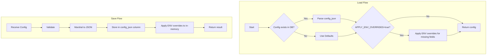

# Single JSON Config Column Refactor Plan

## Problem Statement

The current `configs` table has accumulated many individual columns over time (16+ migrations), making it cumbersome to:
1. Add new configuration fields (requires migration for both SQLite and PostgreSQL)
2. Maintain the QueryBuilder with dialect-specific SQL
3. Keep `dbConfigRow`, `Load()`, and `Save()` methods in sync

### Current Schema (configs table)
```sql
-- Individual columns (require migration for each new field)
version, upstream_url, upstream_credential_id, port,
idle_timeout_ms, stream_deadline_ms, max_generation_time_ms,
max_stream_buffer_size, sse_heartbeat_enabled,
race_retry_enabled, race_parallel_on_idle, race_max_parallel, race_max_buffer_bytes,
log_raw_upstream_response, log_raw_upstream_on_error, log_raw_upstream_max_kb,
updated_at

-- Already JSON columns
loop_detection_json, tool_repair_json, ultimate_model_json
```

## Proposed Solution

Replace all individual columns with a **single `config_json` column** that stores the entire configuration as JSON.

### New Schema
```sql
CREATE TABLE configs (
    id INTEGER PRIMARY KEY CHECK (id = 1),
    config_json TEXT NOT NULL DEFAULT '{}',
    updated_at TEXT NOT NULL DEFAULT (datetime('now'))
);
```

### Configuration Precedence (as requested)
```
DB JSON value → ENV override (if APPLY_ENV_OVERRIDES=true) → Default hardcoded
```

## Architecture



## Implementation Plan

### Phase 1: Database Schema Change

#### Task 1.1: Create new migration files
- [ ] Create `017 consolidate_config_json.up.sql` for SQLite
- [ ] Create `017 consolidate_config_json.up.sql` for PostgreSQL
- [ ] Update `migrate.go` to register new migration

**SQLite Migration:**
```sql
-- Migration 017: Replace config table with single JSON column
-- Note: No data migration needed - fresh start with new schema

DROP TABLE IF EXISTS configs;

CREATE TABLE configs (
    id INTEGER PRIMARY KEY CHECK (id = 1),
    config_json TEXT NOT NULL DEFAULT '{}',
    updated_at TEXT NOT NULL DEFAULT (datetime('now'))
);
```

**PostgreSQL Migration:**
```sql
-- Migration 017: Replace config table with single JSON column
-- Note: No data migration needed - fresh start with new schema

DROP TABLE IF EXISTS configs;

CREATE TABLE configs (
    id INTEGER PRIMARY KEY DEFAULT 1,
    config_json JSONB NOT NULL DEFAULT '{}',
    updated_at TIMESTAMP WITH TIME ZONE DEFAULT NOW()
);
```

### Phase 2: Code Refactoring

#### Task 2.1: Simplify QueryBuilder
Remove complex `GetConfig()`, `UpdateConfig()`, `UpsertConfig()` methods and replace with simple JSON-based queries:

```go
// GetConfig returns the config JSON
func (q *QueryBuilder) GetConfig() string {
    return `SELECT config_json, updated_at FROM configs WHERE id = 1`
}

// UpdateConfig updates the config JSON
func (q *QueryBuilder) UpdateConfig() string {
    if q.dialect == PostgreSQL {
        return `UPDATE configs SET config_json = $1, updated_at = NOW() WHERE id = 1`
    }
    return `UPDATE configs SET config_json = ?, updated_at = datetime('now') WHERE id = 1`
}
```

#### Task 2.2: Simplify dbConfigRow struct
```go
// dbConfigRow represents a row from the configs table
type dbConfigRow struct {
    ConfigJSON string
    UpdatedAt  string
}
```

#### Task 2.3: Refactor ConfigManager.Load()
```go
func (m *ConfigManager) Load() error {
    m.mu.Lock()
    defer m.mu.Unlock()

    // Step 1: Start with defaults
    cfg := config.Defaults

    // Step 2: Load from database JSON
    var dbCfg dbConfigRow
    err := m.store.DB.QueryRowContext(...).Scan(&dbCfg.ConfigJSON, &dbCfg.UpdatedAt)
    
    if err == nil && dbCfg.ConfigJSON != "" && dbCfg.ConfigJSON != "{}" {
        // Parse stored JSON into config
        if err := json.Unmarshal([]byte(dbCfg.ConfigJSON), &cfg); err != nil {
            log.Printf("Warning: failed to parse config JSON, using defaults: %v", err)
            cfg = config.Defaults
        }
    }

    // Step 3: Apply ENV overrides (if APPLY_ENV_OVERRIDES=true)
    // Only override fields where ENV var is explicitly set
    cfg = config.ApplyEnvOverrides(cfg)

    m.cfg = cfg
    return nil
}
```

#### Task 2.4: Refactor ConfigManager.Save()
```go
func (m *ConfigManager) Save(cfg config.Config) (*config.SaveResult, error) {
    // Validate
    if err := cfg.Validate(); err != nil {
        return nil, fmt.Errorf("validation failed: %w", err)
    }

    m.mu.Lock()
    defer m.mu.Unlock()

    // Marshal to JSON
    configJSON, err := json.Marshal(cfg)
    if err != nil {
        return nil, fmt.Errorf("failed to serialize config: %w", err)
    }

    // Save to database
    query := m.qb.UpdateConfig()
    _, err = m.store.DB.ExecContext(..., string(configJSON))
    if err != nil {
        return nil, fmt.Errorf("failed to save config: %w", err)
    }

    // Apply ENV overrides to in-memory config
    m.cfg = config.ApplyEnvOverrides(cfg)

    return &config.SaveResult{}, nil
}
```

#### Task 2.5: Remove merge functions
Delete the complex `mergeConfig()`, `isLoopDetectionProvided()`, `isToolRepairProvided()`, etc. functions since the frontend will send complete config objects.

### Phase 3: ENV Override Refinement

#### Task 3.1: Update ApplyEnvOverrides
Modify the function to only override fields where the ENV var is explicitly set (not empty):

```go
func ApplyEnvOverrides(cfg Config) Config {
    // Check if ENV overrides are enabled
    if os.Getenv("APPLY_ENV_OVERRIDES") == "" {
        return cfg
    }

    // Only override if ENV var exists and is non-empty
    if v := os.Getenv("UPSTREAM_URL"); v != "" {
        cfg.UpstreamURL = v
    }
    // ... etc

    return cfg
}
```

### Phase 4: Testing

#### Task 4.1: Update existing tests
- [ ] Update `config_test.go` for new JSON-based storage

#### Task 4.2: Add new tests
- [ ] Test ENV override precedence
- [ ] Test JSON serialization/deserialization

## Mock Test Requirements

This section defines the mock-based testing strategy for the JSON config refactor, following the patterns established in [`test/mock_llm.go`](test/mock_llm.go) and [`test/mock_llm_race.go`](test/mock_llm_race.go).

### 1. Mock Database Test

Create a mock implementation for testing JSON config storage without a real database connection.

#### Mock QueryBuilder Interface

```go
// MockQueryBuilder implements the QueryBuilder interface for testing
type MockQueryBuilder struct {
    dialect string
    queries map[string]string
}

func NewMockQueryBuilder(dialect string) *MockQueryBuilder {
    return &MockQueryBuilder{
        dialect: dialect,
        queries: map[string]string{
            "GetConfig":    "SELECT config_json, updated_at FROM configs WHERE id = 1",
            "UpdateConfig": "UPDATE configs SET config_json = ?, updated_at = ? WHERE id = 1",
            "UpsertConfig": "INSERT INTO configs (id, config_json) VALUES (1, ?) ON CONFLICT DO UPDATE SET config_json = ?",
        },
    }
}

func (m *MockQueryBuilder) GetConfig() string {
    return m.queries["GetConfig"]
}

func (m *MockQueryBuilder) UpdateConfig() string {
    return m.queries["UpdateConfig"]
}

func (m *MockQueryBuilder) UpsertConfig() string {
    return m.queries["UpsertConfig"]
}
```

#### Mock Database Store

```go
// MockStore simulates database operations with in-memory storage
type MockStore struct {
    mu         sync.RWMutex
    configJSON string
    updatedAt  string
    callCount  map[string]int
    errors     map[string]error // Inject errors for specific operations
}

func NewMockStore() *MockStore {
    return &MockStore{
        configJSON: "{}",
        updatedAt:  time.Now().Format(time.RFC3339),
        callCount:  make(map[string]int),
        errors:     make(map[string]error),
    }
}

// GetConfig simulates retrieving config from database
func (m *MockStore) GetConfig() (configJSON, updatedAt string, err error) {
    m.mu.RLock()
    defer m.mu.RUnlock()
    m.callCount["GetConfig"]++
    
    if err := m.errors["GetConfig"]; err != nil {
        return "", "", err
    }
    return m.configJSON, m.updatedAt, nil
}

// SetConfig simulates storing config to database
func (m *MockStore) SetConfig(configJSON string) error {
    m.mu.Lock()
    defer m.mu.Unlock()
    m.callCount["SetConfig"]++
    
    if err := m.errors["SetConfig"]; err != nil {
        return err
    }
    m.configJSON = configJSON
    m.updatedAt = time.Now().Format(time.RFC3339)
    return nil
}

// InjectError allows tests to simulate database errors
func (m *MockStore) InjectError(operation string, err error) {
    m.mu.Lock()
    defer m.mu.Unlock()
    m.errors[operation] = err
}

// GetCallCount returns how many times an operation was called
func (m *MockStore) GetCallCount(operation string) int {
    m.mu.RLock()
    defer m.mu.RUnlock()
    return m.callCount[operation]
}
```

### 2. Mock Config Manager Test

Testing [`ConfigManager`](pkg/store/database/store.go) with mocked dependencies.

#### Test Harness

```go
// MockConfigManagerTest provides a test harness for ConfigManager
type MockConfigManagerTest struct {
    store    *MockStore
    qb       *MockQueryBuilder
    manager  *ConfigManager
    envBackup map[string]string
}

func NewMockConfigManagerTest() *MockConfigManagerTest {
    store := NewMockStore()
    qb := NewMockQueryBuilder("sqlite")
    
    return &MockConfigManagerTest{
        store:    store,
        qb:       qb,
        manager:  NewConfigManagerWithDeps(store, qb),
        envBackup: make(map[string]string),
    }
}

// SetEnv sets an environment variable and tracks it for cleanup
func (t *MockConfigManagerTest) SetEnv(key, value string) {
    // Backup original value
    if orig, exists := os.LookupEnv(key); exists {
        t.envBackup[key] = orig
    }
    os.Setenv(key, value)
}

// RestoreEnv restores all modified environment variables
func (t *MockConfigManagerTest) RestoreEnv() {
    for key, value := range t.envBackup {
        os.Setenv(key, value)
    }
    // Clear any variables that were set but didn't exist before
    for _, key := range os.Environ() {
        if _, exists := t.envBackup[key]; !exists {
            os.Unsetenv(key)
        }
    }
}
```

#### Load() Test Cases

```go
func TestConfigManager_Load(t *testing.T) {
    tests := []struct {
        name        string
        storedJSON  string
        envVars     map[string]string
        wantConfig  config.Config
        wantErr     bool
    }{
        {
            name:       "empty config JSON returns defaults",
            storedJSON: "{}",
            wantConfig: config.Defaults,
        },
        {
            name:       "partial config merges with defaults",
            storedJSON: `{"upstream_url": "https://api.example.com"}`,
            wantConfig: func() config.Config {
                cfg := config.Defaults
                cfg.UpstreamURL = "https://api.example.com"
                return cfg
            }(),
        },
        {
            name:       "full config from JSON",
            storedJSON: `{"upstream_url": "https://api.example.com", "port": 8080, "race_retry_enabled": true}`,
            wantConfig: config.Config{
                UpstreamURL:     "https://api.example.com",
                Port:           8080,
                RaceRetryEnabled: true,
            },
        },
        {
            name:       "ENV override applies when APPLY_ENV_OVERRIDES is set",
            storedJSON: `{"upstream_url": "https://db.example.com"}`,
            envVars: map[string]string{
                "APPLY_ENV_OVERRIDES": "true",
                "UPSTREAM_URL":        "https://env.example.com",
            },
            wantConfig: func() config.Config {
                cfg := config.Defaults
                cfg.UpstreamURL = "https://env.example.com" // ENV overrides DB
                return cfg
            }(),
        },
        {
            name:       "ENV override skipped when APPLY_ENV_OVERRIDES is not set",
            storedJSON: `{"upstream_url": "https://db.example.com"}`,
            envVars: map[string]string{
                "UPSTREAM_URL": "https://env.example.com",
            },
            wantConfig: func() config.Config {
                cfg := config.Defaults
                cfg.UpstreamURL = "https://db.example.com" // DB value preserved
                return cfg
            }(),
        },
        {
            name:       "only non-empty ENV vars override",
            storedJSON: `{"upstream_url": "https://db.example.com", "port": 8080}`,
            envVars: map[string]string{
                "APPLY_ENV_OVERRIDES": "true",
                "UPSTREAM_URL":        "", // Empty, should NOT override
                "PORT":                "9090",
            },
            wantConfig: func() config.Config {
                cfg := config.Defaults
                cfg.UpstreamURL = "https://db.example.com" // Preserved (ENV was empty)
                cfg.Port = 9090 // Overridden by ENV
                return cfg
            }(),
        },
        {
            name:       "invalid JSON falls back to defaults with warning",
            storedJSON: `{invalid json}`,
            wantConfig: config.Defaults,
            wantErr:    false, // Should not error, just log warning
        },
    }

    for _, tt := range tests {
        t.Run(tt.name, func(t *testing.T) {
            harness := NewMockConfigManagerTest()
            defer harness.RestoreEnv()

            // Setup stored JSON
            harness.store.SetConfig(tt.storedJSON)

            // Set ENV vars
            for k, v := range tt.envVars {
                harness.SetEnv(k, v)
            }

            // Execute Load
            err := harness.manager.Load()
            if (err != nil) != tt.wantErr {
                t.Errorf("Load() error = %v, wantErr %v", err, tt.wantErr)
            }

            // Verify config
            got := harness.manager.Get()
            if !reflect.DeepEqual(got, tt.wantConfig) {
                t.Errorf("Load() config = %+v, want %+v", got, tt.wantConfig)
            }
        })
    }
}
```

#### Save() Test Cases

```go
func TestConfigManager_Save(t *testing.T) {
    tests := []struct {
        name       string
        inputCfg   config.Config
        envVars    map[string]string
        wantJSON   string
        wantErr    bool
        setupError error // Error to inject into mock store
    }{
        {
            name:     "save valid config",
            inputCfg: config.Config{UpstreamURL: "https://api.example.com", Port: 8080},
            wantJSON: `{"upstream_url":"https://api.example.com","port":8080}`,
        },
        {
            name:     "save applies ENV overrides to in-memory but not DB",
            inputCfg: config.Config{UpstreamURL: "https://api.example.com"},
            envVars: map[string]string{
                "APPLY_ENV_OVERRIDES": "true",
                "PORT":                "9999",
            },
            wantJSON: `{"upstream_url":"https://api.example.com"}`, // DB gets original
            // But Get() should return config with PORT=9999
        },
        {
            name:       "database error returns error",
            inputCfg:   config.Config{UpstreamURL: "https://api.example.com"},
            setupError: errors.New("database connection failed"),
            wantErr:    true,
        },
        {
            name:     "save with nested config objects",
            inputCfg: config.Config{
                UpstreamURL: "https://api.example.com",
                LoopDetection: config.LoopDetectionConfig{
                    Enabled:     true,
                    ShadowMode:  false,
                    MaxRepeats:  5,
                },
            },
            wantJSON: `{"upstream_url":"https://api.example.com","loop_detection":{"enabled":true,"shadow_mode":false,"max_repeats":5}}`,
        },
    }

    for _, tt := range tests {
        t.Run(tt.name, func(t *testing.T) {
            harness := NewMockConfigManagerTest()
            defer harness.RestoreEnv()

            // Set ENV vars
            for k, v := range tt.envVars {
                harness.SetEnv(k, v)
            }

            // Inject error if specified
            if tt.setupError != nil {
                harness.store.InjectError("SetConfig", tt.setupError)
            }

            // Execute Save
            _, err := harness.manager.Save(tt.inputCfg)
            if (err != nil) != tt.wantErr {
                t.Errorf("Save() error = %v, wantErr %v", err, tt.wantErr)
            }

            if !tt.wantErr {
                // Verify stored JSON
                gotJSON, _, _ := harness.store.GetConfig()
                if !jsonEqual(gotJSON, tt.wantJSON) {
                    t.Errorf("Save() stored JSON = %v, want %v", gotJSON, tt.wantJSON)
                }
            }
        })
    }
}
```

### 3. Test Cases to Cover

#### Empty Config JSON `{}` Handling

```go
func TestEmptyConfigJSON(t *testing.T) {
    harness := NewMockConfigManagerTest()
    defer harness.RestoreEnv()

    // Store empty JSON
    harness.store.SetConfig("{}")

    // Load should return defaults
    err := harness.manager.Load()
    require.NoError(t, err)

    got := harness.manager.Get()
    assert.Equal(t, config.Defaults, got)
}
```

#### Partial Config Updates

```go
func TestPartialConfigUpdates(t *testing.T) {
    harness := NewMockConfigManagerTest()
    defer harness.RestoreEnv()

    // Initial full config
    initialCfg := config.Config{
        UpstreamURL: "https://api1.example.com",
        Port:        4321,
        RaceRetryEnabled: true,
    }
    _, err := harness.manager.Save(initialCfg)
    require.NoError(t, err)

    // Update only one field
    partialCfg := config.Config{
        UpstreamURL: "https://api2.example.com",
        // Other fields should be preserved from the concept of "patch"
        // Note: Current design expects full config, this tests that behavior
    }
    _, err = harness.manager.Save(partialCfg)
    require.NoError(t, err)

    // Verify the stored config
    got := harness.manager.Get()
    assert.Equal(t, "https://api2.example.com", got.UpstreamURL)
    // Port and other fields should be from partialCfg (which has defaults for unspecified)
}
```

#### Invalid JSON Handling

```go
func TestInvalidJSONHandling(t *testing.T) {
    tests := []struct {
        name    string
        badJSON string
    }{
        {
            name:    "malformed JSON",
            badJSON: `{invalid json}`,
        },
        {
            name:    "truncated JSON",
            badJSON: `{"upstream_url": "https://api.example.com"`,
        },
        {
            name:    "wrong types",
            badJSON: `{"port": "not a number"}`,
        },
        {
            name:    "null values",
            badJSON: `{"upstream_url": null}`,
        },
    }

    for _, tt := range tests {
        t.Run(tt.name, func(t *testing.T) {
            harness := NewMockConfigManagerTest()
            harness.store.SetConfig(tt.badJSON)

            // Load should not error, should fall back to defaults
            err := harness.manager.Load()
            require.NoError(t, err)

            // Should have defaults
            got := harness.manager.Get()
            assert.Equal(t, config.Defaults, got)
        })
    }
}
```

#### Large Config JSON (Size Limits)

```go
func TestLargeConfigJSON(t *testing.T) {
    harness := NewMockConfigManagerTest()
    defer harness.RestoreEnv()

    // Create a config with a very large string field
    largeString := strings.Repeat("x", 1024*1024) // 1MB string
    largeCfg := config.Config{
        UpstreamURL: "https://api.example.com",
        // Assuming there's a field that could be large
        // If not, test with nested JSON in existing JSON columns
    }

    // Save should handle large configs appropriately
    // Option 1: Reject if too large
    // Option 2: Accept but warn
    _, err := harness.manager.Save(largeCfg)
    
    // Define expected behavior:
    // - If we want to reject large configs:
    //   assert.Error(t, err)
    //   assert.Contains(t, err.Error(), "too large")
    // - If we accept them:
    //   assert.NoError(t, err)
    
    // For now, assume we accept but document the behavior
}

func TestConfigJSONSizeLimit(t *testing.T) {
    // Test that we enforce a reasonable size limit (e.g., 64KB)
    const maxConfigSize = 64 * 1024
    
    harness := NewMockConfigManagerTest()
    
    // Create config that exceeds limit
    oversizedJSON := fmt.Sprintf(`{"upstream_url": "%s"}`, strings.Repeat("x", maxConfigSize))
    
    err := harness.store.SetConfig(oversizedJSON)
    // Depending on implementation, this might error or truncate
}
```

#### Concurrent Read/Write Scenarios

```go
func TestConcurrentReadWrite(t *testing.T) {
    harness := NewMockConfigManagerTest()
    defer harness.RestoreEnv()

    // Initial config
    initialCfg := config.Config{UpstreamURL: "https://initial.example.com"}
    _, err := harness.manager.Save(initialCfg)
    require.NoError(t, err)

    var wg sync.WaitGroup
    errors := make(chan error, 100)

    // Start multiple readers
    for i := 0; i < 10; i++ {
        wg.Add(1)
        go func(id int) {
            defer wg.Done()
            for j := 0; j < 100; j++ {
                cfg := harness.manager.Get()
                if cfg.UpstreamURL == "" {
                    errors <- fmt.Errorf("reader %d: got empty UpstreamURL", id)
                }
                time.Sleep(time.Microsecond)
            }
        }(i)
    }

    // Start multiple writers
    for i := 0; i < 5; i++ {
        wg.Add(1)
        go func(id int) {
            defer wg.Done()
            for j := 0; j < 20; j++ {
                cfg := config.Config{
                    UpstreamURL: fmt.Sprintf("https://writer%d-%d.example.com", id, j),
                }
                if _, err := harness.manager.Save(cfg); err != nil {
                    errors <- fmt.Errorf("writer %d: %w", id, err)
                }
                time.Sleep(time.Microsecond * 10)
            }
        }(i)
    }

    // Wait and check for errors
    wg.Wait()
    close(errors)

    for err := range errors {
        t.Errorf("concurrent access error: %v", err)
    }
}

func TestConcurrentLoadSave(t *testing.T) {
    harness := NewMockConfigManagerTest()
    defer harness.RestoreEnv()

    var wg sync.WaitGroup
    
    // Simulate multiple processes loading and saving
    for i := 0; i < 5; i++ {
        wg.Add(1)
        go func(id int) {
            defer wg.Done()
            
            // Load
            if err := harness.manager.Load(); err != nil {
                t.Errorf("load failed: %v", err)
                return
            }
            
            // Modify
            cfg := harness.manager.Get()
            cfg.Port = 8000 + id
            
            // Save
            if _, err := harness.manager.Save(cfg); err != nil {
                t.Errorf("save failed: %v", err)
            }
        }(i)
    }
    
    wg.Wait()
    
    // Final load should work
    require.NoError(t, harness.manager.Load())
    cfg := harness.manager.Get()
    assert.NotEmpty(t, cfg.UpstreamURL)
}
```

#### ENV Override Precedence

```go
func TestENVOverridePrecedence(t *testing.T) {
    tests := []struct {
        name       string
        dbJSON     string
        envVars    map[string]string
        wantConfig config.Config
    }{
        {
            name:   "non-empty ENV overrides DB value",
            dbJSON: `{"upstream_url": "https://db.example.com", "port": 4321}`,
            envVars: map[string]string{
                "APPLY_ENV_OVERRIDES": "true",
                "UPSTREAM_URL":        "https://env.example.com",
            },
            wantConfig: config.Config{
                UpstreamURL: "https://env.example.com", // ENV wins
                Port:        4321,                       // DB value preserved
            },
        },
        {
            name:   "empty ENV does NOT override DB value",
            dbJSON: `{"upstream_url": "https://db.example.com", "port": 4321}`,
            envVars: map[string]string{
                "APPLY_ENV_OVERRIDES": "true",
                "UPSTREAM_URL":        "", // Empty - should not override
            },
            wantConfig: config.Config{
                UpstreamURL: "https://db.example.com", // DB preserved
                Port:        4321,
            },
        },
        {
            name:   "ENV unset does not override",
            dbJSON: `{"upstream_url": "https://db.example.com"}`,
            envVars: map[string]string{
                "APPLY_ENV_OVERRIDES": "true",
                // UPSTREAM_URL not set at all
            },
            wantConfig: config.Config{
                UpstreamURL: "https://db.example.com",
            },
        },
        {
            name:   "APPLY_ENV_OVERRIDES=false prevents all overrides",
            dbJSON: `{"upstream_url": "https://db.example.com"}`,
            envVars: map[string]string{
                "APPLY_ENV_OVERRIDES": "false",
                "UPSTREAM_URL":        "https://env.example.com",
            },
            wantConfig: config.Config{
                UpstreamURL: "https://db.example.com", // DB preserved
            },
        },
        {
            name:   "APPLY_ENV_OVERRIDES unset prevents all overrides",
            dbJSON: `{"upstream_url": "https://db.example.com"}`,
            envVars: map[string]string{
                // APPLY_ENV_OVERRIDES not set
                "UPSTREAM_URL": "https://env.example.com",
            },
            wantConfig: config.Config{
                UpstreamURL: "https://db.example.com", // DB preserved
            },
        },
        {
            name:   "boolean ENV parsing",
            dbJSON: `{"race_retry_enabled": false}`,
            envVars: map[string]string{
                "APPLY_ENV_OVERRIDES": "true",
                "RACE_RETRY_ENABLED":  "true",
            },
            wantConfig: config.Config{
                RaceRetryEnabled: true, // ENV overrides
            },
        },
        {
            name:   "duration ENV parsing",
            dbJSON: `{"idle_timeout": "30s"}`,
            envVars: map[string]string{
                "APPLY_ENV_OVERRIDES": "true",
                "IDLE_TIMEOUT":        "120s",
            },
            wantConfig: config.Config{
                IdleTimeout: config.Duration(120 * time.Second),
            },
        },
    }

    for _, tt := range tests {
        t.Run(tt.name, func(t *testing.T) {
            harness := NewMockConfigManagerTest()
            defer harness.RestoreEnv()

            // Setup DB JSON
            harness.store.SetConfig(tt.dbJSON)

            // Set ENV vars
            for k, v := range tt.envVars {
                harness.SetEnv(k, v)
            }

            // Load
            require.NoError(t, harness.manager.Load())

            // Verify
            got := harness.manager.Get()
            assert.Equal(t, tt.wantConfig.UpstreamURL, got.UpstreamURL)
            assert.Equal(t, tt.wantConfig.Port, got.Port)
            
            if tt.wantConfig.RaceRetryEnabled != got.RaceRetryEnabled {
                t.Errorf("RaceRetryEnabled = %v, want %v", got.RaceRetryEnabled, tt.wantConfig.RaceRetryEnabled)
            }
        })
    }
}
```

### 5. Test File Location

Create the mock test file at:

```
pkg/store/database/config_json_test.go
```

This follows the Go convention of placing tests alongside the code they test.

### 4. Running the Tests

```bash
# Run all config tests
go test ./pkg/store/database/... -v -run Config

# Run specific test categories
go test ./pkg/store/database/... -v -run TestConfigManager
go test ./pkg/store/database/... -v -run TestConcurrent

# Run with race detector
go test ./pkg/store/database/... -race -v

# Run with coverage
go test ./pkg/store/database/... -coverprofile=coverage.out
go tool cover -html=coverage.out
```

### Phase 5: Cleanup

#### Task 5.1: Remove deprecated code
- [ ] Remove old column references from QueryBuilder
- [ ] Remove old dbConfigRow fields
- [ ] Remove merge functions

#### Task 5.2: Update documentation
- [ ] Update AGENTS.md with new config architecture
- [ ] Update README.md if needed

## Benefits

1. **No more migrations for new fields** - Just add to Config struct and Defaults
2. **Simpler code** - Remove 200+ lines of merge logic and column mapping
3. **Type safety** - Go struct remains the source of truth
4. **Flexible** - Easy to add nested configs without schema changes
5. **Consistent** - Same pattern as existing `loop_detection_json`, etc.

## Risks and Mitigations

| Risk | Mitigation |
|------|------------|
| JSON parsing errors | Fallback to defaults, log warning |
| Performance impact | JSON parsing is fast for small configs (~1KB) |
| Breaking existing deployments | Fresh start - no data migration required |

## Rollback Plan

If issues arise:
1. Revert to previous version of the code
2. The DROP TABLE approach means fresh deployment - no data to recover
3. For production: backup configs table before deployment if needed

## Files to Modify

| File | Changes |
|------|---------|
| `pkg/store/database/migrations/sqlite/017_consolidate_config_json.up.sql` | New migration |
| `pkg/store/database/migrations/postgres/017_consolidate_config_json.up.sql` | New migration |
| `pkg/store/database/migrate.go` | Register new migration |
| `pkg/store/database/store.go` | Simplify ConfigManager |
| `pkg/store/database/querybuilder.go` | Simplify queries |
| `pkg/config/config.go` | Keep as-is (struct is source of truth) |
| `pkg/config/config_test.go` | Update tests |

## Estimated Complexity

- **Database Schema Change:** Low (DROP and CREATE - no data migration)
- **Code Refactoring:** Low-Medium (simplification)
- **Testing:** Medium (ensure backward compatibility)
- **Risk:** Low (fallback to defaults on error)

## Summary

This refactoring consolidates 16+ individual columns into a single JSON column, eliminating the need for future schema migrations when adding configuration fields. The precedence order (DB JSON → ENV override → Default) ensures flexibility while maintaining backward compatibility.
