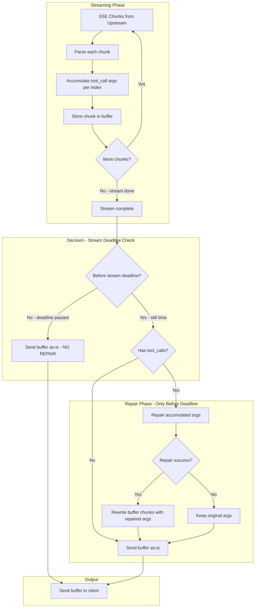

# Plan: Fix Streaming Tool Call Repair

> **Status:** ✅ IMPLEMENTED
> **Original Plan:** Streaming tool call repair fix
> **Review:** See [`streaming-toolcall-repair-fix-review.md`](streaming-toolcall-repair-fix-review.md) for detailed analysis
> **Last Updated:** 2026-03-18

## Problem Statement

The current tool call repair design is **broken for streaming responses** because it attempts to repair each SSE chunk individually, but tool call arguments are **incrementally streamed** across multiple chunks.

### Current Behavior (Broken)

```
Chunk 1: {"delta": {"tool_calls": [{"function": {"arguments": "{"}}]}}         ← Repair attempts: "{" (invalid, can't fix)
Chunk 2: {"delta": {"tool_calls": [{"function": {"arguments": "\"location\":"}}]}} ← Repair attempts: "\"location\":" (invalid)
Chunk 3: {"delta": {"tool_calls": [{"function": {"arguments": " \"Paris\""}]}}    ← Repair attempts: " \"Paris\"" (invalid)
Chunk 4: {"delta": {"tool_calls": [{"function": {"arguments": "}"}}]}}           ← Repair attempts: "}" (invalid)
```

Each chunk contains **partial JSON** that cannot be meaningfully repaired in isolation.

### Expected Behavior

```
1. Accumulate: "{" + "\"location\":" + " \"Paris\"" + "}" = "{\"location\": \"Paris\"}"
2. Repair: Fix the complete accumulated JSON (ONLY if before stream deadline)
3. Reconstruct: Rewrite chunks with repaired arguments
```

### Important Constraint

**Tool repair only applies BEFORE stream deadline is reached.**

After the stream deadline (`STREAM_DEADLINE` config), the proxy releases the buffer to the client immediately - no repair is attempted. This ensures:
- Low latency for the common case (stream completes quickly)
- No repair overhead after deadline (client already waiting too long)
- Graceful degradation: malformed JSON is better than timeout

---

## Architecture Analysis

### What Works

| Component | Status | Notes |
|-----------|--------|-------|
| Non-streaming repair | ✅ Works | [`repairToolCallArgumentsInNonStreamingResponse()`](pkg/proxy/race_executor.go:608) handles complete JSON |
| Tool call accumulation | ✅ Exists | [`handler_helpers.go:317-362`](pkg/proxy/handler_helpers.go:317) accumulates args via `toolCallArgBuilders` |
| Stream buffering | ✅ Exists | Race retry buffers entire stream before sending to client |

### What's Broken

| Component | Issue |
|-----------|-------|
| [`repairToolCallArgumentsInChunk()`](pkg/proxy/race_executor.go:694) | Repairs partial JSON per-chunk |
| [`ToolCallArgumentsRepairNormalizer`](pkg/proxy/normalizers/tool_call_repair.go:53) | Same issue - per-chunk repair |

---

## Solution Design

### Key Insight

The proxy **already buffers the entire stream** for race retry. We can leverage this to:

1. **Accumulate** tool call arguments during streaming (already done)
2. **After stream completes**, repair the accumulated arguments
3. **Rewrite** the buffered chunks with repaired arguments
4. **Send** repaired chunks to client

### Flow Diagram



---

## Implementation Plan (Enhanced)

### Phase 1: Create Lightweight Accumulator Wrapper

**Goal:** Wrap existing accumulation pattern for use in race executor.

**File:** `pkg/proxy/tool_call_accumulator.go` (new)

```go
// ToolCallAccumulator wraps the existing accumulation pattern
// for use in race_executor.go. It reuses the memory-efficient
// strings.Builder pattern from handler_helpers.go
type ToolCallAccumulator struct {
    mu sync.Mutex
    // args[index] = accumulated arguments string builder
    args map[int]*strings.Builder
    // Track tool call metadata per index
    metadata map[int]ToolCallMeta
}

type ToolCallMeta struct {
    ID   string
    Type string
    Name string
}

// ProcessChunk extracts and accumulates tool calls from a streaming chunk
// This is a side-effect - the chunk is passed through unchanged
func (a *ToolCallAccumulator) ProcessChunk(line []byte) error

// GetAccumulatedArgs returns all accumulated arguments
// Returns map[index]completeArgsString
func (a *ToolCallAccumulator) GetAccumulatedArgs() map[int]string

// HasToolCalls returns true if any tool calls were accumulated
func (a *ToolCallAccumulator) HasToolCalls() bool
```

**Why this is better than original plan:**
- Lightweight wrapper, not a complete reimplementation
- Thread-safe for potential parallel access
- Returns simple map for easy repair processing
- Leverages existing patterns from `handler_helpers.go`

### Phase 2: Modify Streaming Handlers

**File:** `pkg/proxy/race_executor.go`

#### 2.1 Modify `handleStreamingResponse()`

```go
func handleStreamingResponse(ctx context.Context, cfg *ConfigSnapshot, resp *http.Response, req *upstreamRequest, provider string) error {
    // ... existing setup ...
    
    // NEW: Create accumulator for this stream
    accumulator := NewToolCallAccumulator()
    streamStartTime := time.Now()
    
    for {
        // ... existing read logic ...
        
        if len(line) > 0 {
            // NEW: Accumulate tool calls BEFORE normalization
            accumulator.ProcessChunk(line)
            
            // ... existing normalization and buffering ...
            
            // REMOVE: Per-chunk repair (lines 884-904)
        }
        
        // ... rest of loop ...
    }
    
    // NEW: Post-stream repair (only if before deadline)
    if sawDone && accumulator.HasToolCalls() {
        if !isPastDeadline(streamStartTime, cfg.StreamDeadline) {
            repairedArgs := repairAccumulatedArgs(accumulator.GetAccumulatedArgs(), cfg.ToolRepair)
            if len(repairedArgs) > 0 {
                req.buffer = rewriteBufferWithRepairedArgs(req.buffer, repairedArgs)
            }
        } else {
            log.Printf("[TOOL-REPAIR] Stream completed after deadline, skipping repair for latency")
        }
    }
    
    return nil
}

func isPastDeadline(startTime time.Time, deadline Duration) bool {
    return time.Since(startTime) > time.Duration(deadline)
}
```

#### 2.2 Modify `handleInternalStream()`

Same pattern as above:
- Add accumulator at start
- Call `accumulator.ProcessChunk()` for each chunk
- Remove per-chunk repair at lines 339-345
- Add post-stream repair after "done" event

### Phase 3: Implement Buffer Rewriting

**File:** `pkg/proxy/buffer_rewriter.go` (new)

```go
// rewriteBufferWithRepairedArgs creates a new buffer with repaired tool call arguments
// This is a memory-efficient implementation that only rewrites chunks containing tool_calls
func rewriteBufferWithRepairedArgs(oldBuffer *streamBuffer, repairedArgs map[int]string) *streamBuffer {
    // Get all chunks from old buffer
    chunks, _ := oldBuffer.GetChunksFrom(0)
    
    // Create new buffer
    newBuffer := newStreamBuffer(oldBuffer.maxBytes)
    
    for _, chunk := range chunks {
        // Check if chunk contains tool_calls
        if hasToolCalls(chunk) {
            // Parse, repair, re-serialize
            repairedChunk := repairChunkArgs(chunk, repairedArgs)
            newBuffer.Add(repairedChunk)
        } else {
            // Pass through unchanged
            newBuffer.Add(bytes.TrimSuffix(chunk, []byte("\n")))
        }
    }
    
    return newBuffer
}

// hasToolCalls checks if a chunk contains tool_calls in delta
func hasToolCalls(chunk []byte) bool {
    // Quick string check before JSON parsing
    return bytes.Contains(chunk, []byte("tool_calls"))
}

// repairChunkArgs repairs tool call arguments in a single chunk
func repairChunkArgs(chunk []byte, repairedArgs map[int]string) []byte
```

**Key Design Decisions:**
1. **New buffer instead of in-place:** Safer, allows graceful fallback
2. **Quick string check:** Avoid JSON parsing for non-tool-call chunks
3. **Preserve format:** Maintain "data: " prefix and newlines

### Phase 4: Implement Accumulated Args Repair

**File:** `pkg/proxy/race_executor.go` (add function)

```go
// repairAccumulatedArgs repairs accumulated tool call arguments
// Returns map[index]repairedArgs (only includes indices that were repaired)
func repairAccumulatedArgs(accumulated map[int]string, config toolrepair.Config) map[int]string {
    if !config.Enabled {
        return nil
    }
    
    repairer := toolrepair.NewRepairer(&config)
    repaired := make(map[int]string)
    
    for idx, args := range accumulated {
        // Check if already valid JSON
        var js interface{}
        if json.Unmarshal([]byte(args), &js) == nil {
            continue // Already valid, no repair needed
        }
        
        // Attempt repair
        result := repairer.RepairArguments(args, "")
        if result.Success && result.Repaired != args {
            repaired[idx] = result.Repaired
            log.Printf("[TOOL-REPAIR] Repaired tool_call[%d] arguments: %d -> %d bytes",
                idx, len(args), len(result.Repaired))
        } else if !result.Success {
            log.Printf("[WARN] Tool repair failed for tool_call[%d], using original args", idx)
        }
    }
    
    return repaired
}
```

### Phase 5: Remove Per-Chunk Repair Code

**Files to modify:**

1. **`pkg/proxy/race_executor.go`:**
   - Remove `repairToolCallArgumentsInChunk()` function (lines 692-792)
   - Remove calls to it in `handleStreamingResponse()` (lines 884-904)
   - Remove calls to it in `handleInternalStream()` (lines 339-345)

2. **`pkg/proxy/normalizers/tool_call_repair.go`:**
   - Mark as **DEPRECATED** with clear comment
   - Keep file but add warning that it's broken for streaming

---

## Edge Cases

| Case | Handling | Location |
|------|----------|----------|
| Multiple tool calls | Accumulate by index, repair each | `ToolCallAccumulator` |
| Tool call with no args | Skip repair | `repairAccumulatedArgs` |
| Repair fails | Keep original, log warning | `repairAccumulatedArgs` |
| Stream error mid-way | Don't repair, send what we have | `handleStreamingResponse` |
| Large tool call args | Already handled by buffer limits | `streamBuffer.maxBytes` |
| **Past stream deadline** | **Skip repair entirely** | `isPastDeadline` check |
| Buffer rewrite fails | Fall back to original buffer | `rewriteBufferWithRepairedArgs` |
| Invalid JSON in chunk | Pass through unchanged | `repairChunkArgs` |

---

## Testing Strategy

### Unit Tests

| Test | Description |
|------|-------------|
| `TestToolCallAccumulator_Single` | Single tool call across 4 chunks |
| `TestToolCallAccumulator_Multiple` | Multiple tool calls with different indices |
| `TestToolCallAccumulator_Empty` | No tool calls in stream |
| `TestRepairAccumulatedArgs_Valid` | Already valid JSON - no repair |
| `TestRepairAccumulatedArgs_Malformed` | Malformed JSON - repair succeeds |
| `TestRepairAccumulatedArgs_Unrepairable` | Can't repair - keep original |
| `TestRewriteBuffer_PreservesFormat` | Output format matches input |
| `TestRewriteBuffer_OnlyToolCallChunks` | Non-tool chunks unchanged |
| `TestIsPastDeadline` | Deadline boundary conditions |

### Integration Tests

| Test | Description |
|------|-------------|
| `TestStreamingRepair_EndToEnd` | Full stream with malformed args |
| `TestStreamingRepair_PastDeadline` | Verify repair skipped after deadline |
| `TestStreamingRepair_MultipleToolCalls` | All tool calls repaired correctly |
| `TestInternalStreamRepair` | Same for internal provider path |

---

## Migration Path

1. **Phase 1:** Add accumulator (no behavior change, just accumulation)
2. **Phase 2:** Add post-stream repair behind feature flag
3. **Phase 3:** Enable by default, monitor metrics
4. **Phase 4:** Remove per-chunk repair code

### Feature Flag

Add to config:
```go
type ToolRepairConfig struct {
    Enabled           bool   `json:"enabled"`
    StreamingRepairV2 bool   `json:"streaming_repair_v2"` // New feature flag
    // ... existing fields ...
}
```

---

## Performance Considerations

### Memory Impact

| Operation | Impact | Mitigation |
|-----------|--------|------------|
| Accumulation | +1 copy of args strings | Use strings.Builder (already efficient) |
| Buffer rewrite | +1 temporary buffer | Only when repair needed |
| JSON parsing | CPU overhead | Quick string check first |

### Latency Impact

| Scenario | Impact |
|----------|--------|
| No tool calls | None (early exit) |
| Valid tool calls | Minimal (validation only) |
| Malformed tool calls | +repair time (before deadline only) |
| Past deadline | None (repair skipped) |

---

## Summary

| Aspect | Current | Proposed |
|--------|---------|----------|
| Repair timing | Per-chunk (broken) | Post-stream (correct) |
| Repair input | Partial JSON | Complete accumulated JSON |
| Buffer handling | Modify in-place | Rewrite after repair |
| Complexity | Low (but broken) | Medium (but correct) |

---

## Files Changed Summary

| File | Action | Lines Changed |
|------|--------|---------------|
| `pkg/proxy/tool_call_accumulator.go` | **NEW** | ~100 |
| `pkg/proxy/buffer_rewriter.go` | **NEW** | ~120 |
| `pkg/proxy/race_executor.go` | **MODIFY** | ~50 added, ~120 removed |
| `pkg/proxy/normalizers/tool_call_repair.go` | **DEPRECATE** | ~5 (comments) |
| `pkg/proxy/tool_call_accumulator_test.go` | **NEW** | ~200 |
| `pkg/proxy/buffer_rewriter_test.go` | **NEW** | ~150 |

**Total:** ~400 lines added, ~120 lines removed, net ~280 lines

---

## Implementation Checklist

### Step 1: Create ToolCallAccumulator
- [ ] Create `pkg/proxy/tool_call_accumulator.go`
- [ ] Implement `ToolCallAccumulator` struct with `sync.Mutex`, `args map[int]*strings.Builder`, `metadata map[int]ToolCallMeta`
- [ ] Implement `NewToolCallAccumulator()` constructor
- [ ] Implement `ProcessChunk(line []byte) error` - parse SSE chunk, extract tool_calls, accumulate by index
- [ ] Implement `GetAccumulatedArgs() map[int]string` - return accumulated args per index
- [ ] Implement `HasToolCalls() bool` - return true if any tool calls accumulated

### Step 2: Create Buffer Rewriter
- [ ] Create `pkg/proxy/buffer_rewriter.go`
- [ ] Implement `rewriteBufferWithRepairedArgs(oldBuffer *streamBuffer, repairedArgs map[int]string) *streamBuffer`
- [ ] Implement `hasToolCalls(chunk []byte) bool` - quick string check
- [ ] Implement `repairChunkArgs(chunk []byte, repairedArgs map[int]string) []byte` - parse, replace args, re-serialize

### Step 3: Modify handleStreamingResponse()
- [ ] Add `accumulator := NewToolCallAccumulator()` at start (after line 810)
- [ ] Add `streamStartTime := time.Now()` at start
- [ ] Add `accumulator.ProcessChunk(line)` before normalization (around line 863)
- [ ] **REMOVE** per-chunk repair code (lines 884-904)
- [ ] Add post-stream repair logic after `sawDone` check (before line 931)
- [ ] Add `isPastDeadline(startTime time.Time, deadline Duration) bool` helper

### Step 4: Modify handleInternalStream()
- [ ] Add `accumulator := NewToolCallAccumulator()` at start (after line 217)
- [ ] Add `streamStartTime := time.Now()` at start
- [ ] Add `accumulator.ProcessChunk()` for each tool_call chunk (around line 331)
- [ ] **REMOVE** per-chunk repair code (lines 339-345)
- [ ] Add post-stream repair logic after "done" event (before return at line 411)

### Step 5: Add repairAccumulatedArgs()
- [ ] Add `repairAccumulatedArgs(accumulated map[int]string, config toolrepair.Config) map[int]string` to race_executor.go

### Step 6: Deprecate Old Code
- [ ] Add deprecation comment to `repairToolCallArgumentsInChunk()` (lines 692-792)
- [ ] Add deprecation comment to `ToolCallArgumentsRepairNormalizer` in `normalizers/tool_call_repair.go`

### Step 7: Add Unit Tests
- [ ] Create `pkg/proxy/tool_call_accumulator_test.go`
- [ ] Create `pkg/proxy/buffer_rewriter_test.go`
- [ ] Add tests per testing strategy above

### Step 8: Integration Testing
- [ ] Test with mock LLM returning malformed tool call arguments
- [ ] Verify repair happens before deadline
- [ ] Verify repair skipped after deadline
- [ ] Test multiple tool calls in single stream

---

## Key Code Locations (Reference)

| Location | Description |
|----------|-------------|
| [`race_executor.go:694-792`](pkg/proxy/race_executor.go:694) | `repairToolCallArgumentsInChunk()` - TO BE REMOVED |
| [`race_executor.go:884-904`](pkg/proxy/race_executor.go:884) | Per-chunk repair call in `handleStreamingResponse()` - TO BE REMOVED |
| [`race_executor.go:339-345`](pkg/proxy/race_executor.go:339) | Per-chunk repair call in `handleInternalStream()` - TO BE REMOVED |
| [`race_executor.go:799`](pkg/proxy/race_executor.go:799) | `handleStreamingResponse()` start - ADD accumulator here |
| [`race_executor.go:211`](pkg/proxy/race_executor.go:211) | `handleInternalStream()` start - ADD accumulator here |
| [`handler_helpers.go:317-362`](pkg/proxy/handler_helpers.go:317) | Existing accumulation pattern - REFERENCE for implementation |
| [`stream_buffer.go:99-134`](pkg/proxy/stream_buffer.go:99) | `GetChunksFrom()` - USE in buffer rewriter |
| [`normalizers/tool_call_repair.go`](pkg/proxy/normalizers/tool_call_repair.go) | `ToolCallArgumentsRepairNormalizer` - TO BE DEPRECATED |

---

## Verification Steps

After implementation, verify:

1. **Build succeeds:** `make build`
2. **Tests pass:** `go test ./pkg/proxy/...`
3. **No regression:** Existing tool call tests still pass
4. **New functionality:** Malformed tool call args in streaming are repaired
5. **Deadline respected:** Repair skipped when stream completes after deadline
