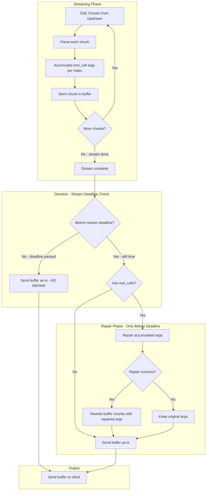

# Plan: Fix Streaming Tool Call Repair

## Problem Statement

The current tool call repair design is **broken for streaming responses** because it attempts to repair each SSE chunk individually, but tool call arguments are **incrementally streamed** across multiple chunks.

### Current Behavior (Broken)

```
Chunk 1: {"delta": {"tool_calls": [{"function": {"arguments": "{"}}]}}         ← Repair attempts: "{" (invalid, can't fix)
Chunk 2: {"delta": {"tool_calls": [{"function": {"arguments": "\"location\":"}}]}} ← Repair attempts: "\"location\":" (invalid)
Chunk 3: {"delta": {"tool_calls": [{"function": {"arguments": " \"Paris\""}]}}    ← Repair attempts: " \"Paris\"" (invalid)
Chunk 4: {"delta": {"tool_calls": [{"function": {"arguments": "}"}}]}}           ← Repair attempts: "}" (invalid)
```

Each chunk contains **partial JSON** that cannot be meaningfully repaired in isolation.

### Expected Behavior

```
1. Accumulate: "{" + "\"location\":" + " \"Paris\"" + "}" = "{\"location\": \"Paris\"}"
2. Repair: Fix the complete accumulated JSON (ONLY if before stream deadline)
3. Reconstruct: Rewrite chunks with repaired arguments
```

### Important Constraint

**Tool repair only applies BEFORE stream deadline is reached.**

After the stream deadline (`STREAM_DEADLINE` config), the proxy releases the buffer to the client immediately - no repair is attempted. This ensures:
- Low latency for the common case (stream completes quickly)
- No repair overhead after deadline (client already waiting too long)
- Graceful degradation: malformed JSON is better than timeout

---

## Architecture Analysis

### What Works

| Component | Status | Notes |
|-----------|--------|-------|
| Non-streaming repair | ✅ Works | [`repairToolCallArgumentsInNonStreamingResponse()`](pkg/proxy/race_executor.go:608) handles complete JSON |
| Tool call accumulation | ✅ Exists | [`handler_helpers.go:317-362`](pkg/proxy/handler_helpers.go:317) accumulates args via `toolCallArgBuilders` |
| Stream buffering | ✅ Exists | Race retry buffers entire stream before sending to client |

### What's Broken

| Component | Issue |
|-----------|-------|
| [`repairToolCallArgumentsInChunk()`](pkg/proxy/race_executor.go:694) | Repairs partial JSON per-chunk |
| [`ToolCallArgumentsRepairNormalizer`](pkg/proxy/normalizers/tool_call_repair.go:53) | Same issue - per-chunk repair |

---

## Solution Design

### Key Insight

The proxy **already buffers the entire stream** for race retry. We can leverage this to:

1. **Accumulate** tool call arguments during streaming (already done)
2. **After stream completes**, repair the accumulated arguments
3. **Rewrite** the buffered chunks with repaired arguments
4. **Send** repaired chunks to client

### Flow Diagram



---

## Implementation Plan

### Phase 1: Centralize Tool Call Accumulation

**Goal:** Create a unified accumulator that tracks tool call arguments across all streaming chunks.

**File:** `pkg/proxy/tool_call_accumulator.go` (new)

```go
// ToolCallAccumulator tracks tool call arguments across streaming chunks
type ToolCallAccumulator struct {
    mu sync.Mutex
    // toolCalls[index] = {id, type, function.name, accumulated arguments}
    toolCalls []ToolCallState
}

type ToolCallState struct {
    Index       int
    ID          string
    Type        string    // "function"
    Name        string    // function name
    ArgsBuilder *strings.Builder
}

// ProcessChunk extracts and accumulates tool calls from a streaming chunk
// Returns the chunk as-is (accumulation is side effect)
func (a *ToolCallAccumulator) ProcessChunk(chunk []byte) error

// GetAccumulatedArgs returns the complete arguments string for a tool call index
func (a *ToolCallAccumulator) GetAccumulatedArgs(index int) string

// GetAllAccumulatedArgs returns all accumulated arguments as a map[index]args
func (a *ToolCallAccumulator) GetAllAccumulatedArgs() map[int]string
```

### Phase 2: Post-Stream Repair (Before Deadline Only)

**Goal:** After stream completes, repair accumulated tool call arguments - **but only if we're before the stream deadline**.

**File:** `pkg/proxy/race_executor.go` (modify)

```go
// handleStreamingResponse - add repair phase after stream completes
func handleStreamingResponse(...) error {
    // ... existing streaming logic ...
    
    // NEW: After stream completes (sawDone = true)
    // ONLY repair if we're before stream deadline
    if toolCallAccumulator.HasToolCalls() && !isPastStreamDeadline(startTime, cfg.StreamDeadline) {
        repairedArgs := repairAccumulatedToolCallArgs(
            toolCallAccumulator.GetAllAccumulatedArgs(),
            cfg.ToolRepair,
        )
        
        // Rewrite buffer with repaired arguments
        req.buffer = rewriteBufferWithRepairedArgs(req.buffer, repairedArgs)
    }
    // If past deadline: skip repair, send buffer as-is for low latency
    
    return nil
}

// isPastStreamDeadline checks if we've exceeded the stream deadline
func isPastStreamDeadline(startTime time.Time, deadline Duration) bool {
    return time.Since(startTime) > time.Duration(deadline)
}
```

**Why this matters:**
- After stream deadline, the coordinator picks the best buffer and starts streaming to client
- Repair at this point would add latency when client has already waited too long
- Malformed JSON is better than additional delay

### Phase 3: Buffer Rewriting

**Goal:** Rewrite buffered chunks with repaired arguments.

**File:** `pkg/proxy/buffer_rewriter.go` (new)

```go
// rewriteBufferWithRepairedArgs rewrites SSE chunks with repaired tool call arguments
func rewriteBufferWithRepairedArgs(buffer *StreamBuffer, repairedArgs map[int]string) *StreamBuffer {
    // For each chunk in buffer:
    //   1. Parse JSON
    //   2. Find tool_calls in delta
    //   3. Replace arguments with repaired version for matching index
    //   4. Re-serialize JSON
    // Return new buffer with rewritten chunks
}
```

### Phase 4: Remove Per-Chunk Repair

**Goal:** Remove the broken per-chunk repair logic.

**Files to modify:**
- [`pkg/proxy/race_executor.go`](pkg/proxy/race_executor.go:884) - Remove `repairToolCallArgumentsInChunk()` call
- [`pkg/proxy/normalizers/tool_call_repair.go`](pkg/proxy/normalizers/tool_call_repair.go) - Deprecate or remove

---

## Detailed Changes

### 1. New File: `pkg/proxy/tool_call_accumulator.go`

| Function | Purpose |
|----------|---------|
| `NewToolCallAccumulator()` | Create new accumulator |
| `ProcessChunk(chunk []byte)` | Parse chunk, accumulate tool call args |
| `GetAccumulatedArgs(index int) string` | Get complete args for a tool call |
| `HasToolCalls() bool` | Check if any tool calls were accumulated |
| `Reset()` | Clear state for new request |

### 2. Modify: `pkg/proxy/race_executor.go`

| Location | Change |
|----------|--------|
| `handleStreamingResponse()` | Create accumulator, process each chunk |
| After stream completes | Call repair on accumulated args |
| After repair | Rewrite buffer with repaired args |

### 3. Modify: `pkg/proxy/internal_handler.go`

| Location | Change |
|----------|--------|
| `handleInternalStream()` | Same pattern as external streaming |

### 4. Deprecate: `pkg/proxy/normalizers/tool_call_repair.go`

This normalizer is fundamentally broken for streaming. Either:
- **Option A:** Remove entirely
- **Option B:** Keep but mark as deprecated, only useful for non-standard providers that send complete args per chunk

---

## Edge Cases

| Case | Handling |
|------|----------|
| Multiple tool calls in same stream | Accumulate by index, repair each independently |
| Tool call with no args | Skip repair, pass through |
| Repair fails for one tool call | Keep original args, log warning |
| Stream error mid-way | Don't repair, send what we have |
| Very large tool call args | Already handled by `MaxArgumentsSize` config |
| **Past stream deadline** | **Skip repair entirely, send buffer as-is** |
| Stream completes exactly at deadline | Skip repair (borderline case, prioritize latency) |

---

## Testing Strategy

### Unit Tests

1. `TestToolCallAccumulator_SingleToolCall` - Accumulate single tool call across chunks
2. `TestToolCallAccumulator_MultipleToolCalls` - Multiple tool calls with different indices
3. `TestRepairAccumulatedArgs_ValidJSON` - No repair needed
4. `TestRepairAccumulatedArgs_MalformedJSON` - Repair succeeds
5. `TestRepairAccumulatedArgs_UnrepairableJSON` - Repair fails, keep original
6. `TestRewriteBufferWithRepairedArgs` - Buffer rewriting preserves format

### Integration Tests

1. Stream with malformed tool call args → Verify client receives repaired JSON
2. Stream with multiple tool calls → Verify all repaired correctly
3. Stream with unrepairable args → Verify original args sent (graceful degradation)
4. **Stream completes past deadline → Verify NO repair attempted (latency priority)**
5. Stream completes before deadline → Verify repair is attempted

---

## Migration Path

1. **Phase 1:** Add accumulator (no behavior change)
2. **Phase 2:** Add post-stream repair (behind feature flag if needed)
3. **Phase 3:** Enable by default, monitor metrics
4. **Phase 4:** Remove per-chunk repair code

---

## Open Questions

1. **Performance impact:** Rewriting buffer requires parsing all chunks. For very long streams, this could add latency. Consider:
   - Only rewrite if tool calls detected
   - Lazy rewriting (only rewrite chunks with tool calls)

2. **Error handling:** If rewriting fails, should we:
   - Send original buffer (graceful degradation) ← Recommended
   - Return error to client

3. **Fixer model integration:** Should the fixer model (LLM-based repair) also work on accumulated args?
   - Yes, but only if configured and other strategies fail
   - Need to be careful about latency

---

## Summary

| Aspect | Current | Proposed |
|--------|---------|----------|
| Repair timing | Per-chunk (broken) | Post-stream (correct) |
| Repair input | Partial JSON | Complete accumulated JSON |
| Buffer handling | Modify in-place | Rewrite after repair |
| Complexity | Low (but broken) | Medium (but correct) |
