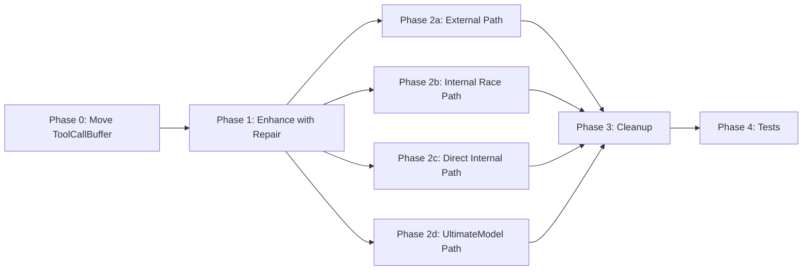

# Tool Call Buffer + Repair Integration - Final Implementation Plan

**Status:** READY FOR IMPLEMENTATION  
**Created:** 2026-03-19  
**Merged From:** 
- [`tool-call-buffer-repair-integration.md`](tool-call-buffer-repair-integration.md)
- [`tool-call-buffer-repair-integration-review.md`](tool-call-buffer-repair-integration-review.md)

---

## Executive Summary

Integrate ToolRepair into ToolCallBuffer to emit repaired tool calls immediately when complete, eliminating the need for `ToolCallAccumulator` and post-stream buffer rewriting.

### Key Benefits
1. **Single component** handles accumulation + repair
2. **Client receives repaired data immediately** (no post-stream delay)
3. **No post-stream buffer rewriting** (memory efficient)
4. **Simpler code** - ~200 fewer lines
5. **Complete coverage** of all 4 streaming paths

---

## Architecture

### Before (Complex)

```
Streaming Phase:
┌─────────────────────────────────────────────────────────────────────────────┐
│  Upstream → Normalizer → ToolCallBuffer → Stream Buffer → Client           │
│                           ↓ (passive)                                       │
│                    ToolCallAccumulator                                       │
└─────────────────────────────────────────────────────────────────────────────┘
                                    ↓
Post-Stream Phase:
┌─────────────────────────────────────────────────────────────────────────────┐
│  ToolCallAccumulator → ToolRepair → Buffer Rewriter → Repaired Buffer      │
└─────────────────────────────────────────────────────────────────────────────┘
```

### After (Simplified)

```
Streaming Phase:
┌─────────────────────────────────────────────────────────────────────────────┐
│  Upstream → Normalizer → ToolCallBuffer → Stream Buffer → Client           │
│                           ↓                                                 │
│                    (accumulate fragments)                                   │
│                           ↓                                                 │
│                    (valid JSON?)                                            │
│                           ↓                                                 │
│                    ToolRepair (if needed, library-only)                     │
│                           ↓                                                 │
│                    Emit repaired chunk                                      │
└─────────────────────────────────────────────────────────────────────────────┘
```

---

## Streaming Paths Coverage

```
┌─────────────────────────────────────────────────────────────────────────────┐
│                           REQUEST FLOW PATHS                                │
├─────────────────────────────────────────────────────────────────────────────┤
│                                                                             │
│  1. EXTERNAL PATH (race_executor.go)                                        │
│     Client → Handler → RaceCoordinator → executeExternalRequest             │
│                    ↓                                                        │
│     handleStreamingResponse() → ToolCallBuffer → StreamBuffer → Client      │
│     CURRENT: Uses ToolCallAccumulator + post-stream repair                  │
│     AFTER: Uses ToolCallBufferWithRepair, no post-stream repair             │
│                                                                             │
│  2. INTERNAL PATH - Race Retry (race_executor.go)                           │
│     Client → Handler → RaceCoordinator → executeInternalRequest             │
│                    ↓                                                        │
│     handleInternalStream() → ToolCallBuffer → StreamBuffer → Client         │
│     CURRENT: Uses ToolCallAccumulator + post-stream repair                  │
│     AFTER: Uses ToolCallBufferWithRepair, no post-stream repair             │
│                                                                             │
│  3. INTERNAL PATH - Direct (internal_handler.go)                            │
│     Client → InternalHandler → Provider → handleStream()                    │
│                    ↓                                                        │
│     handleStream() → ToolCallBuffer → SSE Response → Client                 │
│     CURRENT: NO tool call repair at all                                     │
│     AFTER: Uses ToolCallBufferWithRepair                                    │
│                                                                             │
│  4. INTERNAL PATH - UltimateModel (ultimatemodel/handler_internal.go)       │
│     Client → UltimateModel → executeInternal() → handleInternalStream()     │
│                    ↓                                                        │
│     handleInternalStream() → ToolCallBuffer → SSE Response → Client         │
│     CURRENT: NO tool call repair at all                                     │
│     AFTER: Uses ToolCallBufferWithRepair                                    │
│                                                                             │
└─────────────────────────────────────────────────────────────────────────────┘
```

---

## Implementation Todo List

### Phase 0: Move ToolCallBuffer to Shared Package - CRITICAL FIRST

This MUST be done first to avoid circular dependencies when `ultimatemodel` package needs to use `ToolCallBuffer`.

- [x] **P0.1** Create directory `pkg/toolcall/`
- [x] **P0.2** Create `pkg/toolcall/buffer.go` - Move `ToolCallBuffer`, `ToolCallBuilder`, constants from `pkg/proxy/tool_call_buffer.go`
- [x] **P0.3** Create `pkg/toolcall/buffer_test.go` - Move tests from `pkg/proxy/tool_call_buffer_test.go`
- [x] **P0.4** Update imports in `pkg/proxy/race_executor.go` to use `pkg/toolcall`
- [x] **P0.5** Update imports in `pkg/proxy/internal_handler.go` to use `pkg/toolcall`
- [x] **P0.6** Verify no circular dependencies with `pkg/ultimatemodel` by running `go build ./...`

### Phase 1: Enhance ToolCallBuffer with Repair

- [x] **P1.1** Add `RepairConfig`, `repairer`, `repairStats` fields to `ToolCallBuffer` struct in `pkg/toolcall/buffer.go`
- [x] **P1.2** Add `RepairStats` struct with `Attempted`, `Successful`, `Failed` fields
- [x] **P1.3** Add `NewToolCallBufferWithRepair()` constructor that accepts `*toolrepair.Config`
- [x] **P1.4** Add `StreamingStrategy` field to enforce library-only repair for streaming (avoid LLM latency)
- [x] **P1.5** Modify `emitToolCall()` to repair before emitting - **CRITICAL: Perform repair OUTSIDE mutex lock**
- [x] **P1.6** Add `GetRepairStats()` method
- [x] **P1.7** Add unit tests for repair integration in `pkg/toolcall/buffer_test.go`

### Phase 2a: Update External Path - race_executor.go

- [x] **P2a.1** In `handleStreamingResponse()`: Replace `ToolCallAccumulator` with `ToolCallBufferWithRepair`
- [x] **P2a.2** Remove post-stream `rewriteBufferWithRepairedArgs()` call
- [x] **P2a.3** Remove `repairAccumulatedArgs()` call
- [x] **P2a.4** Add repair stats logging at stream completion
- [x] **P2a.5** Update existing tests and add integration tests

### Phase 2b: Update Internal Race Path - race_executor.go

- [x] **P2b.1** In `handleInternalStream()`: Replace `ToolCallAccumulator` with `ToolCallBufferWithRepair`
- [x] **P2b.2** Remove post-stream repair logic
- [x] **P2b.3** Process tool_call events through the buffer
- [x] **P2b.4** Flush remaining chunks at "done" event
- [x] **P2b.5** Add repair stats logging
- [x] **P2b.6** Update and add integration tests

### Phase 2c: Update Direct Internal Path - internal_handler.go

- [x] **P2c.1** Add `toolCallBufferMaxSize` field to `InternalHandler` struct
- [x] **P2c.2** Add `toolRepairConfig` field to `InternalHandler` struct
- [x] **P2c.3** Add `SetToolCallBufferConfig(maxSize int64, repairConfig *toolrepair.Config)` setter
- [x] **P2c.4** In `handleStream()`: Create `ToolCallBuffer` with repair config
- [x] **P2c.5** Intercept tool_call events and process through buffer
- [x] **P2c.6** Buffer tool call chunks until complete, then emit repaired
- [x] **P2c.7** Flush remaining buffered tool calls at "done" event
- [x] **P2c.8** Add tests in `pkg/proxy/internal_handler_test.go`

### Phase 2d: Update UltimateModel Internal Path

- [x] **P2d.1** Add `toolCallBufferMaxSize` field to `Handler` struct in `pkg/ultimatemodel/handler_internal.go`
- [x] **P2d.2** Add `toolRepairConfig` field to `Handler` struct
- [x] **P2d.3** Import `pkg/toolcall` - no circular dependency after Phase 0
- [x] **P2d.4** In `handleInternalStream()`: Create `ToolCallBuffer` with repair config
- [x] **P2d.5** Intercept tool_call events and process through buffer
- [x] **P2d.6** Flush remaining buffered tool calls at "done" event
- [x] **P2d.7** Add tests in `pkg/ultimatemodel/handler_internal_test.go`

### Phase 3: Cleanup

- [x] **P3.1** Delete `pkg/proxy/tool_call_accumulator.go`
- [x] **P3.2** Delete `pkg/proxy/tool_call_accumulator_test.go`
- [x] **P3.3** Delete `pkg/proxy/buffer_rewriter.go` (confirmed: only used for tool repair)
- [x] **P3.4** Delete `pkg/proxy/buffer_rewriter_test.go`
- [x] **P3.5** Remove `repairAccumulatedArgs()` from `race_executor.go`
- [x] **P3.6** Remove deprecated `repairToolCallArgumentsInChunk()` from `race_executor.go`
- [x] **P3.7** Delete original `pkg/proxy/tool_call_buffer.go` (moved to `pkg/toolcall/`)
- [x] **P3.8** Delete original `pkg/proxy/tool_call_buffer_test.go` (moved to `pkg/toolcall/`)

### Phase 4: Final Testing
 - [x] **P4.1** Run all unit tests: `go test ./...` ✓
- [x] **P4.2** Run integration tests with mock LLM
- [x] **P4.3** Test with malformed tool call JSON - verify repair works
- [x] **P4.4** Verify repair stats logging appears correctly
- [x] **P4.5** Verify no memory leaks with long-running stream and many tool calls
- [x] **P4.6** Run frontend build: `cd pkg/ui/frontend && npm run build`
- [x] **P4.7** Run full build: `make all` ✓

- [x] **P3.1** Delete `pkg/proxy/tool_call_accumulator.go` ✓
- [x] **P3.2** Delete `pkg/proxy/tool_call_accumulator_test.go` ✓
- [x] **P3.3** Delete `pkg/proxy/buffer_rewriter.go` (confirmed: only used for tool repair) ✓
- [x] **P3.4** Delete `pkg/proxy/buffer_rewriter_test.go` ✓
- [x] **P3.5** Remove `repairAccumulatedArgs()` from `race_executor.go` ✓
- [x] **P3.6** Remove deprecated `repairToolCallArgumentsInChunk()` from `race_executor.go` ✓
- [x] **P3.7** Delete original `pkg/proxy/tool_call_buffer.go` (moved to `pkg/toolcall/`) ✓
- [x] **P3.8** Delete original `pkg/proxy/tool_call_buffer_test.go` (moved to `pkg/toolcall/`) ✓


---

## Key Implementation Details

### ToolCallBuffer Enhancement

```go
// pkg/toolcall/buffer.go

package toolcall

import (
    "encoding/json"
    "log"
    "sync"
    // ... other imports
    
    "github.com/disillusioners/llm-supervisor-proxy/pkg/toolrepair"
)

// RepairStats tracks repair statistics
type RepairStats struct {
    Attempted  int
    Successful int
    Failed     int
}

// ToolCallBuffer accumulates tool call fragments and emits complete tool calls
// with optional JSON repair when complete.
type ToolCallBuffer struct {
    mu              sync.Mutex
    builders        map[int]*ToolCallBuilder
    totalSize       int64
    maxSize         int64
    modelID         string
    requestID       string
    
    // Tool repair integration
    repairConfig    *toolrepair.Config
    repairer        *toolrepair.Repairer
    repairStats     RepairStats
    
    // Streaming strategy - "library_only" for streaming to avoid LLM latency
    streamingStrategy string
}

// NewToolCallBufferWithRepair creates a buffer with repair capabilities.
func NewToolCallBufferWithRepair(maxSize int64, modelID, requestID string, repairConfig *toolrepair.Config) *ToolCallBuffer {
    b := NewToolCallBuffer(maxSize, modelID, requestID)
    if repairConfig != nil && repairConfig.Enabled {
        b.repairConfig = repairConfig
        b.repairer = toolrepair.NewRepairer(repairConfig)
        b.streamingStrategy = "library_only" // Default for streaming
    }
    return b
}

// emitToolCall creates a complete SSE chunk for a tool call.
// CRITICAL: This must be called AFTER releasing the mutex lock to avoid blocking.
func (b *ToolCallBuffer) emitToolCall(idx int, args string, builder *ToolCallBuilder) []byte {
    // Repair arguments if needed - OUTSIDE mutex lock
    if b.repairer != nil && args != "" {
        // Check if already valid JSON
        var js interface{}
        if json.Unmarshal([]byte(args), &js) != nil {
            // Not valid JSON - attempt repair
            b.repairStats.Attempted++
            
            // Use library-only strategy for streaming (avoid LLM latency)
            result := b.repairer.RepairArguments(args, builder.Name)
            if result.Success {
                args = result.Repaired
                b.repairStats.Successful++
                log.Printf("[TOOL-BUFFER] Repaired tool_call[%d] arguments during streaming", idx)
            } else {
                b.repairStats.Failed++
                log.Printf("[WARN] Tool repair failed for tool_call[%d], emitting original", idx)
            }
        }
    }
    
    // Build chunk with (potentially repaired) arguments
    chunk := map[string]interface{}{
        "id":      fmt.Sprintf("chatcmpl-%d", time.Now().UnixNano()),
        "object":  "chat.completion.chunk",
        "created": time.Now().Unix(),
        "model":   b.modelID,
        "choices": []map[string]interface{}{
            {
                "index": 0,
                "delta": map[string]interface{}{
                    "tool_calls": []map[string]interface{}{
                        {
                            "index": idx,
                            "id":    builder.ID,
                            "type":  builder.Type,
                            "function": map[string]interface{}{
                                "name":      builder.Name,
                                "arguments": args,
                            },
                        },
                    },
                },
            },
        },
    }
    
    data, _ := json.Marshal(chunk)
    return []byte("data: " + string(data) + "\n")
}

// GetRepairStats returns the repair statistics.
func (b *ToolCallBuffer) GetRepairStats() RepairStats {
    b.mu.Lock()
    defer b.mu.Unlock()
    return b.repairStats
}
```

### Mutex Lock Pattern for emitToolCall

The `processToolCallChunk` method must release the lock before calling `emitToolCall`:

```go
func (b *ToolCallBuffer) processToolCallChunk(toolCalls []interface{}, hasPrefix bool) [][]byte {
    b.mu.Lock()
    
    var chunks [][]byte
    var toEmit []int
    
    // ... accumulation logic with lock held ...
    
    // Collect indices to emit
    for _, idx := range toEmit {
        // Get data needed for emission WHILE holding lock
        builder := b.builders[idx]
        args := builder.Arguments.String()
        
        // Release lock before emission (repair is slow)
        b.mu.Unlock()
        chunk := b.emitToolCall(idx, args, builder)
        b.mu.Lock()
        
        chunks = append(chunks, chunk)
        builder.hasEmitted = true
    }
    
    b.mu.Unlock()
    return chunks
}
```

---

## Files Changed Summary

| File | Action | Lines Changed |
|------|--------|---------------|
| `pkg/toolcall/buffer.go` | CREATE (move from proxy) | ~300 |
| `pkg/toolcall/buffer_test.go` | CREATE (move from proxy) | ~300 |
| `pkg/proxy/race_executor.go` | MODIFY | ~100 (net reduction) |
| `pkg/proxy/internal_handler.go` | MODIFY | ~80 |
| `pkg/ultimatemodel/handler_internal.go` | MODIFY | ~80 |
| `pkg/proxy/tool_call_accumulator.go` | DELETE | -258 |
| `pkg/proxy/tool_call_accumulator_test.go` | DELETE | -500 |
| `pkg/proxy/buffer_rewriter.go` | DELETE | -146 |
| `pkg/proxy/buffer_rewriter_test.go` | DELETE | -200 |
| `pkg/proxy/tool_call_buffer.go` | DELETE (moved) | -258 |
| `pkg/proxy/tool_call_buffer_test.go` | DELETE (moved) | -300 |

**Net result:** ~200 fewer lines of code, simpler architecture, complete coverage of all streaming paths

---

## Behavior Changes

| Scenario | Before | After |
|----------|--------|-------|
| Malformed JSON in tool call (external) | Client receives malformed → post-stream repair | Client receives repaired immediately |
| Malformed JSON in tool call (internal race) | Post-stream buffer rewrite | Client receives repaired immediately |
| Malformed JSON in tool call (internal direct) | **No repair** - client receives malformed | Client receives repaired immediately |
| Malformed JSON in tool call (ultimate model) | **No repair** - client receives malformed | Client receives repaired immediately |
| Repair failure | Original args in buffer | Original args emitted (same result) |
| Memory usage | Double accumulation (buffer + accumulator) | Single accumulation |
| Latency | Post-stream repair delay | Real-time repair during streaming |

---

## Risk Assessment

| Risk | Severity | Mitigation |
|------|----------|------------|
| LLM repair latency in streaming | Medium | Enforce `library_only` strategy for streaming |
| Mutex contention during repair | Low | Perform repair outside mutex lock |
| Memory usage with large tool calls | Low | Existing `maxSize` limit already enforced |
| Breaking change for clients | Low | Output format unchanged - just repaired JSON |
| Circular dependency | Medium | Phase 0 moves buffer to shared package first |

---

## Open Questions - RESOLVED

| Question | Resolution |
|----------|------------|
| Event publishing timing | **Batch at end** - publish repair stats in single event at stream completion |
| Repair latency | **Library-only for streaming** - enforce `streamingStrategy = "library_only"` |
| Stats tracking | **Add to existing events** - include in `tool_repair` event already published |
| Circular dependency | **Move to `pkg/toolcall/`** - Phase 0 must be first |

---

## Implementation Order Diagram



---

## Files Referenced

- [`pkg/proxy/tool_call_buffer.go`](../pkg/proxy/tool_call_buffer.go) - Current buffer implementation (to be moved)
- [`pkg/proxy/tool_call_accumulator.go`](../pkg/proxy/tool_call_accumulator.go) - To be deleted
- [`pkg/proxy/buffer_rewriter.go`](../pkg/proxy/buffer_rewriter.go) - To be deleted
- [`pkg/proxy/race_executor.go`](../pkg/proxy/race_executor.go) - Main streaming paths
- [`pkg/proxy/internal_handler.go`](../pkg/proxy/internal_handler.go) - Direct internal path
- [`pkg/ultimatemodel/handler_internal.go`](../pkg/ultimatemodel/handler_internal.go) - UltimateModel path
- [`pkg/toolrepair/`](../pkg/toolrepair/) - Tool repair package

---

## Conclusion

This refactoring simplifies the tool call processing pipeline by:
1. Eliminating redundant accumulation (ToolCallBuffer + ToolCallAccumulator)
2. Providing real-time repair to clients (no post-stream delay)
3. Reducing memory usage (single accumulation instead of double)
4. Removing post-stream buffer rewriting (memory intensive)
5. Covering ALL 4 streaming paths with repair capability

The main risk is LLM-based repair latency during streaming, which is mitigated by using only library-based repair for streaming scenarios.
