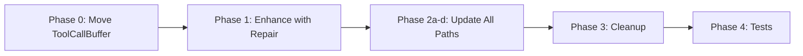

# Plan Review: Tool Call Buffer + Repair Integration

**Review Date:** 2026-03-19  
**Plan Reviewed:** [`tool-call-buffer-repair-integration.md`](tool-call-buffer-repair-integration.md)  
**Status:** APPROVED WITH MODIFICATIONS

---

## Executive Summary

The plan is **well-structured and technically sound**. It correctly identifies the redundancy between `ToolCallBuffer` and `ToolCallAccumulator`, and proposes a clean integration that eliminates post-stream buffer rewriting.

---

## Strengths of the Plan

1. **Accurate Current State Analysis**
   - Correctly identifies that both `ToolCallBuffer` and `ToolCallAccumulator` perform similar accumulation
   - Accurately maps all 4 streaming paths and their current repair coverage

2. **Clear Architecture Diagram**
   - The before/after diagrams clearly illustrate the simplification

3. **Comprehensive Coverage**
   - Addresses all 4 streaming paths: external, internal race, direct internal, ultimate model
   - Phase 0 correctly identifies the circular dependency issue with `ultimatemodel` package

4. **Detailed Implementation Steps**
   - Code snippets are accurate and match existing patterns
   - Migration order is logical

---

## Issues and Recommendations

### Issue 1: Phase 0 is Critical, Not Optional

**Current Plan:** Phase 0 is listed as REQUIRED but the implementation order puts it at Phase 2d.

**Recommendation:** Move Phase 0 to be the **first implementation step**. The circular dependency must be resolved before any other work begins.



### Issue 2: internal_handler.go Repair Coverage

**Current State:** The plan correctly notes that `InternalHandler.handleStream()` has NO tool call repair.

**Problem:** The current `handleStream()` writes directly to `http.ResponseWriter` without any buffering:

```go
fmt.Fprintf(w, "data: %s\n\n", data)
flusher.Flush()
```

**Recommendation:** The plan is correct, but needs to clarify that:
1. Tool call chunks must be intercepted BEFORE writing to client
2. The buffer must hold chunks until tool call is complete
3. This introduces **streaming latency** for tool calls - acceptable tradeoff

### Issue 3: Repair Strategy for Streaming

**Open Question #2** in the plan asks about LLM-based repair latency.

**Recommendation:** Add explicit configuration:

```go
type ToolRepairConfig struct {
    Enabled           bool
    StreamingStrategy string  // "library_only" | "library_and_llm"
    NonStreamingStrategy string // "library_and_llm"
}
```

For streaming, **always use `library_only`** to avoid latency. LLM fallback should only be used for non-streaming responses.

### Issue 4: Missing buffer_rewriter.go Analysis

**Current Plan:** Evaluate if `buffer_rewriter.go` is still needed.

**Finding:** Based on code review, `rewriteBufferWithRepairedArgs()` is used in:
- `race_executor.go:1076` - external path post-stream repair
- `race_executor.go:436` - internal path post-stream repair

Both usages would be eliminated by this plan, so `buffer_rewriter.go` can be **deleted** after integration.

### Issue 5: Race Condition in emitToolCall()

**Current Plan:** The `emitToolCall()` modification checks JSON validity and repairs.

**Potential Issue:** The repair happens while holding the buffer's mutex. If repair is slow with LLM-based strategy, this blocks all other chunk processing.

**Recommendation:** Repair should be done **outside** the mutex lock:

```go
func (b *ToolCallBuffer) emitToolCall(idx int) []byte {
    builder := b.builders[idx]
    args := builder.Arguments.String()
    
    // Release lock before repair - repair is slow
    // b.mu already unlocked by caller
    
    repairedArgs := b.repairIfNecessary(args, builder.Name)
    
    // Build chunk...
}
```

---

## Open Questions Resolution

| Question | Resolution |
|----------|------------|
| Event publishing timing | **Batch at end** - publish repair stats in single event at stream completion |
| Repair latency | **Library-only for streaming** - add `StreamingStrategy` config field |
| Stats tracking | **Add to existing events** - include in `tool_repair` event already published |
| Circular dependency | **Move to `pkg/toolcall/`** - Phase 0 must be first |

---

## Refined Implementation Todo List

### Phase 0: Move ToolCallBuffer to Shared Package - CRITICAL FIRST

- [ ] Create `pkg/toolcall/buffer.go`
- [ ] Move `ToolCallBuffer`, `ToolCallBuilder`, constants from `pkg/proxy/tool_call_buffer.go`
- [ ] Create `pkg/toolcall/buffer_test.go`
- [ ] Update imports in `pkg/proxy/race_executor.go`
- [ ] Update imports in `pkg/proxy/internal_handler.go`
- [ ] Verify no circular dependencies with `pkg/ultimatemodel`

### Phase 1: Enhance ToolCallBuffer with Repair

- [ ] Add `repairConfig`, `repairer`, `repairStats` fields to `ToolCallBuffer`
- [ ] Add `NewToolCallBufferWithRepair()` constructor
- [ ] Modify `emitToolCall()` to repair before emitting - outside mutex
- [ ] Add `GetRepairStats()` method
- [ ] Add `SetStreamingStrategy()` to enforce library-only repair for streaming
- [ ] Add unit tests for repair integration

### Phase 2a: Update External Path - race_executor.go

- [ ] Replace `ToolCallAccumulator` with `ToolCallBufferWithRepair` in `handleStreamingResponse()`
- [ ] Remove post-stream `rewriteBufferWithRepairedArgs()` call
- [ ] Remove `repairAccumulatedArgs()` call
- [ ] Update and add integration tests

### Phase 2b: Update Internal Race Path - race_executor.go

- [ ] Replace `ToolCallAccumulator` with `ToolCallBufferWithRepair` in `handleInternalStream()`
- [ ] Remove post-stream repair logic
- [ ] Update and add integration tests

### Phase 2c: Update Direct Internal Path - internal_handler.go

- [ ] Add `toolCallBufferMaxSize` and `toolRepairConfig` fields to `InternalHandler`
- [ ] Add `SetToolCallBufferConfig()` setter
- [ ] Add `ToolCallBuffer` to `handleStream()` - intercept tool_call events
- [ ] Buffer tool call chunks until complete, then emit repaired
- [ ] Add tests

### Phase 2d: Update UltimateModel Internal Path

- [ ] Add `toolCallBufferMaxSize` and `toolRepairConfig` to `Handler` struct
- [ ] Add `ToolCallBuffer` to `handleInternalStream()`
- [ ] Import from `pkg/toolcall` - no circular dependency after Phase 0
- [ ] Add tests

### Phase 3: Cleanup

- [ ] Delete `pkg/proxy/tool_call_accumulator.go`
- [ ] Delete `pkg/proxy/tool_call_accumulator_test.go`
- [ ] Delete `pkg/proxy/buffer_rewriter.go`
- [ ] Delete `pkg/proxy/buffer_rewriter_test.go`
- [ ] Remove `repairAccumulatedArgs()` from `race_executor.go`
- [ ] Remove deprecated `repairToolCallArgumentsInChunk()` from `race_executor.go`

### Phase 4: Final Testing

- [ ] Run all unit tests
- [ ] Run integration tests with mock LLM
- [ ] Test with malformed tool call JSON
- [ ] Verify repair stats logging
- [ ] Verify no memory leaks with long-running stream and many tool calls

---

## Risk Assessment

| Risk | Severity | Mitigation |
|------|----------|------------|
| LLM repair latency in streaming | Medium | Enforce library-only strategy for streaming |
| Mutex contention during repair | Low | Perform repair outside mutex lock |
| Memory usage with large tool calls | Low | Existing `maxSize` limit already enforced |
| Breaking change for clients | Low | Output format unchanged - just repaired JSON |

---

## Verdict

**APPROVED WITH MODIFICATIONS:**

1. Move Phase 0 to be the **first** implementation step
2. Add explicit streaming vs non-streaming repair strategy
3. Ensure repair happens outside mutex lock
4. Confirm `buffer_rewriter.go` deletion after integration

---

## Files Referenced

- [`pkg/proxy/tool_call_buffer.go`](../pkg/proxy/tool_call_buffer.go) - Current buffer implementation
- [`pkg/proxy/tool_call_accumulator.go`](../pkg/proxy/tool_call_accumulator.go) - To be deleted
- [`pkg/proxy/race_executor.go`](../pkg/proxy/race_executor.go) - Main streaming paths
- [`pkg/proxy/internal_handler.go`](../pkg/proxy/internal_handler.go) - Direct internal path
- [`pkg/ultimatemodel/handler_internal.go`](../pkg/ultimatemodel/handler_internal.go) - UltimateModel path
