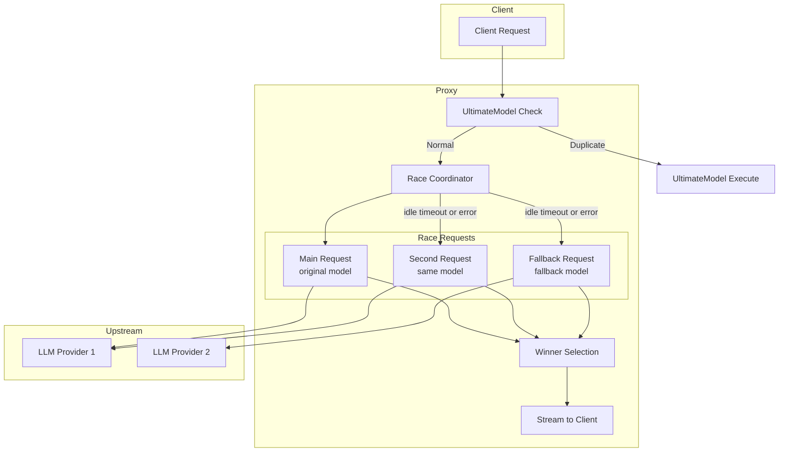
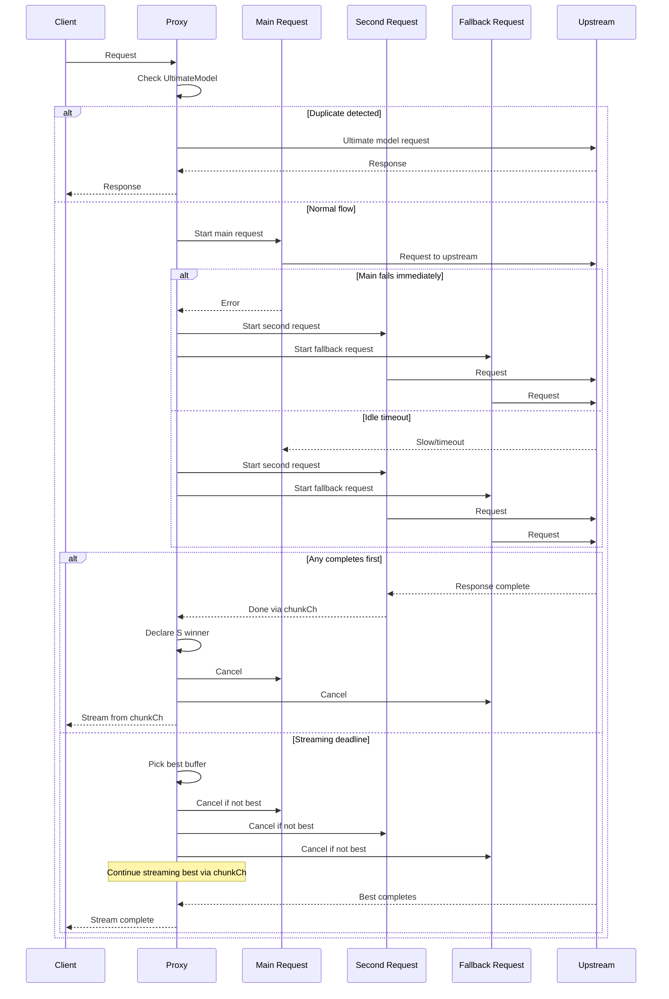

# Unified Race Retry Design

## Overview

This document describes a complete redesign of the proxy retry mechanism to use a unified "race" approach where multiple upstream requests compete in parallel, and the best result is selected.

### Design Decisions (Confirmed)

| Question | Decision |
|----------|----------|
| Fallback Chain | Only first fallback model (max 3 parallel requests) |
| Second Request Timing | Spawn after idle timeout (not immediately) |
| Streaming Deadline | Continue streaming winner until complete or hard deadline |
| Error Handling | Immediately spawn parallel requests on error |

---

## Critical Design Considerations (Based on Review)

> **IMPORTANT**: The following issues were identified during design review and MUST be addressed:

### 1. Data Race on Buffer (Panic Risk)
**Issue**: Go's `bytes.Buffer` is NOT safe for concurrent read/write. If the winner continues streaming while the handler reads, we get `panic: concurrent write to bytes.Buffer`.

**Solution**: Use slice + notification channel pattern (NOT chunk channel):
```go
// Writer appends to slice under lock, sends notification
// Reader tracks read index, reads slice under lock, waits for notification
notifyCh chan struct{}  // Capacity 1 - non-blocking signal
chunks   [][]byte       // Protected by mutex
```

### 2. Deadlock on done Channel (Hang Risk)
**Issue**: Main goroutine blocks on `<-coordinator.done`, but `coordinate()` uses `return` without closing the channel.

**Solution**: Add `defer close(rc.done)` at the start of `coordinate()`.

### 3. All Requests Failed (Hang Risk)
**Issue**: If all spawned requests fail, the loop keeps waiting for timer/deadline.

**Solution**: Track failed count. If `failed_count == spawned_count`, immediately close `done` and return no winner.

### 4. Memory Usage
**Issue**: Buffering up to 3 full LLM responses (megabytes each, ~150MB total) risks memory exhaustion under load.

**Solution**:
- Implement bounded buffer with max bytes limit (50MB per request)
- Use chunk-based storage instead of contiguous buffer
- Drop/reject data if limits exceeded
- Consider global semaphore for memory pressure (future enhancement)

### 5. SSE Chunk Size Limit
**Issue**: `bufio.Scanner` with 256KB limit will fail on large chunks (base64 images, large code blocks).

**Solution**: Use `bufio.Scanner` with increased buffer (64KB initial, 4MB max):
```go
scanner.Buffer(make([]byte, 64*1024), 4*1024*1024)
```

### 6. Winner Context Leak (Resource Leak)
**Issue**: After winner is chosen, `coordinate()` exits. If client disconnects during `streamResult()`, winner's context is never cancelled - upstream continues downloading.

**Solution**: Add defer in `HandleChatCompletions` to always cancel winner:
```go
defer func() {
    if winner := coordinator.GetWinner(); winner != nil {
        winner.cancel()
    }
}()
```

---

## Architecture Diagram



## Sequence Diagram



---

## Current vs New Architecture

### Current Architecture (Sequential Retry)

```
Client Request
     │
     ▼
┌─────────────────────────────────────────────────────────────┐
│ MAIN REQUEST LOOP                                           │
│   ├─ Attempt 1 (model A)                                    │
│   │   └─ Idle timeout → Cancel → Retry same model           │
│   ├─ Attempt 2 (model A)                                    │
│   │   └─ Idle timeout → Cancel → Retry same model           │
│   ├─ Attempt 3 (model A)                                    │
│   │   └─ Error → Fallback to model B                        │
│   ├─ Attempt 1 (model B)                                    │
│   │   └─ Shadow started (parallel)                          │
│   └─ ...                                                    │
└─────────────────────────────────────────────────────────────┘
```

**Problems with current approach:**
1. Sequential retries waste time waiting for slow/stuck requests
2. Shadow retry only spawns ONE fallback request
3. Main request is cancelled on idle timeout, losing partial progress
4. Complex state management across multiple retry types

### New Architecture (Parallel Race)

```
Client Request (time_start recorded)
     │
     ▼
┌─────────────────────────────────────────────────────────────┐
│ MAIN-UPSTREAM-REQUEST (original model)                      │
│   • Starts immediately                                       │
│   • Chunks sent to chunkCh (thread-safe)                    │
│   • NOT cancelled on idle timeout                           │
└─────────────────────────────────────────────────────────────┘
     │
     │ (idle timeout triggered from time_start)
     ▼
┌─────────────────────────────────────────────────────────────┐
│ PARALLEL REQUESTS SPAWNED                                   │
│                                                             │
│  ┌─────────────────────┐  ┌─────────────────────┐          │
│  │ SECOND-UPSTREAM-REQ │  │ FALLBACK-UPSTREAM-  │          │
│  │ (original model)    │  │ REQUEST             │          │
│  │ • Fresh attempt     │  │ (fallback model)    │          │
│  │ • Own chunkCh       │  │ • First fallback    │          │
│  └─────────────────────┘  └─────────────────────┘          │
└─────────────────────────────────────────────────────────────┘
     │
     ▼
┌─────────────────────────────────────────────────────────────┐
│ RACE COORDINATOR                                            │
│   • Monitors all 3 requests                                 │
│   • Receives chunks via channels (no shared buffer)         │
│   • Tracks failed count for early termination               │
│                                                             │
│ WIN CONDITIONS:                                             │
│   1. ANY request DONE first → Stream from its chunkCh       │
│   2. All failed → Return error immediately                  │
│   3. Deadline → Pick best, continue streaming its chunkCh   │
└─────────────────────────────────────────────────────────────┘
```

---

## Key Design Principles

1. **Never Cancel on Idle Timeout**: Main request continues even after idle timeout
2. **Parallel Racing**: Multiple requests compete simultaneously (max 3: main, second, fallback)
3. **Channel-Based Streaming**: Use channels instead of shared buffers (thread-safe)
4. **Best Result Wins**: First complete wins, OR on deadline continue streaming the best partial
5. **Immediate Error Response**: Spawn parallel requests immediately when main fails with error
6. **Early Termination**: If all requests fail, return immediately (don't wait for deadline)
7. **UltimateModel Unchanged**: Hash-based duplicate detection remains separate

---

## Detailed Design

### 1. Thread-Safe Stream Buffer (Notification Pattern)

Instead of `bytes.Buffer` (not concurrency-safe) or chunk channels (deadlock/corruption risk), we use a **notification pattern**:

- Writer appends to slice under lock, sends non-blocking notification
- Reader tracks read index, reads slice under lock, waits for notification
- No blocking on either side, no data loss

```go
package proxy

import (
    "sync"
    "sync/atomic"
)

// streamBuffer is a thread-safe, bounded buffer for SSE chunks
// Uses notification pattern to avoid blocking writer or corrupting stream
type streamBuffer struct {
    mu         sync.RWMutex
    chunks     [][]byte      // All chunks (protected by mu)
    done       chan struct{} // Closed when stream completes
    notifyCh   chan struct{} // Capacity 1 - signals new data available
    err        error         // Final error (if any)
    totalLen   int64         // Total bytes buffered (atomic access)
    maxBytes   int64         // Maximum bytes to buffer (memory protection)
    overflow   bool          // True if maxBytes exceeded
    completed  int32         // Atomic: 1 when stream done
}

const (
    defaultMaxBufferBytes = 50 * 1024 * 1024  // 50MB default limit
)

func newStreamBuffer(maxBytes int64) *streamBuffer {
    if maxBytes <= 0 {
        maxBytes = defaultMaxBufferBytes
    }
    return &streamBuffer{
        chunks:   make([][]byte, 0, 100),
        done:     make(chan struct{}),
        notifyCh: make(chan struct{}, 1), // Capacity 1 - non-blocking signal
        maxBytes: maxBytes,
    }
}

// Add appends a chunk to the buffer. Thread-safe. Never blocks.
// Returns false if buffer overflow (caller should stop).
func (sb *streamBuffer) Add(data []byte) bool {
    // Check if already completed
    if atomic.LoadInt32(&sb.completed) == 1 {
        return false
    }
    
    // Check overflow atomically
    newLen := atomic.AddInt64(&sb.totalLen, int64(len(data)))
    if newLen > sb.maxBytes {
        sb.overflow = true
        return false
    }
    
    // Copy data (don't retain caller's slice - avoids memory leaks)
    chunkData := make([]byte, len(data))
    copy(chunkData, data)
    
    // Store in slice under lock
    sb.mu.Lock()
    sb.chunks = append(sb.chunks, chunkData)
    sb.mu.Unlock()
    
    // Send non-blocking notification (signal that new data is available)
    select {
    case sb.notifyCh <- struct{}{}:
    default:
        // Notification already pending - that's fine
    }
    
    return true
}

// Close marks the buffer as complete. Thread-safe.
func (sb *streamBuffer) Close(err error) {
    if !atomic.CompareAndSwapInt32(&sb.completed, 0, 1) {
        return // Already closed
    }
    
    sb.mu.Lock()
    sb.err = err
    sb.mu.Unlock()
    
    // Send final notification and close done channel
    select {
    case sb.notifyCh <- struct{}{}:
    default:
    }
    close(sb.done)
}

// GetChunksFrom returns chunks starting from index. Thread-safe.
// Returns the chunks and the new index to use for next call.
func (sb *streamBuffer) GetChunksFrom(fromIndex int) ([][]byte, int) {
    sb.mu.RLock()
    defer sb.mu.RUnlock()
    
    if fromIndex >= len(sb.chunks) {
        return nil, fromIndex
    }
    
    // Return copy of chunks from index
    chunks := sb.chunks[fromIndex:]
    result := make([][]byte, len(chunks))
    copy(result, chunks)
    
    return result, len(sb.chunks)
}

// TotalLen returns total buffered bytes. Thread-safe.
func (sb *streamBuffer) TotalLen() int64 {
    return atomic.LoadInt64(&sb.totalLen)
}

// IsComplete returns true if stream has completed.
func (sb *streamBuffer) IsComplete() bool {
    return atomic.LoadInt32(&sb.completed) == 1
}

// NotifyCh returns the notification channel (signals when new data available).
func (sb *streamBuffer) NotifyCh() <-chan struct{} {
    return sb.notifyCh
}

// Done returns a channel that's closed when the stream completes.
func (sb *streamBuffer) Done() <-chan struct{} {
    return sb.done
}

// Err returns the final error (if any). Thread-safe.
func (sb *streamBuffer) Err() error {
    sb.mu.RLock()
    defer sb.mu.RUnlock()
    return sb.err
}
```

### 2. Request State Structure

```go
package proxy

import (
    "context"
    "sync"
    "sync/atomic"
    "time"
)

// upstreamModelType indicates which type of request this is
type upstreamModelType int32  // Use int32 for atomic operations

const (
    modelMain     upstreamModelType = iota  // Original model, first request
    modelSecond                              // Original model, second attempt
    modelFallback                            // Fallback model
)

// upstreamStatus indicates the current state of a request
type upstreamStatus int32  // Use int32 for atomic operations

const (
    statusPending   upstreamStatus = iota  // Not started yet
    statusRunning                          // Currently executing
    statusCompleted                        // Finished successfully with [DONE]
    statusFailed                           // Finished with error
    statusCancelled                        // Cancelled by coordinator
)

// upstreamRequest represents a single upstream request in the race
type upstreamRequest struct {
    id          string              // Unique ID for logging
    model       string              // Model being used
    modelType   upstreamModelType   // main, second, or fallback
    
    // Status (atomic access for thread-safety)
    status      int32               // upstreamStatus (atomic access)
    err         error               // Error if failed (set once)
    startedAt   time.Time           // When request started
    completedAt time.Time           // When request completed (success or fail)
    
    // Context management
    ctx        context.Context
    cancel     context.CancelFunc
    
    // Thread-safe stream buffer (replaces bytes.Buffer)
    buffer     *streamBuffer
    
    // WaitGroup for goroutine cleanup
    wg         sync.WaitGroup
}

// getStatus atomically reads the status
func (r *upstreamRequest) getStatus() upstreamStatus {
    return upstreamStatus(atomic.LoadInt32(&r.status))
}

// setStatus atomically updates the status
func (r *upstreamRequest) setStatus(newStatus upstreamStatus) {
    atomic.StoreInt32(&r.status, int32(newStatus))
}

// compareAndSwapStatus atomically compares and swaps status
// Returns true if the swap was successful
func (r *upstreamRequest) compareAndSwapStatus(oldStatus, newStatus upstreamStatus) bool {
    return atomic.CompareAndSwapInt32(&r.status, int32(oldStatus), int32(newStatus))
}
```

### 3. Race Coordinator

```go
package proxy

import (
    "bufio"
    "bytes"
    "context"
    "fmt"
    "log"
    "net/http"
    "sync"
    "sync/atomic"
    "time"
)

// spawnTrigger indicates why parallel requests are being spawned
type spawnTrigger int

const (
    triggerIdleTimeout spawnTrigger = iota  // Main request hit idle timeout
    triggerMainError                         // Main request failed with error
)

// raceCoordinator manages parallel upstream requests
type raceCoordinator struct {
    mu              sync.RWMutex
    
    // All requests in the race
    main     *upstreamRequest
    second   *upstreamRequest
    fallback *upstreamRequest
    
    // Request configuration
    modelList       []string          // [original, fallback1, ...]
    requestBody     map[string]interface{}
    method          string
    targetURL       string
    originalHeaders http.Header
    client          *http.Client
    
    // Timing
    startTime       time.Time          // When client request arrived
    idleTimeout     time.Duration      // Idle timeout duration
    streamDeadline  time.Duration      // Max generation time
    hardDeadline    time.Time          // Absolute deadline (MaxRequestTime)
    
    // State
    winner          *upstreamRequest   // Request that won the race
    raceFinished    int32              // Atomic: 1 when race concluded
    
    // Failure tracking (for early termination)
    spawnedCount    int32              // Total requests spawned
    failedCount     int32              // Total requests failed
    
    // Channels for coordination
    resultCh        chan *upstreamRequest  // Results from requests (buffered)
    done            chan struct{}          // Closed when coordinator finishes
    
    // Handler reference for internal requests
    handler         *Handler
}

// newRaceCoordinator creates a new race coordinator
func newRaceCoordinator(h *Handler, rc *requestContext) *raceCoordinator {
    return &raceCoordinator{
        modelList:       rc.modelList,
        requestBody:     rc.requestBody,
        method:          rc.method,
        targetURL:       rc.targetURL,
        originalHeaders: rc.originalHeaders,
        client:          h.client,
        startTime:       rc.startTime,
        idleTimeout:     rc.conf.IdleTimeout,
        streamDeadline:  rc.conf.MaxGenerationTime,
        hardDeadline:    rc.hardDeadline,
        resultCh:        make(chan *upstreamRequest, 3), // Buffer for 3 results
        done:            make(chan struct{}),
        handler:         h,
    }
}

// Start begins the race coordinator
func (rc *raceCoordinator) Start(ctx context.Context) {
    // Start main request immediately
    rc.main = rc.startRequest(ctx, modelMain, rc.modelList[0])
    atomic.AddInt32(&rc.spawnedCount, 1)
    
    // Start coordination loop
    go rc.coordinate(ctx)
}

// coordinate handles the race logic
// CRITICAL: Must close rc.done on exit to prevent deadlock
func (rc *raceCoordinator) coordinate(ctx context.Context) {
    // ENSURE done IS ALWAYS CLOSED ON EXIT (fixes deadlock)
    defer close(rc.done)
    
    idleTimer := time.NewTimer(rc.idleTimeout)
    defer idleTimer.Stop()
    
    streamDeadlineTimer := time.NewTimer(rc.streamDeadline)
    defer streamDeadlineTimer.Stop()
    
    for {
        select {
        case <-idleTimer.C:
            // Idle timeout - spawn parallel requests
            rc.spawnParallelRequests(ctx, triggerIdleTimeout)
            // Don't reset timer - only spawn once
            
        case req := <-rc.resultCh:
            // A request finished
            rc.handleRequestResult(ctx, req)
            
            // Check if race is finished
            if atomic.LoadInt32(&rc.raceFinished) == 1 {
                return
            }
            
        case <-streamDeadlineTimer.C:
            // Streaming deadline reached - pick best and continue
            rc.handleStreamingDeadline(ctx)
            return
            
        case <-ctx.Done():
            // Context cancelled (client disconnect or hard deadline)
            rc.handleContextDone(ctx)
            return
            
        case <-time.After(100 * time.Millisecond):
            // Periodic check for "all failed" condition
            if rc.checkAllFailed() {
                log.Printf("[RACE] All requests failed, terminating early")
                rc.handleAllFailed(ctx)
                return
            }
        }
    }
}

// handleRequestResult processes a completed request
func (rc *raceCoordinator) handleRequestResult(ctx context.Context, req *upstreamRequest) {
    status := req.getStatus()
    
    if status == statusCompleted {
        // We have a winner!
        log.Printf("[RACE] Request %s (model=%s, type=%v) completed successfully", 
            req.id, req.model, req.modelType)
        rc.declareWinner(req)
        return
    }
    
    if status == statusFailed || status == statusCancelled {
        // Request failed
        atomic.AddInt32(&rc.failedCount, 1)
        log.Printf("[RACE] Request %s (model=%s, type=%v) failed: %v", 
            req.id, req.model, req.modelType, req.err)
        
        // If main failed, spawn parallel requests immediately
        if req.modelType == modelMain && status == statusFailed {
            rc.spawnParallelRequests(ctx, triggerMainError)
        }
    }
}

// checkAllFailed returns true if all spawned requests have failed
func (rc *raceCoordinator) checkAllFailed() bool {
    spawned := atomic.LoadInt32(&rc.spawnedCount)
    failed := atomic.LoadInt32(&rc.failedCount)
    return spawned > 0 && failed >= spawned
}

// spawnParallelRequests starts second and fallback requests
func (rc *raceCoordinator) spawnParallelRequests(ctx context.Context, trigger spawnTrigger) {
    rc.mu.Lock()
    defer rc.mu.Unlock()
    
    // Don't spawn if race already finished
    if atomic.LoadInt32(&rc.raceFinished) == 1 {
        return
    }
    
    // Log the trigger reason
    log.Printf("[RACE] Spawning parallel requests (trigger=%v, mainStatus=%v)", 
        trigger, rc.main.getStatus())
    
    // Spawn second request (same model)
    if rc.second == nil {
        rc.second = rc.startRequest(ctx, modelSecond, rc.modelList[0])
        atomic.AddInt32(&rc.spawnedCount, 1)
    }
    
    // Spawn fallback request (next model in chain) - only first fallback
    if rc.fallback == nil && len(rc.modelList) > 1 {
        fallbackModel := rc.modelList[1]  // First fallback in chain only
        rc.fallback = rc.startRequest(ctx, modelFallback, fallbackModel)
        atomic.AddInt32(&rc.spawnedCount, 1)
    }
}

// declareWinner cancels other requests and sets the winner
func (rc *raceCoordinator) declareWinner(winner *upstreamRequest) {
    if !atomic.CompareAndSwapInt32(&rc.raceFinished, 0, 1) {
        return // Race already finished
    }
    
    rc.mu.Lock()
    rc.winner = winner
    rc.mu.Unlock()
    
    log.Printf("[RACE] Winner declared: %s (model=%s, type=%v, bytes=%d)", 
        winner.id, winner.model, winner.modelType, winner.buffer.TotalLen())
    
    // Cancel all other running requests
    for _, req := range []*upstreamRequest{rc.main, rc.second, rc.fallback} {
        if req != nil && req != winner && req.getStatus() == statusRunning {
            req.cancel()
        }
    }
}

// handleStreamingDeadline picks best buffer and continues streaming
func (rc *raceCoordinator) handleStreamingDeadline(ctx context.Context) {
    if !atomic.CompareAndSwapInt32(&rc.raceFinished, 0, 1) {
        return // Race already finished
    }
    
    // Find request with most content (best candidate to continue)
    var best *upstreamRequest
    var bestLen int64
    
    for _, req := range []*upstreamRequest{rc.main, rc.second, rc.fallback} {
        if req != nil {
            len := req.buffer.TotalLen()
            if len > bestLen {
                best = req
                bestLen = len
            }
        }
    }
    
    if best != nil && bestLen > 0 {
        rc.mu.Lock()
        rc.winner = best
        rc.mu.Unlock()
        
        log.Printf("[RACE] Streaming deadline reached, picking best: %s (model=%s, bytes=%d)", 
            best.id, best.model, bestLen)
        
        // DON'T cancel the winner - let it continue streaming
        // Cancel only the other requests
        for _, req := range []*upstreamRequest{rc.main, rc.second, rc.fallback} {
            if req != nil && req != best && req.getStatus() == statusRunning {
                req.cancel()
            }
        }
    } else {
        // No content at all - all failed
        log.Printf("[RACE] Streaming deadline reached, no content available")
        rc.handleAllFailed(ctx)
    }
}

// handleContextDone handles client disconnect or hard deadline
func (rc *raceCoordinator) handleContextDone(ctx context.Context) {
    atomic.StoreInt32(&rc.raceFinished, 1)
    
    log.Printf("[RACE] Context done, cancelling all requests")
    
    // Cancel all running requests
    for _, req := range []*upstreamRequest{rc.main, rc.second, rc.fallback} {
        if req != nil && req.getStatus() == statusRunning {
            req.cancel()
        }
    }
}

// handleAllFailed handles the case where all requests failed
func (rc *raceCoordinator) handleAllFailed(ctx context.Context) {
    atomic.StoreInt32(&rc.raceFinished, 1)
    
    log.Printf("[RACE] All requests failed")
    
    // Cancel all running requests
    for _, req := range []*upstreamRequest{rc.main, rc.second, rc.fallback} {
        if req != nil && req.getStatus() == statusRunning {
            req.cancel()
        }
    }
}

// GetWinner returns the winning request (nil if none)
func (rc *raceCoordinator) GetWinner() *upstreamRequest {
    rc.mu.RLock()
    defer rc.mu.RUnlock()
    return rc.winner
}

// Done returns a channel that's closed when the coordinator finishes
func (rc *raceCoordinator) Done() <-chan struct{} {
    return rc.done
}
```

### 4. Request Execution

```go
package proxy

import (
    "bytes"
    "encoding/json"
    "fmt"
    "io"
    "log"
    "net/http"
    "time"
)

// startRequest creates and starts a new upstream request
func (rc *raceCoordinator) startRequest(ctx context.Context, modelType upstreamModelType, model string) *upstreamRequest {
    reqCtx, cancel := context.WithCancel(ctx)
    
    req := &upstreamRequest{
        id:        fmt.Sprintf("%s-%d", modelType, time.Now().UnixNano()),
        model:     model,
        modelType: modelType,
        status:    int32(statusRunning),
        buffer:    newStreamBuffer(0), // Use default max bytes
        startedAt: time.Now(),
        ctx:       reqCtx,
        cancel:    cancel,
    }
    
    req.wg.Add(1)
    go rc.executeRequest(req)
    
    log.Printf("[RACE] Started request %s (model=%s, type=%v)", req.id, model, modelType)
    
    return req
}

// executeRequest performs the actual upstream request
func (rc *raceCoordinator) executeRequest(req *upstreamRequest) {
    defer req.wg.Done()
    defer func() {
        // Always send result to coordinator (non-blocking)
        select {
        case rc.resultCh <- req:
        case <-rc.done:
        }
    }()
    
    // Build request body
    bodyToSend := rc.buildRequestBody(req.model)
    newBodyBytes, _ := json.Marshal(bodyToSend)
    
    // Create HTTP request with context
    proxyReq, err := http.NewRequestWithContext(req.ctx, rc.method, rc.targetURL, bytes.NewBuffer(newBodyBytes))
    if err != nil {
        req.setStatus(statusFailed)
        req.err = fmt.Errorf("failed to create request: %w", err)
        return
    }
    
    // Copy headers
    copyHeaders(proxyReq, rc.originalHeaders)
    
    // Execute request
    resp, err := rc.client.Do(proxyReq)
    if err != nil {
        req.setStatus(statusFailed)
        req.err = fmt.Errorf("request failed: %w", err)
        return
    }
    defer resp.Body.Close()
    
    if resp.StatusCode != http.StatusOK {
        req.setStatus(statusFailed)
        req.err = fmt.Errorf("upstream returned %d", resp.StatusCode)
        return
    }
    
    // Stream response to buffer using bufio.Scanner with increased buffer
    // IMPORTANT: Use bufio.Scanner with 64KB initial buffer, 4MB max to handle large chunks
    // (base64 images, large code blocks) without byte-by-byte reading overhead
    scanner := bufio.NewScanner(resp.Body)
    scanner.Buffer(make([]byte, 64*1024), 4*1024*1024) // 64KB initial, 4MB max
    
    for scanner.Scan() {
        // Check for cancellation
        select {
        case <-req.ctx.Done():
            req.setStatus(statusCancelled)
            req.buffer.Close(nil)
            return
        default:
        }
        
        line := scanner.Bytes()
        
        // Add newline back (scanner strips it)
        lineWithNewline := make([]byte, len(line)+1)
        copy(lineWithNewline, line)
        lineWithNewline[len(line)] = '\n'
        
        // Write line to buffer
        if !req.buffer.Add(lineWithNewline) {
            // Buffer overflow
            log.Printf("[RACE] Request %s buffer overflow, stopping", req.id)
            req.setStatus(statusFailed)
            req.err = fmt.Errorf("buffer overflow")
            req.buffer.Close(req.err)
            return
        }
        
        // Check for [DONE] marker
        if bytes.Contains(line, []byte("data: [DONE]")) {
            req.setStatus(statusCompleted)
            req.completedAt = time.Now()
            req.buffer.Close(nil)
            log.Printf("[RACE] Request %s completed successfully", req.id)
            return
        }
    }
    
    // Stream ended without [DONE]
    req.setStatus(statusFailed)
    req.err = fmt.Errorf("stream ended without [DONE]")
    req.buffer.Close(req.err)
}

// buildRequestBody creates the request body for a specific model
func (rc *raceCoordinator) buildRequestBody(model string) map[string]interface{} {
    body := make(map[string]interface{})
    for k, v := range rc.requestBody {
        body[k] = v
    }
    body["model"] = model
    return body
}
```

### 5. Handler Integration

```go
// HandleChatCompletions with unified race retry
func (h *Handler) HandleChatCompletions(w http.ResponseWriter, r *http.Request) {
    // ... existing setup code ...
    
    // === ULTIMATE MODEL CHECK (UNCHANGED) ===
    if triggered, hash := h.ultimateHandler.ShouldTrigger(messages); triggered {
        // ... existing ultimate model logic ...
        return
    }
    
    // === UNIFIED RACE RETRY ===
    coordinator := newRaceCoordinator(h, rc)
    coordinator.Start(r.Context())
    
    // Wait for race to finish (coordinator.done is always closed on exit)
    <-coordinator.Done()
    
    // Get result
    winner := coordinator.GetWinner()
    if winner == nil {
        // All requests failed
        h.sendAllFailedError(w, rc)
        return
    }
    
    // CRITICAL: Ensure winner is cancelled when we exit to prevent resource leaks
    // (upstream continues downloading if client disconnects during streamResult)
    defer winner.cancel()
    
    // Stream winner's buffer to client
    h.streamResult(w, winner)
}

// streamResult streams the winner's buffer to the client using notification pattern
// IMPORTANT: Caller must defer cancellation of winner to prevent resource leaks
func (h *Handler) streamResult(w http.ResponseWriter, winner *upstreamRequest) {
    // Set SSE headers
    w.Header().Set("Content-Type", "text/event-stream")
    w.Header().Set("Cache-Control", "no-cache")
    w.Header().Set("Connection", "keep-alive")
    w.WriteHeader(http.StatusOK)
    
    // Track read index for incremental reading
    readIndex := 0
    
    // First, flush any buffered chunks
    chunks, newIndex := winner.buffer.GetChunksFrom(readIndex)
    for _, chunk := range chunks {
        w.Write(chunk)
    }
    readIndex = newIndex
    if f, ok := w.(http.Flusher); ok {
        f.Flush()
    }
    
    // If stream is still running, continue streaming using notification pattern
    for !winner.buffer.IsComplete() {
        select {
        case <-winner.buffer.NotifyCh():
            // New data available - read it
            chunks, newIndex := winner.buffer.GetChunksFrom(readIndex)
            for _, chunk := range chunks {
                w.Write(chunk)
            }
            readIndex = newIndex
            if f, ok := w.(http.Flusher); ok {
                f.Flush()
            }
            
        case <-winner.buffer.Done():
            // Stream completed - flush any remaining chunks
            chunks, _ := winner.buffer.GetChunksFrom(readIndex)
            for _, chunk := range chunks {
                w.Write(chunk)
            }
            if f, ok := w.(http.Flusher); ok {
                f.Flush()
            }
            return
            
        case <-winner.ctx.Done():
            // Context cancelled (client disconnect or hard deadline)
            return
        }
    }
    
    // Stream completed - flush any remaining chunks
    chunks, _ = winner.buffer.GetChunksFrom(readIndex)
    for _, chunk := range chunks {
        w.Write(chunk)
    }
    if f, ok := w.(http.Flusher); ok {
        f.Flush()
    }
}

// sendAllFailedError sends an error response when all requests failed
func (h *Handler) sendAllFailedError(w http.ResponseWriter, rc *requestContext) {
    if !rc.headersSent {
        http.Error(w, "All upstream requests failed", http.StatusBadGateway)
    } else {
        // Headers already sent - send SSE error
        fmt.Fprintf(w, "event: error\ndata: {\"error\": \"All upstream requests failed\"}\n\n")
        if f, ok := w.(http.Flusher); ok {
            f.Flush()
        }
    }
}
```

---

## Configuration Changes

### New Environment Variables

| Variable | Default | Description |
|----------|---------|-------------|
| `RACE_RETRY_ENABLED` | `true` | Enable unified race retry |
| `RACE_PARALLEL_ON_IDLE` | `true` | Spawn parallel requests on idle timeout |
| `RACE_MAX_PARALLEL` | `3` | Max parallel requests (main + second + fallback) |
| `RACE_MAX_BUFFER_BYTES` | `52428800` | Max bytes per request buffer (50MB) |

### Removed Environment Variables

| Variable | Reason |
|----------|--------|
| `MAX_IDLE_RETRIES` | No longer needed - parallel race instead |
| `MAX_GENERATION_RETRIES` | No longer needed - parallel race instead |
| `MAX_UPSTREAM_ERROR_RETRIES` | No longer needed - parallel race instead |
| `SHADOW_RETRY_ENABLED` | Replaced by race retry |

---

## Timeline

```
time_start ─────────────────────────────────────────────────────────►
     │
     ├─ MAIN REQUEST STARTS
     │       │
     │       ├─ ERROR ────────────────────────────────────────────────
     │       │       │
     │       │       └─ IMMEDIATELY SPAWN PARALLEL REQUESTS
     │       │               (second + fallback)
     │       │
     │       ▼
     ├───────┼───── IDLE TIMEOUT ─────────────────────────────────────
     │       │           │
     │       │           ├─ SECOND REQUEST STARTS (same model)
     │       │           │
     │       │           └─ FALLBACK REQUEST STARTS (first fallback)
     │       │                   │
     │       │                   │
     │       │                   ▼
     │       │                   ├─ ANY DONE FIRST ──► WINNER!
     │       │                   │   (cancel others, stream winner)
     │       │                   │
     │       │                   │
     ├───────┼───────────────────┼─── STREAMING DEADLINE ─────────────
     │       │                   │           │
     │       │                   │           └─ PICK BEST BUFFER
     │       │                   │               (cancel others, CONTINUE
     │       │                   │                streaming winner until done
     │       │                   │                or hard deadline)
     │       │                   │
     ├───────┼───────────────────┼───────────┼─── HARD DEADLINE ──────
     │       │                   │           │        │
     │       │                   │           │        └─ FORCE END
     │       │                   │           │            (return what we have)
```

---

## Edge Cases

| Scenario | Behavior |
|----------|----------|
| Main completes before idle timeout | No parallel requests spawned, main wins |
| Main fails with error immediately | Immediately spawn second + fallback requests |
| All 3 requests fail | Return error immediately (don't wait for deadline) |
| Client disconnects | Cancel all requests immediately |
| Main has partial content, others fail | Continue streaming main on deadline |
| Fallback model not configured | Only spawn second request (no fallback) |
| Internal model (direct provider) | Same logic, use internal handler |
| UltimateModel triggered | Bypass race retry entirely |
| Streaming deadline reached | Pick best buffer, continue streaming until done or hard deadline |
| Hard deadline reached | Force end, return whatever content we have |
| Buffer overflow | Stop that request, continue with others |

---

## Interaction with UltimateModel

The UltimateModel feature remains unchanged and takes precedence:

```
Client Request
     │
     ├─► UltimateModel.ShouldTrigger()
     │       │
     │       ├─ YES ─► UltimateModel.Execute() ──► DONE (no race retry)
     │       │
     │       └─ NO ──► Continue to race retry
     │
     ▼
Race Retry Logic
```

---

## Benefits

1. **Faster Response**: Don't wait for stuck requests to timeout
2. **Better Success Rate**: Multiple attempts running simultaneously
3. **Simpler Logic**: One unified retry mechanism instead of 3 separate counters
4. **Preserved Progress**: Main request continues even after idle timeout
5. **Best Effort**: On deadline, use whatever has the most content
6. **Thread-Safe**: Channel-based streaming avoids data races
7. **No Deadlocks**: Guaranteed channel closure on all exit paths
8. **Early Termination**: Don't wait for deadline if all requests fail

---

## Implementation Files

### New Files

| File | Description |
|------|-------------|
| `pkg/proxy/stream_buffer.go` | Thread-safe stream buffer with channels |
| `pkg/proxy/race_request.go` | Upstream request structure |
| `pkg/proxy/race_coordinator.go` | Race coordinator implementation |
| `pkg/proxy/race_executor.go` | Request execution logic |
| `pkg/proxy/stream_buffer_test.go` | Unit tests for stream buffer |
| `pkg/proxy/race_coordinator_test.go` | Unit tests for coordinator |

### Modified Files

| File | Changes |
|------|---------|
| `pkg/proxy/handler.go` | Integrate race coordinator |
| `pkg/proxy/handler_helpers.go` | Remove old retry counters |
| `pkg/proxy/handler_attempt.go` | Remove (replaced by race) |
| `pkg/proxy/handler_shadow.go` | Remove (replaced by race) |
| `pkg/proxy/handler_response.go` | Use race coordinator |
| `pkg/proxy/handler_errors.go` | Simplify error handling |
| `pkg/config/config.go` | Add new config options |
| `pkg/config/manager.go` | Add new config options |

### Removed Files

| File | Reason |
|------|--------|
| `pkg/proxy/handler_attempt.go` | Replaced by race coordinator |
| `pkg/proxy/handler_shadow.go` | Replaced by race coordinator |

---

## Migration Path

1. **Phase 1**: Add race coordinator alongside existing logic (feature flag `RACE_RETRY_ENABLED`)
2. **Phase 2**: Test with `RACE_RETRY_ENABLED=true` in staging
3. **Phase 3**: Make race retry the default
4. **Phase 4**: Remove old retry logic

---

## Implementation Todo List

### Phase 1: Core Infrastructure

- [ ] Create `pkg/proxy/stream_buffer.go` with thread-safe chunk buffer
- [ ] Create `pkg/proxy/race_request.go` with `upstreamRequest` struct and atomic status
- [ ] Create `pkg/proxy/race_coordinator.go` with coordinator struct
- [ ] Create `pkg/proxy/race_executor.go` with request execution logic
- [ ] Add new config options to `pkg/config/config.go`

### Phase 2: Coordinator Logic

- [ ] Implement `Start()` method to begin main request
- [ ] Implement `coordinate()` event loop with `defer close(rc.done)`
- [ ] Implement `spawnParallelRequests()` for second + fallback
- [ ] Implement `declareWinner()` to cancel losers
- [ ] Implement `handleStreamingDeadline()` to pick best and continue streaming
- [ ] Implement `checkAllFailed()` for early termination
- [ ] Implement `executeRequest()` with manual byte reading (4MB limit)

### Phase 3: Handler Integration

- [ ] Modify `pkg/proxy/handler.go` to use race coordinator
- [ ] Add feature flag check for `RACE_RETRY_ENABLED`
- [ ] Implement `streamResult()` to flush winner buffer + continue streaming
- [ ] Update request logging to track race outcomes
- [ ] Add event publishing for race events (spawn, win, lose, deadline)

### Phase 4: Cleanup

- [ ] Remove old retry counter logic from `handler_helpers.go`
- [ ] Remove shadow retry code from `handler_shadow.go`
- [ ] Remove attempt code from `handler_attempt.go`
- [ ] Simplify error handling in `handler_errors.go`
- [ ] Update `handler_response.go` to work with coordinator
- [ ] Remove deprecated config variables

### Phase 5: Testing

- [ ] Unit tests for stream buffer (concurrent read/write)
- [ ] Unit tests for race coordinator
- [ ] Unit tests for request execution
- [ ] Integration tests for race scenarios:
  - Main wins before idle timeout
  - Main fails, second wins
  - Fallback wins
  - All fail (early termination)
  - Deadline picks best partial
  - Client disconnect cancels all
  - Buffer overflow handling
- [ ] Load tests for memory usage (3x buffers)
- [ ] Race condition detection with `go test -race`

### Phase 6: Documentation & Monitoring

- [ ] Update README with new retry behavior
- [ ] Add metrics for race outcomes (main/second/fallback win rates)
- [ ] Add logging for debugging race decisions
- [ ] Update AGENTS.md with new architecture
